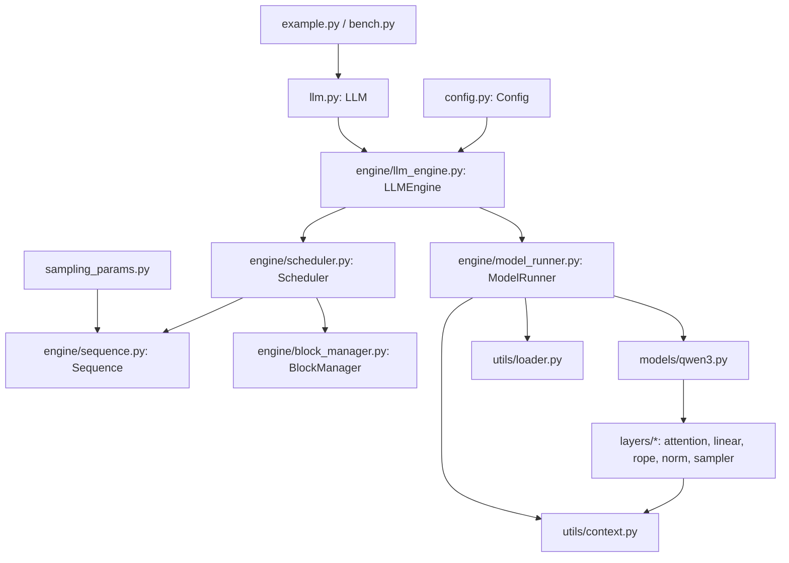

# Entry Points and Settings

> [!abstract] In one line
> What an inference engine is for, how the repo is laid out, and the two small dataclasses (`SamplingParams`, `Config`) whose fields steer every later part.

## What is vLLM, and what problem does inference serving solve?

A language model produces text one token at a time. Given tokens $x_1 \dots x_t$, a forward pass returns a probability distribution over the next token; you sample $x_{t+1}$, append it, and run again. This is **autoregressive generation**. Training processes a whole known sequence in one parallel pass. Generation cannot, because token $t+1$ does not exist until token $t$ has been sampled.

A request therefore has two phases with different costs:

- **Prefill.** The prompt is known in full, so all its tokens go through the model in one pass. The GPU does a lot of matrix math per byte of weights it reads, so it is **compute-bound**. This phase produces the first output token.
- **Decode.** Each later step feeds in exactly one new token per sequence. The GPU reads every weight in the model to do very little math, so it is **memory-bandwidth-bound**. This phase runs once per output token, hundreds of times per request.

In attention, a new token needs the keys and values of *every earlier token*, in every layer. Recomputing them at each step would cost $O(t^2)$ work over a sequence. Instead the engine stores them once and reuses them. That store is the **KV cache**. Its size per token is

$$
\text{bytes/token} = 2 \times n_\text{layers} \times n_\text{kv heads} \times d_\text{head} \times \text{bytes per element}
$$

For Qwen3-0.6B (28 layers, 8 KV heads, head dim 128, bf16): $2 \times 28 \times 8 \times 128 \times 2 = 114{,}688$ bytes, about **112 KiB per token**. One 4096-token sequence needs 448 MiB. The weights are about 1.2 GB, so on an 8 GB GPU the KV cache, not the model, decides how many requests fit at once. **KV cache memory is the bottleneck.**

Why do we need many requests at once? Because decode is bandwidth-bound: reading the weights to produce one token for one sequence costs almost the same as reading them to produce one token for 256 sequences. **Batching** many requests turns the wasted compute into throughput. So the whole job of a serving engine is this: fit as many sequences' KV caches into GPU memory as possible, and keep the GPU busy with large batches.

**vLLM** is the engine that made this practical. Its two main ideas both show up in this repo:

1. **Paged KV cache** (PagedAttention). The cache is cut into fixed-size blocks, and each sequence keeps a table of which blocks it owns, like virtual memory pages. There is no fragmentation and no need to reserve `max_len` slots up front. See [[04 Memory - Paged KV Cache]].
2. **Continuous batching.** On every step the scheduler decides which sequences run. Finished ones leave and new ones join right away, without waiting for the whole batch to finish. See [[05 Scheduling - Continuous Batching]].

nano-vLLM rebuilds these ideas, plus prefix caching, tensor parallelism, `torch.compile` and CUDA graphs, in about 1.2k lines. The README reports it slightly faster than vLLM on one benchmark (1434 vs 1362 tok/s, Qwen3-0.6B, RTX 4070 Laptop). [[09 Measuring Speed]] covers that benchmark.

## A map of the repo



Read it top to bottom. The user calls `LLM.generate`. The engine loop asks the **scheduler** which sequences to run, and the scheduler asks the **block manager** for KV-cache blocks. The **model runner** turns those sequences into GPU tensors, stores the per-step metadata in a global **context**, and runs the Qwen3 model. The model's attention layers read that context to find their cache blocks.

The notes follow the same order in which a request travels:

| # | Note | Files |
|---|------|-------|
| 01 | Entry Points and Settings (this note) | README, example.py, `__init__`, llm.py, sampling_params.py, config.py |
| 02 | [[02 The Main Loop]] | engine/llm_engine.py |
| 03 | [[03 Tracking a Request]] | engine/sequence.py |
| 04 | [[04 Memory - Paged KV Cache]] | engine/block_manager.py |
| 05 | [[05 Scheduling - Continuous Batching]] | engine/scheduler.py |
| 06 | [[06 Getting Data onto the GPU]] | utils/context.py, engine/model_runner.py |
| 07 | [[07 Model Building Blocks]] | layers/* |
| 08 | [[08 The Full Model]] | models/qwen3.py, utils/loader.py |
| 09 | [[09 Measuring Speed]] | bench.py, pyproject.toml |
| 10 | [[10 History - Real Bugs]] | git history |

## Why this exists

An engine has two kinds of knobs. Some belong to a **request**: how random the output should be, and when to stop. Some belong to the **engine**: how much GPU memory to take, how large a batch may grow, how many GPUs to use. nano-vLLM keeps them in two separate dataclasses, `SamplingParams` and `Config`. The public API is a thin shell over the engine, so this part is short. Its value is that every field here is a promise that some later part keeps, and knowing them up front makes the rest of the code easier to read.

## Walkthrough

### Using the API: `example.py`

*`example.py` L1–11*
```python
import os
from nanovllm import LLM, SamplingParams
from transformers import AutoTokenizer


def main():
    path = os.path.expanduser("~/huggingface/Qwen3-0.6B/")
    tokenizer = AutoTokenizer.from_pretrained(path)
    llm = LLM(path, enforce_eager=True, tensor_parallel_size=1)

    sampling_params = SamplingParams(temperature=0.6, max_tokens=256)
```

- `path` must be a **local directory** holding a Hugging Face checkpoint (`config.json`, tokenizer files, `*.safetensors`). `Config` asserts this, as shown below. The README's `huggingface-cli download ... --local-dir ~/huggingface/Qwen3-0.6B/` command puts it there.
- `LLM(path, enforce_eager=True, tensor_parallel_size=1)`: the keyword arguments are `Config` fields. `enforce_eager=True` skips CUDA graph capture, which makes startup faster and debugging easier.
- One `SamplingParams` is shared by all prompts here. `generate` also accepts a list with one per prompt.

### Applying the chat template

*`example.py` L12–23*
```python
    prompts = [
        "introduce yourself",
        "list all prime numbers within 100",
    ]
    prompts = [
        tokenizer.apply_chat_template(
            [{"role": "user", "content": prompt}],
            tokenize=False,
            add_generation_prompt=True,
        )
        for prompt in prompts
    ]
```

Qwen3 is a chat model. It was fine-tuned on conversations wrapped in special tokens, and a bare string like `"introduce yourself"` looks like the middle of a document to it, not a question. `apply_chat_template` wraps the message in the model's own format, which for Qwen looks roughly like:

```text
<|im_start|>user
introduce yourself<|im_end|>
<|im_start|>assistant
```

- `add_generation_prompt=True` appends the final `<|im_start|>assistant\n`, which tells the model that it should now speak.
- `tokenize=False` returns a string, not token IDs. The engine tokenizes it again in `add_request` ([[02 The Main Loop]]).

> [!important] The engine knows nothing about chat
> Templating is entirely the caller's job. The engine sees only a string or a list of token IDs. When the model emits `<|im_end|>`, which is Qwen's EOS token, the scheduler stops that sequence ([[05 Scheduling - Continuous Batching]]).

### Generating and reading the output

*`example.py` L24–33*
```python
    outputs = llm.generate(prompts, sampling_params)

    for prompt, output in zip(prompts, outputs):
        print("\n")
        print(f"Prompt: {prompt!r}")
        print(f"Completion: {output['text']!r}")


if __name__ == "__main__":
    main()
```

`generate` runs every prompt to completion and returns them **in input order**, each as a dict `{"text": ..., "token_ids": ...}`. The signature in `llm_engine.py` says `-> list[str]`, but it actually returns dicts, as the README's `outputs[0]["text"]` also shows. The output does not include the prompt tokens.

### The package surface

*`nanovllm/__init__.py` L1–2*
```python
from nanovllm.llm import LLM
from nanovllm.sampling_params import SamplingParams
```

These two names are the whole public API, and they match vLLM's `from vllm import LLM, SamplingParams`. That match is why `bench.py` can switch to real vLLM by changing one import line.

### `LLM` is an empty subclass

*`nanovllm/llm.py` L1–5*
```python
from nanovllm.engine.llm_engine import LLMEngine


class LLM(LLMEngine):
    pass
```

`LLM` adds nothing. All behaviour lives in `LLMEngine` ([[02 The Main Loop]]). The subclass exists only to give users vLLM's familiar name while the engine keeps a descriptive one. In real vLLM, `LLM` is a thicker wrapper over the engine. Here the two are the same thing.

### Per-request knobs: `SamplingParams`

*`nanovllm/sampling_params.py` L1–11*
```python
from dataclasses import dataclass


@dataclass(slots=True)
class SamplingParams:
    temperature: float = 1.0
    max_tokens: int = 64
    ignore_eos: bool = False

    def __post_init__(self):
        assert self.temperature > 1e-10, "greedy sampling is not permitted"
```

`slots=True` gives the class fixed attributes and no per-instance `__dict__`. This makes it smaller and faster, and a typo such as `sp.temprature = 0.5` raises an error instead of silently adding a new attribute.

- **`temperature`**: logits are divided by $T$ before softmax, $p_i = \mathrm{softmax}(z / T)_i$. $T<1$ sharpens the distribution toward the top token, $T>1$ flattens it, and $T=1$ is the model's raw distribution. It is copied into `Sequence.temperature` ([[03 Tracking a Request]]), stacked into a per-row tensor in `ModelRunner.prepare_sample` ([[06 Getting Data onto the GPU]]), and used by `Sampler` ([[07 Model Building Blocks]]).
- **`max_tokens`**: a hard cap on *generated* tokens, not counting the prompt. The scheduler finishes a sequence when `num_completion_tokens == max_tokens`. The default of 64 is short, which is why the example asks for 256.
- **`ignore_eos`**: if `True`, the EOS token does not stop generation, so the sequence always runs to exactly `max_tokens`. `bench.py` uses it so every run produces a known number of tokens.

The stopping rule these two fields feed, from `scheduler.py` L89:

```python
            if (not seq.ignore_eos and token_id == self.eos) or seq.num_completion_tokens == seq.max_tokens:
```

### Why temperature 0 (greedy) is refused

Greedy decoding means always taking the most likely token. It is the $T \to 0$ limit, and most libraries implement it as a special case with `argmax`. nano-vLLM has no such branch. Every token goes through one sampler:

*`nanovllm/layers/sampler.py` L8–12*
```python
    def forward(self, logits: torch.Tensor, temperatures: torch.Tensor):
        logits = logits.float().div_(temperatures.unsqueeze(dim=1))
        probs = torch.softmax(logits, dim=-1)
        sample_tokens = probs.div_(torch.empty_like(probs).exponential_(1).clamp_min_(1e-10)).argmax(dim=-1)
        return sample_tokens
```

Two facts explain the assert:

1. Line 9 divides by $T$. With $T=0$ you get `inf` or `nan` logits, and softmax turns them into garbage. The threshold `1e-10` rules out zero and anything close enough to overflow.
2. Line 11 is the **Gumbel-max trick** in its exponential form. If $E_i \sim \mathrm{Exp}(1)$ independently, then
$$
\arg\max_i \frac{p_i}{E_i} \;\sim\; \mathrm{Categorical}(p)
$$
so a single elementwise divide and an `argmax` draw one sample per row. There are no `torch.multinomial` calls and no per-row branching, and it compiles well. Because every row is always sampled, supporting greedy would need a separate `argmax` path selected per row. The author chose to forbid it instead. [[07 Model Building Blocks]] derives why the trick works.

> [!tip] Want near-greedy output?
> Use a small temperature such as `0.01`. The softmax becomes almost one-hot, and the result is greedy in practice.

### Per-engine knobs: `Config` fields

*`nanovllm/config.py` L1–18*
```python
import os
from dataclasses import dataclass
from transformers import AutoConfig


@dataclass(slots=True)
class Config:
    model: str
    max_num_batched_tokens: int = 16384
    max_num_seqs: int = 512
    max_model_len: int = 4096
    gpu_memory_utilization: float = 0.9
    tensor_parallel_size: int = 1
    enforce_eager: bool = False
    hf_config: AutoConfig | None = None
    eos: int = -1
    kvcache_block_size: int = 256
    num_kvcache_blocks: int = -1
```

`LLMEngine.__init__` builds this from whatever keyword arguments you passed to `LLM(...)`. It keeps only names that are `Config` fields and **silently drops the rest**, so a misspelled `max_num_seq=8` is ignored without an error ([[02 The Main Loop]]).

Each field, and where it matters:

- **`model`**: path to the local checkpoint directory. It is used by `AutoConfig` below, by the tokenizer in `LLMEngine`, and by `load_model` ([[08 The Full Model]]).

- **`max_num_batched_tokens`** (16384): the token budget for one **prefill** step. The scheduler adds waiting sequences until their prompt tokens would exceed it. Only the first sequence in a step may be split to fit, which is **chunked prefill** ([[05 Scheduling - Continuous Batching]]). It also sizes the warmup run that measures peak activation memory ([[06 Getting Data onto the GPU]]). A larger value allows bigger prefill batches but a higher activation peak, which leaves less memory for the KV cache.

- **`max_num_seqs`** (512): the most sequences in one step, prefill or decode. It is the upper limit on batch size in the scheduler's two loops ([[05 Scheduling - Continuous Batching]]). The model runner also uses it, capped at 512, as the largest batch size it captures a CUDA graph for ([[06 Getting Data onto the GPU]]).

- **`max_model_len`** (4096): the longest a sequence (prompt plus output) is expected to get. It is lowered to the model's limit in `__post_init__`. It has exactly two uses, both in `ModelRunner`: it sets the warmup sequence length (`min(max_num_batched_tokens, max_model_len)`), and it sets the width of the block-table buffer captured into CUDA graphs, `ceil(max_model_len / block_size)` columns ([[06 Getting Data onto the GPU]]).

> [!warning] `max_model_len` is not enforced on requests
> Nothing rejects a prompt or generation that grows past it. With CUDA graphs on, a decode step for such a sequence would try to copy a block table wider than the captured buffer, which fails on `graph_vars["block_tables"][:bs, :context.block_tables.size(1)] = ...`. If you want a guard in your own version, put it in `add_request`.

- **`gpu_memory_utilization`** (0.9): the fraction of *total* GPU memory the engine may use in all. After loading weights and running warmup, `allocate_kv_cache` spends whatever is left under that ceiling on KV blocks ([[06 Getting Data onto the GPU]]):
$$
\texttt{num\_kvcache\_blocks} = \left\lfloor \frac{\text{total} \cdot u - \text{used} - \text{peak} + \text{current}}{\text{block\_bytes}} \right\rfloor
$$
With Qwen3-0.6B, one 256-token block is $256 \times 112\text{ KiB} = 28\text{ MiB}$. So every GB left over is about 36 blocks, or about 9k tokens of cache.

- **`tensor_parallel_size`** (1): the number of GPUs the model is sharded across. `LLMEngine` spawns one extra `ModelRunner` process for each rank above 0 ([[02 The Main Loop]]). The linear, embedding and attention layers split their weights and heads by this number ([[07 Model Building Blocks]]). The KV cache holds only `num_key_value_heads // world_size` heads per GPU.

- **`enforce_eager`** (False): when `True`, skips CUDA graph capture and always launches the model's kernels one by one. The `@torch.compile` decorators on individual layers still apply. When `False`, decode steps with at most 512 sequences replay a pre-captured graph, which removes kernel launch overhead that dominates small decode batches ([[06 Getting Data onto the GPU]]). `example.py` sets `True` for fast startup, and `bench.py` sets `False` for speed.

- **`hf_config`** (None): the model's Hugging Face config (layer count, head counts, hidden size, dtype, `max_position_embeddings`). It is filled in by `__post_init__`. The model constructor reads it ([[08 The Full Model]]), and so does the KV-cache sizing arithmetic ([[06 Getting Data onto the GPU]]).

- **`eos`** (-1): the end-of-sequence token ID. It is a placeholder here and is set in `LLMEngine.__init__` from `tokenizer.eos_token_id` ([[02 The Main Loop]]), then used by the scheduler's stop check.

- **`kvcache_block_size`** (256): tokens per KV-cache block, the "page size" of the paged cache. It is copied to the class attribute `Sequence.block_size` ([[03 Tracking a Request]]) and used by `BlockManager` ([[04 Memory - Paged KV Cache]]), the scheduler, and the model runner's slot mapping ([[06 Getting Data onto the GPU]]). It is also the granularity of prefix caching: only *full* 256-token blocks can be shared between requests.

- **`num_kvcache_blocks`** (-1): how many blocks the cache has. `-1` means "not known yet". It can only be computed after the model is on the GPU and warmup has measured peak memory. `ModelRunner.allocate_kv_cache` then **writes it back into this same `Config` object**, and the `Scheduler`, built later in `LLMEngine.__init__`, reads it to size the `BlockManager`.

> [!important] `Config` is filled in over time
> Three fields are placeholders that later code fills in: `hf_config` (in `__post_init__`), `num_kvcache_blocks` (by `ModelRunner`), and `eos` (by `LLMEngine`). That is why the construction order in `LLMEngine.__init__` matters: model runner first, then tokenizer, then scheduler. Build the scheduler earlier and it would see `-1` blocks.

### Validation in `__post_init__`

*`nanovllm/config.py` L20–25*
```python
    def __post_init__(self):
        assert os.path.isdir(self.model)
        assert self.kvcache_block_size % 256 == 0
        assert 1 <= self.tensor_parallel_size <= 8
        self.hf_config = AutoConfig.from_pretrained(self.model)
        self.max_model_len = min(self.max_model_len, self.hf_config.max_position_embeddings)
```

- `os.path.isdir(self.model)`: the model must be a local directory, not a Hub name like `"Qwen/Qwen3-0.6B"`. The weight loader globs `*.safetensors` from this path, so it cannot download anything.
- `kvcache_block_size % 256 == 0`: the paged-attention kernels from `flash_attn` (`flash_attn_with_kvcache` and `flash_attn_varlen_func` with a `block_table`) require the page size to be a multiple of 256. The block size is really set by the kernel, not by free choice ([[07 Model Building Blocks]]).
- `1 <= tensor_parallel_size <= 8`: one node holds at most 8 GPUs, and the NCCL setup uses a single-host `tcp://localhost` rendezvous ([[06 Getting Data onto the GPU]]).
- `AutoConfig.from_pretrained`: reads `config.json` into `hf_config`.
- `min(max_model_len, max_position_embeddings)`: the engine never plans for sequences longer than the model was trained for. For Qwen3-0.6B, `max_position_embeddings` is 40960, so the default 4096 wins.

> [!question] Check yourself
> 1. Why does `num_kvcache_blocks` start at `-1` instead of being computed in `__post_init__`?
> 2. You call `LLM(path, max_num_seq=8)`. What batch limit do you get?
> 3. Why can't you pass `temperature=0`, and how would you get almost-greedy output?
> 4. Why does serving many requests at once give more throughput than serving them one by one?
>
> > [!success]- Answer
> > 1. The count depends on how much memory is left after the weights are loaded and the warmup forward pass has measured peak activation memory. Neither exists yet when `Config` is built.
> > 2. 512. The misspelled key is not a `Config` field, so `LLMEngine` drops it without an error.
> > 3. The sampler divides logits by temperature and always samples with the Gumbel-max trick. There is no argmax branch, and $T=0$ would divide by zero. Use something like `temperature=0.01`.
> > 4. Decode is memory-bandwidth-bound: every step reads all the weights whatever the batch size, so extra sequences in the batch cost little extra time. The limit is how many sequences' KV caches fit in memory.

## Build it yourself

> [!tip] Build-it-yourself
> Start with these two dataclasses and an `LLM` stub. They cost nothing and pin down the interface every later part plugs into.

- [ ] `SamplingParams(temperature, max_tokens, ignore_eos)` with `slots=True` and the `temperature > 1e-10` assert.
- [ ] `Config` with all eleven fields and their defaults, including the placeholders `hf_config=None`, `eos=-1` and `num_kvcache_blocks=-1`.
- [ ] `__post_init__`: check the local directory, the block size multiple of 256 and the TP range, load `AutoConfig`, and clamp `max_model_len`.
- [ ] `class LLM(LLMEngine): pass`, and an `__init__.py` that exports `LLM` and `SamplingParams`.
- [ ] A copy of `example.py` that applies the chat template, to use as your smoke test once [[02 The Main Loop]] exists.

Invariants to keep:
- `Config` is one mutable object shared by the engine, model runner and scheduler. Later parts write `num_kvcache_blocks` and `eos` into it, so the scheduler must be built after both are set.
- `kvcache_block_size` must match what your attention kernel accepts (a multiple of 256 for flash-attn paged KV).
- Temperature is always positive, because the sampler always samples.

[[02 The Main Loop]] →
