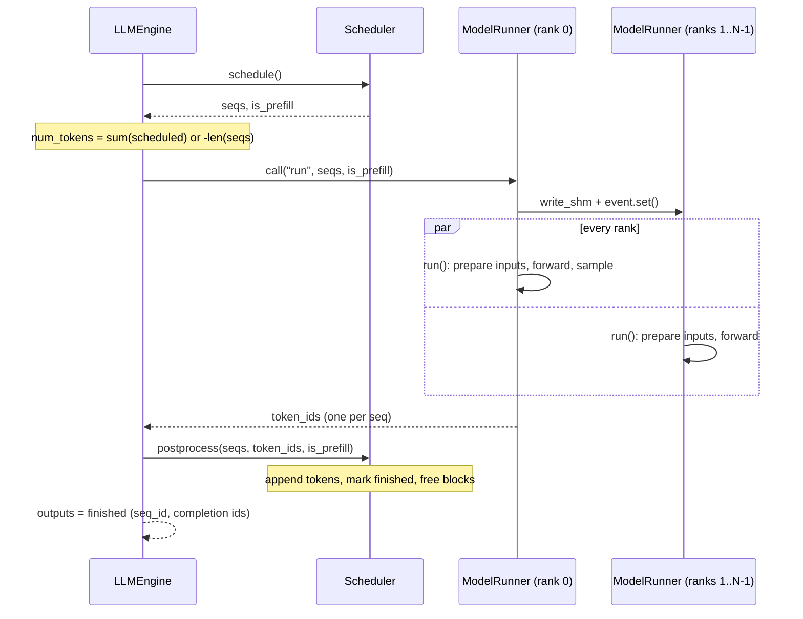

 
# The Main Loop: `LLMEngine`

> [!abstract] In one line
> `LLMEngine` starts one worker per GPU, turns prompts into sequences, and then repeats one step until all requests are done: the scheduler picks a batch, the model runner produces one token per sequence, and the scheduler records the results.

<br>

## Why this exists

A language model on its own is a function: token ids go in, logits for the next token come out. To serve many prompts you need something around it. That code has to turn text into token ids, decide which prompts run on the GPU right now, call the model, append the sampled tokens, notice when a request is done, and return the text in the order the user asked for it.

`LLMEngine` does exactly that and nothing more. It holds three collaborators: a **tokenizer** (text to ids and back), a **`Scheduler`** (decides *what* runs in each step, see [[05 Scheduling - Continuous Batching]]), and a **`ModelRunner`** (does the GPU work, see [[06 Getting Data onto the GPU]]). The engine is the conductor. Every forward pass the system makes goes through one call to `step()`.

The file is only 90 lines long, but it is the spine of the whole system. Once you understand it, every other part is "what happens inside one of these calls".

<br>

## Walkthrough: `nanovllm/engine/llm_engine.py`

### Imports: who the engine talks to

*`nanovllm/engine/llm_engine.py` L1–12*
```python
import atexit
from dataclasses import fields
from time import perf_counter
from tqdm.auto import tqdm
from transformers import AutoTokenizer
import torch.multiprocessing as mp

from nanovllm.config import Config
from nanovllm.sampling_params import SamplingParams
from nanovllm.engine.sequence import Sequence
from nanovllm.engine.scheduler import Scheduler
from nanovllm.engine.model_runner import ModelRunner
```

- `atexit` makes sure worker processes are cleaned up when Python exits.
- `fields` lets the engine filter user kwargs down to real `Config` fields.
- `perf_counter` and `tqdm` are only used for the progress bar and throughput numbers.
- `torch.multiprocessing` is a thin wrapper around the standard `multiprocessing` that knows how to share CUDA tensors. Here it only starts processes and creates events.
- The last four imports are the other parts of the system: `Config` ([[01 Entry Points and Settings]]), `Sequence` ([[03 Tracking a Request]]), `Scheduler`, `ModelRunner`.

Remember that the public class `LLM` in `nanovllm/llm.py` is just `class LLM(LLMEngine): pass`. Everything the user calls lives here.

<br>

### Building the `Config` from loose kwargs

*`nanovllm/engine/llm_engine.py` L17–21*
```python
    def __init__(self, model, **kwargs):
        config_fields = {field.name for field in fields(Config)}
        config_kwargs = {k: v for k, v in kwargs.items() if k in config_fields}
        config = Config(model, **config_kwargs)
        Sequence.block_size = config.kvcache_block_size
```

The user writes `LLM(path, enforce_eager=True, tensor_parallel_size=2)`. The engine:

- collects the names of all fields of the `Config` dataclass (`model`, `max_num_seqs`, `kvcache_block_size`, ...),
- keeps only the kwargs whose names match, so unknown kwargs are **silently dropped** rather than raising,
- builds the `Config` (its `__post_init__` loads the HuggingFace config, see [[01 Entry Points and Settings]]),
- sets `Sequence.block_size` as a **class attribute**. Every `Sequence` created later uses this to compute how many KV-cache blocks it needs (`num_blocks`, `last_block_num_tokens`). Setting it on the class, once, means no sequence needs to carry a reference to the config.

> [!warning] Typos disappear
> Because of the filter, `LLM(path, max_num_seq=8)` (missing `s`) runs happily with the default `max_num_seqs=512`. In your own version you may prefer to raise on unknown kwargs.

<br>

### Starting one process per extra GPU

*`nanovllm/engine/llm_engine.py` L22–31*
```python
        self.ps = []
        self.events = []
        ctx = mp.get_context("spawn")
        for i in range(1, config.tensor_parallel_size):
            event = ctx.Event()
            process = ctx.Process(target=ModelRunner, args=(config, i, event))
            process.start()
            self.ps.append(process)
            self.events.append(event)
        self.model_runner = ModelRunner(config, 0, self.events)
```

With **tensor parallelism** (TP), every layer's weight matrices are split across $N$ GPUs, and each GPU computes its slice of every matmul (the layers are in [[07 Model Building Blocks]]). All $N$ GPUs must run the *same* forward pass at the *same* time. nano-vLLM uses one OS process per GPU:

- **Rank 0 lives in the main process.** It is `self.model_runner`, created on the last line. It is the only rank that talks to the scheduler, samples tokens and returns results.
- **Ranks 1..N-1 are child processes**, started by the loop. With `tensor_parallel_size=1` the loop body never runs, `self.ps` and `self.events` stay empty, and everything happens in one process.
- `mp.get_context("spawn")`: CUDA cannot be safely used in a process created by `fork` after the parent touched CUDA, so each child starts a fresh Python interpreter. The `config` is pickled and sent to it.
- `target=ModelRunner`: the child's entry point is the **constructor** itself. For rank > 0, `ModelRunner.__init__` loads its shard of the model, allocates its KV cache, and then calls `self.loop()`, which never returns until it receives `"exit"`. The child process is "a `ModelRunner` stuck inside its own constructor, waiting for orders".
- **Events**: each child gets its *own* `Event`; rank 0 gets the *list* of all of them. An `Event` is a cross-process boolean flag. Rank 0 sets it to say "a new command is waiting", and the child waits on it.

The commands themselves travel through a 1 MiB shared-memory buffer. Here is the interface, from `model_runner.py` (details in [[06 Getting Data onto the GPU]]):

*`nanovllm/engine/model_runner.py` L76–89*
```python
    def write_shm(self, method_name, *args):
        assert self.world_size > 1 and self.rank == 0
        data = pickle.dumps([method_name, *args])
        n = len(data)
        self.shm.buf[0:4] = n.to_bytes(4, "little")
        self.shm.buf[4:n+4] = data
        for event in self.event:
            event.set()

    def call(self, method_name, *args):
        if self.world_size > 1 and self.rank == 0:
            self.write_shm(method_name, *args)
        method = getattr(self, method_name, None)
        return method(*args)
```

So `self.model_runner.call("run", seqs, is_prefill)` on rank 0 does two things: it pickles `["run", seqs, is_prefill]` into shared memory and wakes every worker, then runs `self.run(seqs, is_prefill)` locally. The workers' `loop()` reads the same message and calls their own `run`. That is the whole remote-procedure-call mechanism: **the engine only ever talks to rank 0, and rank 0 forwards each call to the other ranks.**

<br>

### Tokenizer, EOS, scheduler, and cleanup hook

*`nanovllm/engine/llm_engine.py` L32–35*
```python
        self.tokenizer = AutoTokenizer.from_pretrained(config.model, use_fast=True)
        config.eos = self.tokenizer.eos_token_id
        self.scheduler = Scheduler(config)
        atexit.register(self.exit)
```

- The tokenizer is loaded from the same model directory. `use_fast=True` picks the Rust-backed tokenizer.
- `config.eos` was `-1` until now. The scheduler reads it (`self.eos = config.eos`) and uses it in `postprocess` to decide when a sequence is finished.
- **The order matters.** The `Scheduler` is built *after* the `ModelRunner` on purpose. Inside the `ModelRunner` constructor, `allocate_kv_cache()` measures free GPU memory and writes `config.num_kvcache_blocks`. The scheduler's `BlockManager` is then created with that number of blocks. If you build the scheduler first, it sees `num_kvcache_blocks = -1`.
- `atexit.register(self.exit)` makes sure the workers are shut down even if the user never cleans up explicitly.

> [!important] Only rank 0 has a scheduler and a tokenizer
> Worker processes never see prompts, text, or scheduling decisions. They receive ready-made `Sequence` objects through `call("run", ...)` and run the same forward pass. All bookkeeping is centralised in the main process.

<br>

### Shutting down: `exit()`

*`nanovllm/engine/llm_engine.py` L37–41*
```python
    def exit(self):
        self.model_runner.call("exit")
        del self.model_runner
        for p in self.ps:
            p.join()
```

- `call("exit")` broadcasts `"exit"` to every worker and runs `exit()` on rank 0. `ModelRunner.exit` closes shared memory, hits a `dist.barrier()` so all ranks leave together, frees CUDA graphs, and destroys the NCCL process group. The worker's `loop()` sees `method_name == "exit"` and breaks, so its constructor finally returns and the process ends.
- `del self.model_runner` drops rank 0's model and KV cache.
- `p.join()` waits for each child process to actually terminate, so no orphaned processes keep GPU memory.

<br>

### Adding a request

*`nanovllm/engine/llm_engine.py` L43–47*
```python
    def add_request(self, prompt: str | list[int], sampling_params: SamplingParams):
        if isinstance(prompt, str):
            prompt = self.tokenizer.encode(prompt)
        seq = Sequence(prompt, sampling_params)
        self.scheduler.add(seq)
```

A prompt can be text or already-tokenized ids. Text is encoded (e.g. `"Hello"` becomes something like `[9707]`). The token ids are wrapped in a `Sequence`, which gets a fresh `seq_id` from a global counter, status `WAITING`, and copies of `temperature`, `max_tokens` and `ignore_eos` from the sampling params ([[03 Tracking a Request]]).

`scheduler.add` is one line: `self.waiting.append(seq)`. Adding a request does **no GPU work**. It only puts the request in the queue. The GPU work happens in `step()`.

<br>

### One step of the engine

*`nanovllm/engine/llm_engine.py` L49–55*
```python
    def step(self):
        seqs, is_prefill = self.scheduler.schedule()
        num_tokens = sum(seq.num_scheduled_tokens for seq in seqs) if is_prefill else -len(seqs)
        token_ids = self.model_runner.call("run", seqs, is_prefill)
        self.scheduler.postprocess(seqs, token_ids, is_prefill)
        outputs = [(seq.seq_id, seq.completion_token_ids) for seq in seqs if seq.is_finished]
        return outputs, num_tokens
```

This is the heart of the engine. One call to `step()` means one forward pass over one batch. To follow it you need the two kinds of step:

- **Prefill**: run the model over a prompt's tokens (possibly many per sequence) to fill the KV cache, and sample the first new token.
- **Decode**: every running sequence feeds exactly **one** token (the last one it generated) and gets one new token back.

The scheduler never mixes the two in one batch. It returns either a prefill batch or a decode batch, and says which with `is_prefill`.

Line by line:

1. **`schedule()`** returns `(list[Sequence], bool)`. It prefers prefill: if any waiting sequence fits, the batch is a prefill batch. Otherwise it builds a decode batch from the running sequences, preempting some if the KV cache is full. On each chosen sequence it sets `seq.num_scheduled_tokens`, which is how many tokens this sequence feeds into this forward pass. For prefill that is the uncached part of the prompt (or a chunk of it, with **chunked prefill**). For decode it is always `1`.
2. **`num_tokens`** counts the work done in this step, with a **sign convention**: positive for prefill, negative for decode (explained below).
3. **`call("run", seqs, is_prefill)`** runs the forward pass on all ranks and returns `list[int]`, one sampled token id per sequence, from rank 0 (the other ranks return `None`).
4. **`postprocess`** walks over `zip(seqs, token_ids)`. For each sequence it records the newly cached tokens (`num_cached_tokens += num_scheduled_tokens`). If the sequence is still mid-prefill (a chunk that did not reach the end of the prompt), the sampled token is thrown away. Otherwise the token is appended, and if it is EOS (unless `ignore_eos`) or `max_tokens` has been reached, the sequence becomes `FINISHED` and its KV blocks are freed.
5. **`outputs`** collects `(seq_id, completion_token_ids)` for the sequences that finished *in this step*. `completion_token_ids` is `token_ids[num_prompt_tokens:]`, only the generated part.

A tiny example. Three prompts of lengths 4, 2, 5 were just added, nothing is cached, and the budget is large enough:

```text
step 1: schedule -> prefill [A(4), B(2), C(5)]   num_tokens = 4+2+5 = 11
        run      -> [a1, b1, c1]                  one token each
step 2: schedule -> decode  [A, B, C]            num_tokens = -3
        run      -> [a2, b2, c2]
...
```

#### The sign convention of `num_tokens`

`step()` has to tell its caller two things for the progress bar: how many tokens were processed, and whether this was a prefill or decode step. Instead of returning a third value, it packs both into one integer:

- **prefill**: $\text{num\_tokens} = \sum_i \text{num\_scheduled\_tokens}_i > 0$, the prompt tokens actually pushed through the model. Cached prefix tokens are not counted, because they cost no compute.
- **decode**: $\text{num\_tokens} = -\,\text{len(seqs)} < 0$. Each sequence contributes exactly one token, so the token count equals the batch size, and the minus sign marks the step as decode.

A prefill step always schedules at least one token, so zero never shows up, and the sign alone tells you the phase.

<br>

#### Sequence diagram of one `step()`



<br>

### Are we done?

*`nanovllm/engine/llm_engine.py` L57–58*
```python
    def is_finished(self):
        return self.scheduler.is_finished()
```

It delegates to the scheduler, which returns `not self.waiting and not self.running`. The engine is finished when no request is waiting to be prefilled and none is still decoding. Finished sequences are removed from `running` in `postprocess`, so they do not count.

<br>

### `generate()`: setting up the batch

*`nanovllm/engine/llm_engine.py` L60–72*
```python
    def generate(
        self,
        prompts: list[str] | list[list[int]],
        sampling_params: SamplingParams | list[SamplingParams],
        use_tqdm: bool = True,
    ) -> list[str]:
        pbar = tqdm(total=len(prompts), desc="Generating", dynamic_ncols=True, disable=not use_tqdm)
        if not isinstance(sampling_params, list):
            sampling_params = [sampling_params] * len(prompts)
        for prompt, sp in zip(prompts, sampling_params):
            self.add_request(prompt, sp)
        outputs = {}
        prefill_throughput = decode_throughput = 0.
```

This is the offline, "give me all the answers" API that `example.py` and `bench.py` use.

- The progress bar counts **finished requests**, not tokens: `total=len(prompts)`.
- `sampling_params` may be one object shared by all prompts, or one per prompt. A single object is broadcast with `[sp] * len(prompts)`. That list holds the *same* object many times, which is fine because `Sequence.__init__` copies its fields rather than keeping the object.
- **Every prompt is added up front.** The scheduler sees the whole workload immediately and can pack as many as fit into each batch. That is what makes offline batch inference fast.
- `outputs` is a dict keyed by `seq_id`, because sequences finish in whatever order their EOS happens to arrive, not in input order.

> [!warning] The return annotation is wrong
> `generate` is annotated `-> list[str]`, but it returns a `list[dict]` with keys `"text"` and `"token_ids"` (see the last chunk).

<br>

### `generate()`: the loop and the throughput display

*`nanovllm/engine/llm_engine.py` L73–86*
```python
        while not self.is_finished():
            t = perf_counter()
            output, num_tokens = self.step()
            if num_tokens > 0:
                prefill_throughput = num_tokens / (perf_counter() - t)
            else:
                decode_throughput = -num_tokens / (perf_counter() - t)
            pbar.set_postfix({
                "Prefill": f"{int(prefill_throughput)}tok/s",
                "Decode": f"{int(decode_throughput)}tok/s",
            })
            for seq_id, token_ids in output:
                outputs[seq_id] = token_ids
                pbar.update(1)
```

This is the whole engine loop: keep stepping until the scheduler has nothing left.

- Each step is timed on its own. The sign of `num_tokens` decides which number to update:
  - `num_tokens > 0`: a prefill step. `prefill_throughput` = prompt tokens / seconds.
  - otherwise: a decode step. `-num_tokens` flips it back to a positive count of generated tokens, so `decode_throughput` = new tokens / seconds.
- Each number keeps its last value until the next step of the same kind, so the bar always shows both, for example `Prefill=15000tok/s, Decode=1400tok/s`. They are **instantaneous** values from the most recent step, not averages over the run.
- The timing covers the whole `step()`: scheduling, the forward pass, sampling, and `postprocess`. So it measures end-to-end engine throughput, not only GPU time.
- For every sequence that finished in this step, its completion ids are stored and the bar advances by one.

Why the two numbers are so different: a prefill step pushes thousands of tokens through the model in one forward pass, and the GPU is busy doing matmuls. A decode step processes one token per sequence, so with 256 running sequences the forward pass handles only 256 tokens, while it still has to read all the weights and the whole KV cache. Decode is limited by memory bandwidth, prefill by compute. Showing them separately keeps a slow decode phase from hiding behind a fast prefill number. [[09 Measuring Speed]] measures this more carefully.

<br>

### `generate()`: restoring the input order and decoding

*`nanovllm/engine/llm_engine.py` L87–90*
```python
        pbar.close()
        outputs = [outputs[seq_id] for seq_id in sorted(outputs.keys())]
        outputs = [{"text": self.tokenizer.decode(token_ids), "token_ids": token_ids} for token_ids in outputs]
        return outputs
```

- `seq_id` comes from `Sequence.counter`, an `itertools.count()` shared by the whole process. Prompts were added in input order, so their ids increase in input order: sorting the keys restores the original order even though the sequences finished out of order. The ids do not start at 0 on a second `generate()` call, but they still increase, so the sort still works.
- Each completion is decoded to text. The EOS token, if one was generated, is part of `token_ids` (postprocess appends it before marking the sequence finished), so it is also passed to `decode`.
- The result is `[{"text": ..., "token_ids": [...]}, ...]`, one dict per prompt, in the same order as `prompts`.

<br>

> [!question] Check yourself: why does `step()` return a negative `num_tokens` for decode steps?
> > [!success]- Answer
> > The caller (`generate`) needs to know both *how many* tokens a step processed and *which kind* of step it was, because prefill and decode throughput are reported separately. A prefill step always processes at least one token, so its count is strictly positive. For a decode step the count is simply the batch size (one token per sequence). Negating it puts both pieces of information in one integer: the sign says "decode", and the absolute value is the number of generated tokens. `generate` checks `num_tokens > 0` to choose the counter and uses `-num_tokens` to recover the positive count.

> [!question] Check yourself: why must the `Scheduler` be constructed after rank 0's `ModelRunner`?
> > [!success]- Answer
> > The number of KV-cache blocks depends on how much GPU memory is left after the model is loaded and a warmup pass has run. `ModelRunner.allocate_kv_cache()` computes it and writes `config.num_kvcache_blocks`. The scheduler's `BlockManager` needs that number when it is created.

> [!question] Check yourself: `generate` gets 3 prompts; the second one finishes first. In what order are the results returned, and why?
> > [!success]- Answer
> > In input order. Results are stored in a dict keyed by `seq_id`, and ids were handed out in increasing order as the prompts were added. Sorting the keys rebuilds the input order.

<br>

## Build it yourself

- [ ] Write `__init__`: filter kwargs into `Config`, set `Sequence.block_size`, and create the rank 0 `ModelRunner`. Start with `tensor_parallel_size=1` and add the spawned workers and events later.
- [ ] Create the tokenizer, set `config.eos`, then create the `Scheduler`, in this order.
- [ ] Write `add_request`: tokenize if needed, wrap in a `Sequence`, append to the scheduler's waiting queue.
- [ ] Write `step`: `schedule` → `run` → `postprocess` → collect finished sequences; return `(outputs, num_tokens)` with the sign convention.
- [ ] Write `generate`: broadcast sampling params, add all requests, loop until `is_finished`, and restore the order by `seq_id`.
- [ ] Add `exit` and register it with `atexit` once you have worker processes.

Invariants your version must preserve:

- Every forward pass is exactly one `step()`, and a batch is either all prefill or all decode.
- Only rank 0 schedules, samples, and returns token ids. Every rank must receive the *same* `run` call for every step, or the collectives inside the model deadlock.
- The KV-cache size is known before the scheduler (and its block manager) is built.
- `seq_id`s increase in the order requests were added, so outputs can be returned in input order.

← [[01 Entry Points and Settings]] | [[03 Tracking a Request]] →
