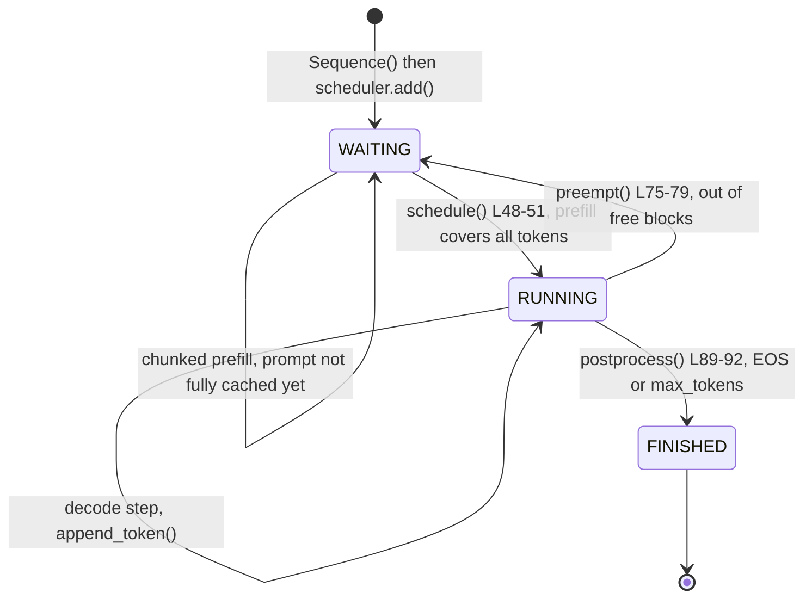

# Tracking a Request: the `Sequence` Object

> [!abstract] In one line
> A `Sequence` is the record the engine keeps for one request: its tokens, how many of them already have KV in the cache, how many are being processed this step, which cache blocks hold them, and where it is in its WAITING → RUNNING → FINISHED lifecycle.


## Why this exists

An inference engine serves many requests at once, and each one advances at a different pace. One request is still processing its 600-token prompt, another is on its 40th generated token, a third has just hit its end-of-sequence token. Every step, the scheduler has to answer questions like "how many tokens of this request still need to go through the model?", "which cache blocks hold its keys and values?", and "is it done?". It needs one object per request that answers them cheaply.

That object is `Sequence`. It holds no tensors and does no math. It is bookkeeping: a list of token ids plus a few counters. The counters are the interesting part, because the scheduler ([[05 Scheduling - Continuous Batching]]), the block manager ([[04 Memory - Paged KV Cache]]) and the model runner ([[06 Getting Data onto the GPU]]) all read and write them. The walkthrough below goes through every field, shows who touches it, and then follows one concrete request through its whole life.

There is also a second, less obvious job. With tensor parallelism, the main process sends the batch of sequences to the worker processes every step by pickling them. `Sequence` decides exactly what goes over that wire, and it sends as little as possible.


## The walkthrough: `nanovllm/engine/sequence.py`

### Imports

*`nanovllm/engine/sequence.py` L1–5*
```python
from copy import copy
from enum import Enum, auto
from itertools import count

from nanovllm.sampling_params import SamplingParams
```

Three small standard-library tools, each used exactly once:

- `copy`: a shallow copy of the prompt list, so the sequence owns its own `token_ids`.
- `Enum, auto`: for the status enum.
- `count`: an infinite counter, used to hand out ids.

`SamplingParams` is the dataclass from [[01 Entry Points and Settings]] (`temperature=1.0`, `max_tokens=64`, `ignore_eos=False` by default).


### The three states a request can be in

*`nanovllm/engine/sequence.py` L8–11*
```python
class SequenceStatus(Enum):
    WAITING = auto()
    RUNNING = auto()
    FINISHED = auto()
```

`auto()` just assigns 1, 2, 3; the values never matter, only identity comparisons do. The meaning of each state:

- **WAITING**: the sequence sits in `scheduler.waiting`. Its prompt (or part of it) still needs a prefill pass. A sequence in the middle of a chunked prefill is also WAITING.
- **RUNNING**: the sequence sits in `scheduler.running`. All of its tokens except the newest one have KV in the cache, and every step it gets exactly one decode token.
- **FINISHED**: it produced EOS or hit `max_tokens`. Its blocks are released and it is gone from both queues.

Here is every transition, with the line of code that performs it:



The three places in `scheduler.py` that write `status`:

*`nanovllm/engine/scheduler.py` L48–51 (prefill done → RUNNING)*
```python
            if seq.num_cached_tokens + seq.num_scheduled_tokens == seq.num_tokens:
                seq.status = SequenceStatus.RUNNING
                self.waiting.popleft()
                self.running.append(seq)
```

*`nanovllm/engine/scheduler.py` L75–79 (preemption → back to WAITING)*
```python
    def preempt(self, seq: Sequence):
        seq.status = SequenceStatus.WAITING
        seq.is_prefill = True
        self.block_manager.deallocate(seq)
        self.waiting.appendleft(seq)
```

*`nanovllm/engine/scheduler.py` L89–92 (done → FINISHED)*
```python
            if (not seq.ignore_eos and token_id == self.eos) or seq.num_completion_tokens == seq.max_tokens:
                seq.status = SequenceStatus.FINISHED
                self.block_manager.deallocate(seq)
                self.running.remove(seq)
```

> [!important] Preemption throws the cache away
> `preempt` does not swap KV to CPU. It calls `deallocate`, which empties `block_table` and resets `num_cached_tokens` to 0. The sequence keeps its `token_ids` (prompt plus everything generated so far), goes to the *front* of the waiting queue, and later gets prefilled again from scratch, generated tokens included. This is called **recompute preemption**. Prefix caching often softens the cost: the full blocks it hashed earlier may still be in the cache and get reused.


### Class-level state: block size and the id counter

*`nanovllm/engine/sequence.py` L14–16*
```python
class Sequence:
    block_size = 256
    counter = count()
```

Both are **class attributes**, shared by every `Sequence`:

- `block_size`: the number of tokens per KV-cache block. The default is 256, and `LLMEngine.__init__` overwrites it with the config value (`Sequence.block_size = config.kvcache_block_size`, see [[02 The Main Loop]]). It lives on `Sequence` so that the properties `num_blocks`, `last_block_num_tokens` and `block(i)` can compute block math without being passed a config.
- `counter`: one `itertools.count()` for the whole process. `next(Sequence.counter)` returns 0, 1, 2, ... so every sequence gets a unique, increasing `seq_id`.

`seq_id` is how outputs are matched back to prompts. `LLMEngine.step` returns `(seq.seq_id, seq.completion_token_ids)` for finished sequences, and `generate` finishes with `sorted(outputs.keys())`. Because ids increase in submission order, sorting by id puts outputs back in prompt order, even though requests finish in any order.

> [!warning] The ids do not start at 0
> `ModelRunner.warmup_model` builds dummy `Sequence([0] * seq_len)` objects in the main process before any real request arrives, and each one consumes a counter value. So the first real request might get `seq_id` 1 or higher. Nothing depends on the ids starting at 0; they only need to be unique and increasing.

> [!warning] `block_size` in worker processes
> Worker processes are started with `mp.get_context("spawn")`. A spawned process imports `sequence.py` fresh, so there `Sequence.block_size` is the class default 256, not whatever `LLMEngine.__init__` assigned in the main process. The workers call `seq.last_block_num_tokens` in `prepare_decode`, which reads `self.block_size`. With the default `kvcache_block_size=256` the two agree. In your own version, either make block size a constant or set it inside each worker too.


### The constructor: prompt bookkeeping

*`nanovllm/engine/sequence.py` L18–24*
```python
    def __init__(self, token_ids: list[int], sampling_params = SamplingParams()):
        self.seq_id = next(Sequence.counter)
        self.status = SequenceStatus.WAITING
        self.token_ids = copy(token_ids)
        self.last_token = token_ids[-1]
        self.num_tokens = len(self.token_ids)
        self.num_prompt_tokens = len(token_ids)
```

- `token_ids`: the **whole** token history, prompt first, then every generated token appended after it. It is copied so that `append_token` never mutates the caller's list.
- `last_token`: the newest token. Right now that is the last prompt token. During decode it is the only token the model needs as input.
- `num_tokens`: always equal to `len(self.token_ids)` in the main process. It is stored separately because worker processes receive a `Sequence` whose `token_ids` is empty (see `__setstate__` below) but still need the true length.
- `num_prompt_tokens`: fixed forever. It is the boundary between prompt and completion inside `token_ids`.

The default argument `SamplingParams()` is evaluated once at function definition. That is safe here because the constructor only reads from it.


### The constructor: cache, scheduling and sampling state

*`nanovllm/engine/sequence.py` L25–31*
```python
        self.num_cached_tokens = 0
        self.num_scheduled_tokens = 0
        self.is_prefill = True
        self.block_table = []
        self.temperature = sampling_params.temperature
        self.max_tokens = sampling_params.max_tokens
        self.ignore_eos = sampling_params.ignore_eos
```

These are the fields that make continuous batching, chunked prefill and prefix caching work. Read them as positions along `token_ids`:

```text
 token_ids:  [ 0 ....................................................... num_tokens )
             |<--- num_cached_tokens --->|<- num_scheduled_tokens ->|  rest      |
               KV already in the cache     processed in THIS step     later
```

- **`num_cached_tokens`**: how many tokens, counted from the start, already have K and V written to the cache. The model never recomputes them. It becomes nonzero in three ways: a prefix-cache hit in `allocate`, a finished chunk in `postprocess`, and each decode step.
- **`num_scheduled_tokens`**: how many tokens starting at `num_cached_tokens` go through the model in the current step. The scheduler sets it, the model runner reads it, `postprocess` folds it into `num_cached_tokens` and resets it to 0.
- **`is_prefill`**: whether this sequence is still in prefill. It controls only one thing, how much data `__getstate__` sends to the workers. It becomes `False` the first time the sequence is scheduled for decode, and goes back to `True` on preemption.
- **`block_table`**: the list of physical KV-cache block ids that hold this sequence, in order. Entry `i` holds tokens `[i*256, (i+1)*256)`. An empty `block_table` means "no memory assigned yet", and the scheduler tests exactly that (`if not seq.block_table:`).
- `temperature`, `max_tokens`, `ignore_eos`: copied from `SamplingParams` so the sequence carries its own stopping and sampling rules.

Here is who writes and who reads each counter:

| Field | Written by | Read by |
|---|---|---|
| `num_cached_tokens` | `allocate` (set to `num_cached_blocks * block_size`), `deallocate` (set to 0), `postprocess` (`+= num_scheduled_tokens`) | `schedule` L41 and L48, `hash_blocks`, `prepare_prefill` (as `start`) |
| `num_scheduled_tokens` | `schedule` L46 (prefill) and L67 (decode, `= 1`), `postprocess` (reset to 0) | `LLMEngine.step` (token count), `hash_blocks`, `postprocess`, `prepare_prefill` (as `seqlen_q`) |
| `is_prefill` | `__init__` (`True`), `schedule` L68 (`False`), `preempt` (`True`) | `__getstate__` |
| `block_table` | `allocate` and `may_append` (append), `deallocate` (clear) | `schedule` L35 and L44, `hash_blocks`, `prepare_prefill`, `prepare_decode`, `prepare_block_tables` |
| `temperature` | `__init__` | `ModelRunner.prepare_sample` |
| `max_tokens`, `ignore_eos` | `__init__` | `postprocess` L89 |

The two lines where the scheduler sets `num_scheduled_tokens`:

*`nanovllm/engine/scheduler.py` L46–47 (prefill: as many tokens as the budget allows)*
```python
            seq.num_scheduled_tokens = min(num_tokens, remaining)
            num_batched_tokens += seq.num_scheduled_tokens
```

*`nanovllm/engine/scheduler.py` L67–69 (decode: always exactly one)*
```python
                seq.num_scheduled_tokens = 1
                seq.is_prefill = False
                self.block_manager.may_append(seq)
```

And the place where the step's work gets committed:

*`nanovllm/engine/scheduler.py` L81–88*
```python
    def postprocess(self, seqs: list[Sequence], token_ids: list[int], is_prefill: bool):
        for seq, token_id in zip(seqs, token_ids):
            self.block_manager.hash_blocks(seq)
            seq.num_cached_tokens += seq.num_scheduled_tokens
            seq.num_scheduled_tokens = 0
            if is_prefill and seq.num_cached_tokens < seq.num_tokens:
                continue
            seq.append_token(token_id)
```

The order matters. `hash_blocks` runs *before* the counters move, because it uses the range `[num_cached_tokens, num_cached_tokens + num_scheduled_tokens)` to find which blocks just became full. Then the scheduled tokens count as cached. If this was a prefill chunk that did not reach the end of the sequence, the model still sampled a token from the chunk's last position, but that token is meaningless (it predicts the next *prompt* token), so `continue` throws it away.

> [!important] The decode invariant
> While a sequence is RUNNING, at the start of each step `num_cached_tokens == num_tokens - 1`. Every token has KV in the cache except the newest one, `last_token`, which was sampled last step and has never been through the model. The decode step feeds exactly that token, writes its KV, and samples the next one.


### Length, indexing and `is_finished`

*`nanovllm/engine/sequence.py` L33–41*
```python
    def __len__(self):
        return self.num_tokens

    def __getitem__(self, key):
        return self.token_ids[key]

    @property
    def is_finished(self):
        return self.status == SequenceStatus.FINISHED
```

- `__len__` returns `num_tokens`, not `len(self.token_ids)`. That distinction is what lets a worker, whose `token_ids` is empty during decode, still get the right answer from `len(seq)`. `can_append`, `may_append` and `prepare_decode` all use `len(seq)`.
- `__getitem__` makes `seq[start:end]` work, which is how `prepare_prefill` pulls out the tokens to run: `input_ids.extend(seq[start:end])`.
- `is_finished` is what `LLMEngine.step` uses to decide which sequences to return as outputs.


### Prompt and completion views

*`nanovllm/engine/sequence.py` L43–53*
```python
    @property
    def num_completion_tokens(self):
        return self.num_tokens - self.num_prompt_tokens

    @property
    def prompt_token_ids(self):
        return self.token_ids[:self.num_prompt_tokens]

    @property
    def completion_token_ids(self):
        return self.token_ids[self.num_prompt_tokens:]
```

Prompt and completion live in one list, split at `num_prompt_tokens`. Keeping them in one list is natural because the model sees them as one continuous context.

- `num_completion_tokens` is checked against `max_tokens` in `postprocess` L89 to stop generation.
- `completion_token_ids` is the output the user gets back (`LLMEngine.step` returns it for finished sequences).
- `prompt_token_ids` is not used anywhere in the engine. It is there for convenience.

Note that `completion_token_ids` includes the EOS token if generation stopped on EOS, because `append_token` runs before the EOS check.


### Block arithmetic: `num_blocks` and `last_block_num_tokens`

*`nanovllm/engine/sequence.py` L55–61*
```python
    @property
    def num_blocks(self):
        return (self.num_tokens + self.block_size - 1) // self.block_size

    @property
    def last_block_num_tokens(self):
        return self.num_tokens - (self.num_blocks - 1) * self.block_size
```

With $n$ = `num_tokens` and $B$ = `block_size`:

$$
\text{num\_blocks} = \left\lceil \frac{n}{B} \right\rceil, \qquad
\text{last\_block\_num\_tokens} = n - (\text{num\_blocks} - 1)\,B
$$

`(n + B - 1) // B` is the usual integer ceiling. `last_block_num_tokens` is always between 1 and $B$. It is *not* `n % B`, which would give 0 for a completely full last block. For $n = 512$: `num_blocks = 2`, `last_block_num_tokens = 256`.

- `num_blocks` is how many blocks the sequence needs in total. `can_allocate` and `allocate` use it to size the block table.
- `last_block_num_tokens` tells `prepare_decode` where the newest token goes inside the last block:

*`nanovllm/engine/model_runner.py` L181*
```python
            slot_mapping.append(seq.block_table[-1] * self.block_size + seq.last_block_num_tokens  - 1)
```

A **slot** is a flat index into the cache: block id times block size plus offset inside the block. The newest token is the last one in the last block, so its offset is `last_block_num_tokens - 1`.

> [!note] What happened to `num_cached_blocks`
> Older versions had a property `num_cached_blocks` returning `self.num_cached_tokens // self.block_size`. It was removed in commit `8d63a98` ("support chunked prefill"). Today the number of prefix-cached blocks is computed as a local variable by `BlockManager.can_allocate` and passed to `allocate`, which sets `num_cached_tokens = num_cached_blocks * self.block_size`. If you want the value, it is `seq.num_cached_tokens // seq.block_size`.


### Reading one block's tokens: `block(i)`

*`nanovllm/engine/sequence.py` L63–65*
```python
    def block(self, i):
        assert 0 <= i < self.num_blocks
        return self.token_ids[i*self.block_size: (i+1)*self.block_size]
```

Returns the token ids that belong in logical block `i`. The last block may be shorter than `block_size`, since the slice just stops at the end of the list.

The block manager uses it for prefix caching, which hashes a block's tokens together with the previous block's hash (details in [[04 Memory - Paged KV Cache]]):

*`nanovllm/engine/block_manager.py` L62–64*
```python
        for i in range(seq.num_blocks - 1):
            token_ids = seq.block(i)
            h = self.compute_hash(token_ids, h)
```

Notice `num_blocks - 1`: only full blocks can be cache hits, never the last one. `allocate` and `hash_blocks` call `seq.block(i)` the same way. `block(i)` needs the real `token_ids`, so it only ever runs in the main process.


### Growing by one token: `append_token`

*`nanovllm/engine/sequence.py` L67–70*
```python
    def append_token(self, token_id: int):
        self.token_ids.append(token_id)
        self.last_token = token_id
        self.num_tokens += 1
```

Called only from `postprocess`, once per sequence per step (except for unfinished prefill chunks). It updates the three fields that describe the token list together, so they never disagree. It does *not* touch `num_cached_tokens`: the new token has no KV yet. That is exactly why the decode invariant `num_cached_tokens == num_tokens - 1` holds.

It also does not allocate a block. If the new token spills into a new block, `num_blocks` goes up by one while `block_table` stays the same length until the next `schedule()` call runs `may_append`:

*`nanovllm/engine/block_manager.py` L103–108*
```python
    def can_append(self, seq: Sequence) -> bool:
        return len(self.free_block_ids) >= (len(seq) % self.block_size == 1)

    def may_append(self, seq: Sequence):
        if len(seq) % self.block_size == 1:
            seq.block_table.append(self._allocate_block())
```

`len(seq) % block_size == 1` means "the newest token is the first one in a new block". The boolean is compared as 0 or 1: either you need one free block or none.


## A worked example: a 600-token prompt

Setup: `block_size = 256`, the default `max_num_batched_tokens = 16384`, `SamplingParams(max_tokens=200)`, an empty prefix cache. Call the prompt tokens `t0 … t599`, and suppose the block manager hands out physical blocks 7, 8, 9.

### Positions to blocks

```text
 token position:  0 ............ 255 | 256 ........... 511 | 512 ..... 599 | 600 ..... 767
                 +-------------------+---------------------+---------------+---------------+
 logical block:  |      block 0      |       block 1       |    block 2    |  (free slots  |
                 |    256 tokens     |     256 tokens      |   88 tokens   |   in block 2) |
                 +-------------------+---------------------+---------------+---------------+
 block_table:          [ 7,                  8,                   9 ]
 slot range:        1792 .. 2047        2048 .. 2303           2304 .. 2391 | 2392 .. 2559
```

Token at position $p$ lives in logical block $\lfloor p/256 \rfloor$ at offset $p \bmod 256$, so its slot is `block_table[p // 256] * 256 + p % 256`. Position 599 → block 2 → physical 9 → slot $9 \cdot 256 + 87 = 2391$.

### Step by step

**Just constructed.** `seq_id` = next counter value, `status = WAITING`, `num_tokens = 600`, `num_prompt_tokens = 600`, `last_token = t599`, `num_cached_tokens = 0`, `num_scheduled_tokens = 0`, `is_prefill = True`, `block_table = []`. Properties: `num_blocks = ceil(600/256) = 3`, `last_block_num_tokens = 600 - 2·256 = 88`, `block(2)` is `token_ids[512:768]`, which is 88 tokens long.

**`schedule()` (prefill).** `block_table` is empty, so `can_allocate` checks blocks 0 and 1 against the prefix cache (nothing there) and returns 0 cached blocks. `num_tokens = 600 - 0·256 = 600`. `allocate` fills `block_table = [7, 8, 9]` and sets `num_cached_tokens = 0`. Then `num_scheduled_tokens = min(600, 16384) = 600`. Since `0 + 600 == 600`, the sequence becomes RUNNING.

**Model runs.** `prepare_prefill` uses `start = 0`, `seqlen_q = 600`, writes KV into slots 1792..2391, and samples a token from the last position. Call it `t600`.

**`postprocess()`.** `hash_blocks` hashes blocks `600 // 256 = 2` of them, i.e. blocks 0 and 1 (block 2 is not full, so it is not hashed). `num_cached_tokens = 600`, `num_scheduled_tokens = 0`. `600 < 600` is false, so `append_token(t600)`.

**Decode step 1.** `schedule()`: `len(seq) = 601`, `601 % 256 = 89 ≠ 1`, so no new block. `num_scheduled_tokens = 1`, `is_prefill = False`. The model gets input `t600` at position 600, context length 601, slot `9·256 + 89 - 1 = 2392`. It samples `t601`. `postprocess`: `hash_blocks` has `start = end = 2`, nothing to do. `num_cached_tokens = 601`, append `t601`.

**Decode step 2.** Same pattern: input `t601`, slot 2393, sample `t602`.

| Value | After construction | After prefill | After decode 1 | After decode 2 |
|---|---|---|---|---|
| `status` | WAITING | RUNNING | RUNNING | RUNNING |
| `num_tokens` | 600 | 601 | 602 | 603 |
| `last_token` | `t599` | `t600` | `t601` | `t602` |
| `num_prompt_tokens` | 600 | 600 | 600 | 600 |
| `num_completion_tokens` | 0 | 1 | 2 | 3 |
| `completion_token_ids` | `[]` | `[t600]` | `[t600, t601]` | `[t600, t601, t602]` |
| `num_cached_tokens` | 0 | 600 | 601 | 602 |
| `num_scheduled_tokens` | 0 | 0 | 0 | 0 |
| `is_prefill` | True | True | False | False |
| `block_table` | `[]` | `[7, 8, 9]` | `[7, 8, 9]` | `[7, 8, 9]` |
| `num_blocks` | 3 | 3 | 3 | 3 |
| `last_block_num_tokens` | 88 | 89 | 90 | 91 |
| cached full blocks (`num_cached_tokens // 256`) | 0 | 2 | 2 | 2 |

`num_scheduled_tokens` is always 0 between steps. It is only nonzero between `schedule()` and `postprocess()`, and there it is 600, then 1, then 1. `is_prefill` is still `True` right after the prefill step; it flips only when `schedule()` first picks the sequence for decode.

**Crossing into a new block.** Block 2 has room up to position 767. After 167 decode steps, `num_tokens = 768`, so the 168th decode step feeds the token at position 767 and writes its KV into the last slot of block 2. In that step's `postprocess`, `hash_blocks` sees `start = 767 // 256 = 2`, `end = 768 // 256 = 3` and hashes block 2, since it just became full. `append_token` makes `num_tokens = 769`, so `num_blocks = 4` while `block_table` still has 3 entries. On the next `schedule()`, `769 % 256 == 1`, so `may_append` allocates a fourth block, and position 768 goes to its offset 0 (`last_block_num_tokens = 1`).

**Finishing.** With `max_tokens = 200`, the step that brings `num_completion_tokens` to 200 (`num_tokens = 800`) sets FINISHED. `deallocate` releases blocks in reverse, clears `block_table`, and sets `num_cached_tokens = 0`. `LLMEngine.step` returns `(seq_id, completion_token_ids)`, 200 tokens.

### The same prompt with chunked prefill

If instead `max_num_batched_tokens = 512`, the first `schedule()` sets `num_scheduled_tokens = min(600, 512) = 512`. `0 + 512 ≠ 600`, so the sequence stays WAITING at the head of the queue, with `block_table = [7, 8, 9]` already allocated. `postprocess` makes `num_cached_tokens = 512` and discards the sampled token (`512 < 600`). Next step, `block_table` is non-empty, so the scheduler computes `num_tokens = 600 - 512 = 88`, schedules 88, and `512 + 88 == 600` promotes it to RUNNING. From here it is identical to the table above.

### After a preemption

Suppose at `num_tokens = 650` the cache runs out and this sequence is preempted. Then `status = WAITING`, `is_prefill = True`, `block_table = []`, `num_cached_tokens = 0`, while `token_ids` (650 tokens), `num_tokens = 650` and `num_prompt_tokens = 600` are kept. When it is rescheduled, `can_allocate` may find blocks 0 and 1 still in the prefix cache (they were hashed and not yet reused), giving `num_cached_tokens = 512` and a prefill of 138 tokens. That prefill ends at position 649, so the token it samples is the correct next token, and generation continues where it left off.


## What gets sent to the workers

With `tensor_parallel_size > 1`, rank 0 runs `self.model_runner.call("run", seqs, is_prefill)` every step, and `call` does `pickle.dumps([method_name, *args])` into shared memory for the other ranks ([[06 Getting Data onto the GPU]]). Pickling a list of `Sequence` objects calls each one's `__getstate__`. The default would pickle the whole `__dict__`, including the full `token_ids`, every step. For a batch of hundreds of long sequences that is a lot of bytes serialized on the critical path of every decode step.

### `__getstate__`: send the minimum

*`nanovllm/engine/sequence.py` L72–74*
```python
    def __getstate__(self):
        last_state = self.last_token if not self.is_prefill else self.token_ids
        return (self.num_tokens, self.num_prompt_tokens, self.num_cached_tokens, self.num_scheduled_tokens, self.block_table, last_state)
```

What is pickled is exactly this 6-tuple:

1. `num_tokens`
2. `num_prompt_tokens`
3. `num_cached_tokens`
4. `num_scheduled_tokens`
5. `block_table`
6. `last_state`: the full `token_ids` list if the sequence is in prefill, otherwise just the integer `last_token`.

Not sent: `seq_id`, `status`, `is_prefill`, `temperature`, `max_tokens`, `ignore_eos`. Workers never need them. Sampling happens only on rank 0 (`prepare_sample` runs only `if self.rank == 0`), and stopping decisions are made by the scheduler, which lives in the main process.

Why is `last_token` enough during decode? Look at what `prepare_decode` reads:

*`nanovllm/engine/model_runner.py` L177–181*
```python
        for seq in seqs:
            input_ids.append(seq.last_token)
            positions.append(len(seq) - 1)
            context_lens.append(len(seq))
            slot_mapping.append(seq.block_table[-1] * self.block_size + seq.last_block_num_tokens  - 1)
```

`last_token`, `len(seq)` (that is `num_tokens`), `block_table`, and `last_block_num_tokens` (computed from `num_tokens`). All the earlier tokens are already represented by their K and V in the GPU cache, which each worker holds its own shard of. Resending them would be pure waste. Prefill is different: `prepare_prefill` does `seq[start:end]` over the tokens being processed, so it needs the list.

For the example above, the state tuple is about 2.5 KB during the prefill step (600 ints) and about 40 bytes during a decode step.

> [!important] Why `is_prefill` is a field, not a guess
> An earlier version picked what to send with `self.num_completion_tokens == 0 or self.num_cached_tokens < self.num_tokens`. That breaks after preemption: a preempted sequence has completion tokens, but must be re-prefilled with its full `token_ids`. Commit `f64d821` replaced the guess with an explicit `is_prefill` flag, set to `False` by the decode branch of `schedule()` and back to `True` by `preempt()`. Since `schedule()` runs before `call("run", ...)`, the flag is always correct at pickling time. See [[10 History - Real Bugs]].

### `__setstate__`: rebuild a partial `Sequence` in the worker

*`nanovllm/engine/sequence.py` L76–83*
```python
    def __setstate__(self, state):
        self.num_tokens, self.num_prompt_tokens, self.num_cached_tokens, self.num_scheduled_tokens, self.block_table, last_state = state
        if isinstance(last_state, list):
            self.token_ids = last_state
            self.last_token = self.token_ids[-1]
        else:
            self.token_ids = []
            self.last_token = last_state
```

Unpickling does not call `__init__`. It creates an empty object and hands the tuple to `__setstate__`. So no `seq_id` is drawn from the worker's counter, and the worker's `Sequence` has only these attributes: the four counters, `block_table`, `token_ids`, `last_token`.

- If `last_state` is a list, this is a prefill: keep the full list and derive `last_token` from it.
- Otherwise it is a decode: `token_ids = []` and `last_token` is the int that was sent.

This is where the earlier design choices pay off. Because `__len__` returns `num_tokens` and `last_block_num_tokens` is computed from `num_tokens`, the worker's decode path works with an empty `token_ids`. Calling `seq.block(i)`, `completion_token_ids`, or reading `seq.status` in a worker would fail or give nonsense, and nothing in the worker code path does.

> [!warning] The worker's `Sequence` is a throwaway
> A fresh copy is unpickled every step and discarded after `run`. Workers keep no per-request state between steps except the KV cache itself. All the truth lives in the main process's `Sequence`.

> [!question] Check yourself
> 1. Right after a 600-token prompt finishes prefill, what are `num_tokens` and `num_cached_tokens`, and why do they differ?
> 2. Why does `__len__` return `num_tokens` rather than `len(self.token_ids)`?
> 3. A sequence is preempted at `num_tokens = 650`. What does `__getstate__` send on its next scheduled step, and why?
> 4. Why is `last_block_num_tokens` not simply `num_tokens % block_size`?
>
> > [!success]- Answer
> > 1. `num_tokens = 601`, `num_cached_tokens = 600`. The sampled token `t600` was appended but has not been through the model yet, so it has no KV. That is the decode invariant.
> > 2. In worker processes during decode, `token_ids` is empty; only `num_tokens` is sent. `len(seq)` must still give the true length for positions, context lengths and slot mapping.
> > 3. The full 650-token `token_ids` list, because `preempt` set `is_prefill = True` and the next step is a prefill that needs every token that is not prefix-cached.
> > 4. When the last block is exactly full, `num_tokens % block_size` is 0, but the block holds `block_size` tokens. The formula always gives a value in `1..block_size`.


## Build it yourself

- [ ] Write the `SequenceStatus` enum with WAITING, RUNNING, FINISHED.
- [ ] Write `Sequence.__init__` with a class-level `count()` for `seq_id`, a copied `token_ids`, `last_token`, `num_tokens`, `num_prompt_tokens`, and the sampling fields.
- [ ] Add the cache and scheduling fields: `num_cached_tokens`, `num_scheduled_tokens`, `is_prefill`, `block_table`.
- [ ] Add `__len__` (returning `num_tokens`), `__getitem__`, and the properties `is_finished`, `num_completion_tokens`, `prompt_token_ids`, `completion_token_ids`.
- [ ] Add the block math: `num_blocks`, `last_block_num_tokens`, `block(i)`. Check them by hand on 600, 512 and 513 tokens.
- [ ] Add `append_token`.
- [ ] Add `__getstate__` / `__setstate__` last, once tensor parallelism exists. Until then a plain pickle is fine.

Invariants your version must preserve:

- `num_tokens == len(token_ids)` in the main process, always.
- `num_cached_tokens <= num_tokens`, and while RUNNING at the start of a step, `num_cached_tokens == num_tokens - 1`.
- `num_scheduled_tokens` is 0 between steps.
- `block_table` is empty exactly when the sequence holds no cache memory (new, preempted, or finished), and then `num_cached_tokens == 0`.
- Entry `i` of `block_table` holds tokens `[i*block_size, (i+1)*block_size)`.
- `is_prefill` is `True` whenever the next step for this sequence will be a prefill, so the workers receive the full token list.

← [[02 The Main Loop]] | [[04 Memory - Paged KV Cache]] →
