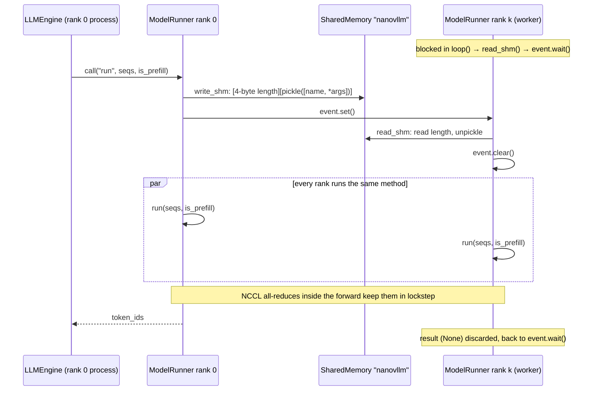

# Getting Data onto the GPU

> [!abstract] In one line
> `ModelRunner` turns a Python list of `Sequence` objects into flat GPU tensors plus a global `Context` of attention metadata, runs the model (eagerly for prefill, by CUDA graph replay for decode), samples tokens on rank 0, and relays every call to the tensor-parallel workers through shared memory.


## Why this exists

Everything up to now has been bookkeeping on the CPU. The scheduler ([[05 Scheduling - Continuous Batching]]) hands over a list of sequences and a flag saying "prefill" or "decode". The block manager ([[04 Memory - Paged KV Cache]]) has given each sequence a `block_table`, a list of block ids that says where its keys and values live. None of this is anything a GPU kernel can use. A kernel wants a few contiguous integer tensors: which token ids to embed, at which positions, where in the cache each new key/value must be written, and where each sequence starts and ends inside the flattened batch.

`ModelRunner` is the translation layer. It also owns the GPU itself: it starts the distributed process group, builds the model, decides how many KV-cache blocks fit in memory, allocates that cache, and records CUDA graphs so that decode steps (tiny batches of one token per sequence) are not dominated by kernel-launch overhead. Finally, when the model is split across several GPUs, rank 0 is the only process that talks to the scheduler, so it must forward each call to the other ranks. That is the shared-memory RPC at the top of the file.

`context.py` is the small companion: a global object that carries the attention metadata from `ModelRunner` down to the attention layers without passing it through every `forward` call.


---

## Part A: `nanovllm/utils/context.py`

### The fields of `Context`

*`nanovllm/utils/context.py` L1–16*
```python
from dataclasses import dataclass
import torch


@dataclass(slots=True)
class Context:
    is_prefill: bool = False
    cu_seqlens_q: torch.Tensor | None = None
    cu_seqlens_k: torch.Tensor | None = None
    max_seqlen_q: int = 0
    max_seqlen_k: int = 0
    slot_mapping: torch.Tensor | None = None
    context_lens: torch.Tensor | None = None
    block_tables: torch.Tensor | None = None

_CONTEXT = Context()
```

The **context** is everything the attention kernels need to know about the batch that is not in the token tensors themselves. The model's input is a single flat list of tokens (no padding, no batch dimension), so the attention layer needs a side channel that tells it how that flat list is cut into sequences and where the cache lives.

| Field | Used in | Shape / type | Meaning |
|---|---|---|---|
| `is_prefill` | both | `bool` | Chooses the kernel: `flash_attn_varlen_func` (prefill) or `flash_attn_with_kvcache` (decode). Also tells the LM head to keep only the last token of each sequence. |
| `cu_seqlens_q` | prefill | `int32 [B+1]` | Cumulative query lengths: sequence `i`'s new tokens are rows `cu_seqlens_q[i]:cu_seqlens_q[i+1]` of the flat batch. |
| `cu_seqlens_k` | prefill | `int32 [B+1]` | Cumulative key lengths: cached prefix plus new tokens. Equal to `cu_seqlens_q` unless some prefix is already in the cache. |
| `max_seqlen_q`, `max_seqlen_k` | prefill | `int` | Longest query / key length in the batch; FlashAttention uses them to size its launch grid. |
| `slot_mapping` | both | `int32 [N_new_tokens]` | For each new token, the flat index of the cache slot its K and V must be written into. `-1` means "don't write". |
| `context_lens` | decode | `int32 [B]` | Number of tokens each sequence attends over, including the one being decoded now. |
| `block_tables` | decode, and prefill with a cached prefix | `int32 [B, max_blocks]` | Each sequence's block table, padded with `-1`. |

`slots=True` gives the dataclass `__slots__`, so attribute access is a little faster and a typo such as `ctx.slot_maping = ...` raises instead of silently creating a new attribute. `_CONTEXT` is a module-level instance, one per process, so each tensor-parallel rank has its own.

### Getting, setting and resetting

*`nanovllm/utils/context.py` L18–27*
```python
def get_context():
    return _CONTEXT

def set_context(is_prefill, cu_seqlens_q=None, cu_seqlens_k=None, max_seqlen_q=0, max_seqlen_k=0, slot_mapping=None, context_lens=None, block_tables=None):
    global _CONTEXT
    _CONTEXT = Context(is_prefill, cu_seqlens_q, cu_seqlens_k, max_seqlen_q, max_seqlen_k, slot_mapping, context_lens, block_tables)

def reset_context():
    global _CONTEXT
    _CONTEXT = Context()
```

- `set_context` builds a fresh `Context` and rebinds the global. It never mutates the old one, so nothing that held a reference to a previous context sees it change under its feet.
- `get_context` must be called at use time (as `from ... import get_context` then `get_context()`), not cached at import time, because `_CONTEXT` is rebound.
- `reset_context` drops the references to the GPU tensors after each step so they can be freed, and so a stale context can never leak into the next step.

The life cycle for one step is always: `prepare_*` calls `set_context`, the model runs and its layers call `get_context`, then `run` calls `reset_context`.

> [!important] Why a global?
> The model's call signature is `model(input_ids, positions)`. The metadata is needed in exactly two places, deep inside: every `Attention.forward` (28 layers deep in Qwen3) and the LM head. Threading `slot_mapping`, `cu_seqlens_q`, `block_tables` and friends through `Qwen3ForCausalLM → Qwen3Model → DecoderLayer → Qwen3Attention → Attention` would put seven extra arguments on every `forward` in the model, most of which do nothing with them. It would also make the model incompatible with the standard "tokens in, hidden states out" signature that CUDA graph capture records. A per-process global is the simplest thing that works because a process only ever runs one batch at a time.

### How the context is consumed (a glance)

The details belong to [[07 Model Building Blocks]], but seeing the consumer makes the producer's job clear:

*`nanovllm/layers/attention.py` L59–75*
```python
    def forward(self, q: torch.Tensor, k: torch.Tensor, v: torch.Tensor):
        context = get_context()
        k_cache, v_cache = self.k_cache, self.v_cache
        if k_cache.numel() and v_cache.numel():
            store_kvcache(k, v, k_cache, v_cache, context.slot_mapping)
        if context.is_prefill:
            if context.block_tables is not None:    # prefix cache
                k, v = k_cache, v_cache
            o = flash_attn_varlen_func(q, k, v,
                                       max_seqlen_q=context.max_seqlen_q, cu_seqlens_q=context.cu_seqlens_q,
                                       max_seqlen_k=context.max_seqlen_k, cu_seqlens_k=context.cu_seqlens_k,
                                       softmax_scale=self.scale, causal=True, block_table=context.block_tables)
        else:    # decode
            o = flash_attn_with_kvcache(q.unsqueeze(1), k_cache, v_cache,
                                        cache_seqlens=context.context_lens, block_table=context.block_tables, 
                                        softmax_scale=self.scale, causal=True)
        return o
```

Three things to take away for this note:

1. **Write first, then read.** The new tokens' K and V are scattered into the cache at `slot_mapping` before attention runs. So by the time attention reads the cache, the current tokens are already in it.
2. **Prefill without a cached prefix** attends over the freshly computed `k, v` (contiguous, described by `cu_seqlens_k`). **Prefill with a cached prefix** swaps `k, v` for the whole paged cache and uses `block_tables` to find the old tokens. That is why `prepare_prefill` only builds `block_tables` when there is a prefix.
3. **Decode** always reads from the paged cache, using `context_lens` and `block_tables`.

The LM head (`nanovllm/layers/embed_head.py`) also reads the context: during prefill it keeps only rows `cu_seqlens_q[1:] - 1`, the last token of each sequence, because only those produce a next token.


---

## Part B: `nanovllm/engine/model_runner.py`

### Imports

*`nanovllm/engine/model_runner.py` L1–12*
```python
import pickle
import torch
import torch.distributed as dist
from multiprocessing.synchronize import Event
from multiprocessing.shared_memory import SharedMemory

from nanovllm.config import Config
from nanovllm.engine.sequence import Sequence
from nanovllm.models.qwen3 import Qwen3ForCausalLM
from nanovllm.layers.sampler import Sampler
from nanovllm.utils.context import set_context, get_context, reset_context
from nanovllm.utils.loader import load_model
```

`pickle`, `Event` and `SharedMemory` are for the rank 0 → worker RPC. `torch.distributed` is for NCCL. The rest you have met or will meet: the model and loader in [[08 The Full Model]], the sampler in [[07 Model Building Blocks]].


## 1. Construction: from nothing to a ready GPU

### Storing the configuration

*`nanovllm/engine/model_runner.py` L15–24*
```python
class ModelRunner:

    def __init__(self, config: Config, rank: int, event: Event | list[Event]):
        self.config = config
        hf_config = config.hf_config
        self.block_size = config.kvcache_block_size
        self.enforce_eager = config.enforce_eager
        self.world_size = config.tensor_parallel_size
        self.rank = rank
        self.event = event
```

One `ModelRunner` exists per GPU. `LLMEngine` ([[02 The Main Loop]]) spawns ranks `1 … N-1` as separate processes whose *target is this constructor*, then builds rank 0 in its own process:

```python
            process = ctx.Process(target=ModelRunner, args=(config, i, event))
            ...
        self.model_runner = ModelRunner(config, 0, self.events)
```

Hence the odd type of `event`: rank 0 gets the **list** of all workers' events (it signals them), and each worker gets **its own single** event (it waits on it). With one GPU the list is empty.

### Distributed init, default dtype/device, and building the model

*`nanovllm/engine/model_runner.py` L26–39*
```python
        dist.init_process_group("nccl", "tcp://localhost:2333", world_size=self.world_size, rank=rank)
        torch.cuda.set_device(rank)
        default_dtype = torch.get_default_dtype()
        torch.set_default_dtype(hf_config.dtype)
        torch.set_default_device("cuda")
        self.model = Qwen3ForCausalLM(hf_config)
        load_model(self.model, config.model)
        self.sampler = Sampler()
        self.warmup_model()
        self.allocate_kv_cache()
        if not self.enforce_eager:
            self.capture_cudagraph()
        torch.set_default_device("cpu")
        torch.set_default_dtype(default_dtype)
```

The order here matters; each step depends on the one before.

- **`init_process_group("nccl", "tcp://localhost:2333", ...)`**: every rank connects to a rendezvous at port 2333 on this machine. NCCL is NVIDIA's library for GPU-to-GPU collectives (all-reduce, gather); the tensor-parallel layers use it inside the forward pass. This runs even with `world_size=1`, because the parallel layers ask `dist.get_rank()` and `dist.get_world_size()` unconditionally.
- **`torch.cuda.set_device(rank)`**: rank `r` owns GPU `r`. Single-node only.
- **Default dtype and device**: with the default set to e.g. `bfloat16` on `cuda`, every `nn.Parameter` and every `torch.empty/zeros` created from here on is born on the GPU in the model's dtype. No full-precision CPU copy of the weights is ever materialised. The same trick means the KV cache in `allocate_kv_cache` and the static buffers in `capture_cudagraph` need no `device=` or `dtype=` arguments.
- **`load_model`** copies safetensors weights into the parameters ([[08 The Full Model]]).
- **`warmup_model` → `allocate_kv_cache` → `capture_cudagraph`**: warmup measures peak activation memory; the cache is sized from what is left; graphs are captured last because they bake in the addresses of the cache tensors, so the cache must exist first.
- **Restore the defaults** at the end, so that the metadata tensors built later in `prepare_*` are created on the CPU (in pinned memory) and then copied over.

### Shared memory: rank 0 creates, workers attach and never return

*`nanovllm/engine/model_runner.py` L41–48*
```python
        if self.world_size > 1:
            if rank == 0:
                self.shm = SharedMemory(name="nanovllm", create=True, size=2**20)
                dist.barrier()
            else:
                dist.barrier()
                self.shm = SharedMemory(name="nanovllm")
                self.loop()
```

- Rank 0 creates a 1 MiB named shared-memory segment `"nanovllm"`, then enters the barrier.
- Workers enter the barrier first, so they can only attach to the segment *after* rank 0 has created it. Without the barrier, a worker could try to open a segment that does not exist yet.
- Then each worker calls `self.loop()`, which only returns on `exit`. So for workers, the constructor *is* the process's whole life: it sits in `loop()` executing whatever rank 0 tells it to. Rank 0's constructor returns normally and the engine goes on to build the tokenizer and scheduler.

We come back to `loop`, `read_shm`, `write_shm` and `exit` in section 7.


## 2. Sizing and allocating the KV cache

### Warmup: measure the worst-case activation memory

*`nanovllm/engine/model_runner.py` L91–101*
```python
    def warmup_model(self):
        torch.cuda.empty_cache()
        torch.cuda.reset_peak_memory_stats()
        max_num_batched_tokens, max_model_len = self.config.max_num_batched_tokens, self.config.max_model_len
        seq_len = min(max_num_batched_tokens, max_model_len)
        num_seqs = min(max_num_batched_tokens // seq_len, self.config.max_num_seqs)
        seqs = [Sequence([0] * seq_len) for _ in range(num_seqs)]
        for seq in seqs:
            seq.num_scheduled_tokens = seq_len
        self.run(seqs, True)
        torch.cuda.empty_cache()
```

The goal: find out how much temporary memory (activations, attention workspace, logits) the largest possible step needs, so the KV cache doesn't steal it.

- `empty_cache` returns cached-but-unused blocks from PyTorch's allocator to the driver; `reset_peak_memory_stats` zeroes the high-water mark so the next measurement covers only the warmup.
- The largest prefill the scheduler will ever issue has `max_num_batched_tokens` tokens in total. With defaults (`16384`, `max_model_len=4096`): `seq_len = 4096`, `num_seqs = min(16384 // 4096, 512) = 4`. Four dummy prompts of 4096 zeros.
- `num_scheduled_tokens = seq_len` marks the whole prompt as scheduled, just as the scheduler would.
- `self.run(seqs, True)` does a real prefill. Two details make this safe before the cache exists: the dummy sequences have an empty `block_table`, so `prepare_prefill` skips the slot mapping (the `# warmup` branch below), and the attention layers still hold their empty placeholder `k_cache`, so `store_kvcache` is skipped (`if k_cache.numel() and v_cache.numel()`).
- The final `empty_cache` releases the activations back to the driver, so `mem_get_info` in the next function sees them as free.

### The memory budget arithmetic

*`nanovllm/engine/model_runner.py` L103–114*
```python
    def allocate_kv_cache(self):
        config = self.config
        hf_config = config.hf_config
        free, total = torch.cuda.mem_get_info()
        used = total - free
        peak = torch.cuda.memory_stats()["allocated_bytes.all.peak"]
        current = torch.cuda.memory_stats()["allocated_bytes.all.current"]
        num_kv_heads = hf_config.num_key_value_heads // self.world_size
        head_dim = getattr(hf_config, "head_dim", hf_config.hidden_size // hf_config.num_attention_heads)
        block_bytes = 2 * hf_config.num_hidden_layers * self.block_size * num_kv_heads * head_dim * hf_config.dtype.itemsize
        config.num_kvcache_blocks = int(total * config.gpu_memory_utilization - used - peak + current) // block_bytes
        assert config.num_kvcache_blocks > 0
```

Four numbers from two different views of memory:

- `free, total` come from the **CUDA driver** (`mem_get_info`): device-wide, so `used` includes the CUDA context, NCCL buffers, anything PyTorch has cached, and even other processes on the same GPU.
- `peak` and `current` come from **PyTorch's allocator**: `current` is what live tensors occupy now (essentially the weights), `peak` is the high-water mark during warmup (weights plus the biggest activations).

Then the per-block cost. A block holds `block_size` tokens; each token needs a K and a V vector (the `2`) of `num_kv_heads × head_dim` elements in each of the `L` layers. With tensor parallelism each rank stores only its share of the KV heads, hence `// self.world_size`.

$$
\text{block\_bytes} = 2 \cdot L \cdot B \cdot H_{kv} \cdot d_{head} \cdot s_{dtype}
$$

$$
N_{blocks} = \left\lfloor \frac{T \cdot u \;-\; \text{used} \;-\; \text{peak} \;+\; \text{current}}{\text{block\_bytes}} \right\rfloor
= \left\lfloor \frac{T \cdot u \;-\; \underbrace{(\text{used} - \text{current})}_{\text{non-PyTorch overhead}} \;-\; \underbrace{\text{peak}}_{\text{PyTorch at worst}}}{\text{block\_bytes}} \right\rfloor
$$

The second form is the clearest way to read it: of the allowed fraction $T \cdot u$ of the GPU, subtract whatever is not PyTorch tensors (`used - current`), subtract the most PyTorch ever needed at once (`peak`, which already includes the weights), and fill the rest with KV blocks.

**Worked example** (Qwen3-0.6B on an 80 GiB GPU, one rank; the memory readings are illustrative):

- Model: $L = 28$, $H_{kv} = 8$, $d_{head} = 128$, bf16 so $s = 2$, $B = 256$.
  $\text{block\_bytes} = 2 \cdot 28 \cdot 256 \cdot 8 \cdot 128 \cdot 2 = 29{,}360{,}128$ bytes $= 28$ MiB (that is 112 KiB per token).
- $T \cdot u = 80 \cdot 0.9 = 72$ GiB.
- Readings: `used` $= 2.5$ GiB (1.2 GiB weights + 1.3 GiB CUDA context and friends), `current` $= 1.2$ GiB, `peak` $= 4.2$ GiB (weights + 3 GiB of warmup activations).
- Budget $= 72 - 2.5 - 4.2 + 1.2 = 66.5$ GiB $= 68{,}096$ MiB.
- $N_{blocks} = \lfloor 68{,}096 / 28 \rfloor = 2432$ blocks, i.e. $2432 \times 256 = 622{,}592$ tokens of KV cache shared by all running sequences.

The result is written back into `config.num_kvcache_blocks`, which is how the `Scheduler`'s `BlockManager` (constructed afterwards in `LLMEngine`) learns how many blocks it may hand out. The `assert` fires if the model plus activations don't leave room for even one block.

> [!warning] `gpu_memory_utilization` is a fraction of the whole device
> Because `used` is measured device-wide, another process holding 20 GiB on the same GPU shrinks your cache by 20 GiB, and if it leaves too little the `assert` fails. The limit is "use at most this fraction of the card, all users included", not "use this fraction of what's free".

### The cache tensor and wiring it into the layers

*`nanovllm/engine/model_runner.py` L115–121*
```python
        self.kv_cache = torch.empty(2, hf_config.num_hidden_layers, config.num_kvcache_blocks, self.block_size, num_kv_heads, head_dim)
        layer_id = 0
        for module in self.model.modules():
            if hasattr(module, "k_cache") and hasattr(module, "v_cache"):
                module.k_cache = self.kv_cache[0, layer_id]
                module.v_cache = self.kv_cache[1, layer_id]
                layer_id += 1
```

One single allocation holds the whole cache, created on the GPU in the model dtype thanks to the defaults set in `__init__`:

```text
kv_cache: [2, num_layers, num_blocks, block_size, num_kv_heads, head_dim]
           │   │           │           │           └───────┬────────┘
           │   │           │           │           one token's K (or V) for one layer
           │   │           │           token offset inside the block
           │   │           block id  (the numbers in seq.block_table)
           │   layer
           0 = K, 1 = V

kv_cache[0, l]  → module.k_cache : [num_blocks, block_size, num_kv_heads, head_dim]
kv_cache[1, l]  → module.v_cache : [num_blocks, block_size, num_kv_heads, head_dim]
```

- `self.model.modules()` walks modules in definition order, so the `Attention` modules come out in layer order 0, 1, …, L-1.
- The `hasattr` test picks out exactly the `Attention` modules, which created `self.k_cache = self.v_cache = torch.tensor([])` as a placeholder. Until this loop runs they are empty, which is what let warmup skip the cache write.
- `self.kv_cache[0, layer_id]` is a **view**, not a copy. Each layer's slice is contiguous, so it can equally be seen as a flat array of `num_blocks × block_size` **slots**, each slot holding `num_kv_heads × head_dim` numbers. That flat view is what `store_kvcache` uses (it asserts `k_cache.stride(1) == D` and writes at offset `slot * D`), and it is why a single integer, the slot, is enough to address one token's K/V:

$$
\text{slot} = \text{block\_id} \cdot B + \text{offset\_in\_block}
$$

Note that the first dimension is K/V and the second is layer, so layer `l`'s K lives in one contiguous chunk and its V in another. The block ids in `seq.block_table` index the third dimension and are the same across all layers: block 7 means "slot range 7·B … 7·B+B-1 in every layer's K and V".


## 3. Preparing a prefill batch

### Padding block tables into a rectangle

*`nanovllm/engine/model_runner.py` L123–127*
```python
    def prepare_block_tables(self, seqs: list[Sequence]):
        max_len = max(len(seq.block_table) for seq in seqs)
        block_tables = [seq.block_table + [-1] * (max_len - len(seq.block_table)) for seq in seqs]
        block_tables = torch.tensor(block_tables, dtype=torch.int32, pin_memory=True).cuda(non_blocking=True)
        return block_tables
```

Block tables are ragged (a 10-token sequence needs more blocks than a 3-token one), but a tensor must be rectangular. Pad every row with `-1` to the longest. The kernel never reads the padding because the sequence lengths (`cu_seqlens_k` or `context_lens`) stop it first.

`pin_memory=True` + `.cuda(non_blocking=True)` is the transfer idiom used for every metadata tensor in this file. **Pinned** (page-locked) host memory can be read by the GPU's DMA engine directly, which makes the host-to-device copy faster and lets it run asynchronously: the CPU queues the copy and moves on to build the next tensor. CUDA stream ordering guarantees the copy completes before any kernel that uses the tensor.

### Walking the sequences: tokens, positions, cumulative lengths

*`nanovllm/engine/model_runner.py` L129–148*
```python
    def prepare_prefill(self, seqs: list[Sequence]):
        input_ids = []
        positions = []
        cu_seqlens_q = [0]
        cu_seqlens_k = [0]
        max_seqlen_q = 0
        max_seqlen_k = 0
        slot_mapping = []
        block_tables = None
        for seq in seqs:
            start = seq.num_cached_tokens
            seqlen_q = seq.num_scheduled_tokens
            end = start + seqlen_q
            seqlen_k = end
            input_ids.extend(seq[start:end])
            positions.extend(range(start, end))
            cu_seqlens_q.append(cu_seqlens_q[-1] + seqlen_q)
            cu_seqlens_k.append(cu_seqlens_k[-1] + seqlen_k)
            max_seqlen_q = max(seqlen_q, max_seqlen_q)
            max_seqlen_k = max(seqlen_k, max_seqlen_k)
```

The batch is **flattened**: all sequences' new tokens are concatenated into one 1-D list, with no padding. Padding would waste compute proportional to the length difference; the varlen FlashAttention kernel instead uses the cumulative-length arrays to find the boundaries.

For each sequence, the window of tokens to compute this step is `[start, end)`:

- `start = seq.num_cached_tokens`: tokens whose K/V are already in the cache and need not be recomputed. This is nonzero in two cases: a **prefix-cache hit** (the block manager found matching full blocks, [[04 Memory - Paged KV Cache]]) or a **later chunk of a chunked prefill** (a long prompt split across steps by the scheduler, [[05 Scheduling - Continuous Batching]]).
- `seqlen_q = seq.num_scheduled_tokens`: how many tokens the scheduler granted this step. These produce queries.
- `seqlen_k = end`: the keys each new token may attend to are *all* tokens `0 … end-1`, cached ones included.
- `input_ids` gets only the new tokens `seq[start:end]`, and `positions` gets their true positions `start … end-1`, not `0 … seqlen_q-1`. RoPE needs the absolute position, so a token at position 260 must be rotated as position 260 even if it is the first token computed this step.
- `cu_seqlens_q` / `cu_seqlens_k` are running sums: entry `i` is where sequence `i` starts in the flat query (resp. key) list; the last entry is the total.
- `max_seqlen_q` / `max_seqlen_k` are the per-batch maxima the kernel needs.

> [!important] `cu_seqlens_q` vs `cu_seqlens_k`
> Without any cached tokens, each sequence has as many keys as queries and the two arrays are identical. With a cached prefix, a sequence has *more* keys than queries: its 3 new tokens must also attend to the 4 cached ones. So `cu_seqlens_k[-1] > cu_seqlens_q[-1]` is exactly the test for "at least one sequence in this batch has cached tokens".

### Computing the slot mapping

*`nanovllm/engine/model_runner.py` L149–161*
```python
            if not seq.block_table:    # warmup
                continue
            start_block = start // self.block_size
            end_block = (end + self.block_size - 1) // self.block_size
            for i in range(start_block, end_block):
                slot_start = seq.block_table[i] * self.block_size
                if i == start_block:
                    slot_start += start % self.block_size
                if i != end_block - 1:
                    slot_end = seq.block_table[i] * self.block_size + self.block_size
                else:
                    slot_end = seq.block_table[i] * self.block_size + end - i * self.block_size
                slot_mapping.extend(range(slot_start, slot_end))
```

The **slot mapping** answers: for the `j`-th token in the flat batch, which cache slot does its K/V go into? Token at position `p` of a sequence lives in logical block `p // B` at offset `p % B`, and logical block `i` is physical block `seq.block_table[i]`:

$$
\text{slot}(p) = \text{block\_table}[\lfloor p / B \rfloor] \cdot B + (p \bmod B)
$$

Instead of computing this per token, the code walks block by block and emits contiguous ranges:

- `start_block` / `end_block`: the logical blocks that `[start, end)` touches (`end_block` is a ceiling division, exclusive).
- **First block**: start at offset `start % B` rather than 0. For a prefix-cache hit `start` is block-aligned so this adds 0; for a chunked-prefill continuation `start` can land mid-block.
- **Middle blocks**: the whole block, `[id·B, id·B + B)`.
- **Last block**: stop at offset `end - i·B`, which may be less than `B` if the sequence ends mid-block.
- The `# warmup` guard: warmup sequences have no blocks, so their `slot_mapping` stays empty and nothing is written (the cache doesn't exist yet anyway).

The invariant: `len(slot_mapping) == cu_seqlens_q[-1] == len(input_ids)`. `store_kvcache` asserts `slot_mapping.numel() == N`. (During warmup the mapping is empty, but so is the cache, so the store is skipped before that check.)

### When `block_tables` is passed, and shipping it all to the GPU

*`nanovllm/engine/model_runner.py` L162–170*
```python
        if cu_seqlens_k[-1] > cu_seqlens_q[-1]:    # prefix cache
            block_tables = self.prepare_block_tables(seqs)
        input_ids = torch.tensor(input_ids, dtype=torch.int64, pin_memory=True).cuda(non_blocking=True)
        positions = torch.tensor(positions, dtype=torch.int64, pin_memory=True).cuda(non_blocking=True)
        cu_seqlens_q = torch.tensor(cu_seqlens_q, dtype=torch.int32, pin_memory=True).cuda(non_blocking=True)
        cu_seqlens_k = torch.tensor(cu_seqlens_k, dtype=torch.int32, pin_memory=True).cuda(non_blocking=True)
        slot_mapping = torch.tensor(slot_mapping, dtype=torch.int32, pin_memory=True).cuda(non_blocking=True)
        set_context(True, cu_seqlens_q, cu_seqlens_k, max_seqlen_q, max_seqlen_k, slot_mapping, None, block_tables)
        return input_ids, positions
```

`block_tables` is built **only** if some sequence has cached tokens (a prefix-cache hit or a later chunk). The reason is in the attention layer shown earlier: in the no-cache case the keys for every query were all computed *in this very step*, so attention can read them from the contiguous `k, v` tensors, which is cheaper and simpler. When some keys were computed in an earlier step (or by another request that shared the prefix), they exist only in the paged cache, so attention must read `k_cache, v_cache` through `block_tables`. It is all-or-nothing for the batch: if one sequence has a prefix, the whole batch reads through the cache. That works because `store_kvcache` has already written every new token into the cache before the read.

Token ids and positions are `int64` (embedding and RoPE indexing); all metadata is `int32` (what FlashAttention expects). `context_lens` is `None` for prefill.

### Worked example: two sequences, one prefix-cache hit

Pretend `block_size = 4` for readability (the real one is 256 or a multiple).

- **Sequence A**: 10-token prompt `a0 … a9`, nothing cached. Block table `[7, 3, 9]`. `num_cached_tokens = 0`, `num_scheduled_tokens = 10`.
- **Sequence B**: 7-token prompt `b0 … b6`. Its first 4 tokens form a full block that matched a cached block (physical block 5), so `num_cached_tokens = 4`. Block table `[5, 2]`. `num_scheduled_tokens = 3`.

```text
A: positions 0 1 2 3 | 4 5 6 7 | 8 9 . .      block_table [7, 3, 9]
             new new.. all new  | new new
B: positions 0 1 2 3 | 4 5 6 .                block_table [5, 2]
             cached   | new new new
```

The loop:

| | `start` | `seqlen_q` | `end` = `seqlen_k` | `start_block` | `end_block` |
|---|---|---|---|---|---|
| A | 0 | 10 | 10 | 0 | 3 |
| B | 4 | 3 | 7 | 1 | 2 |

Slot ranges:

- A, `i=0` (block 7, first, not last): `[28, 32)` → 28 29 30 31
- A, `i=1` (block 3, middle): `[12, 16)` → 12 13 14 15
- A, `i=2` (block 9, last): `slot_end = 36 + 10 - 8 = 38` → 36 37
- B, `i=1` (block 2, both first and last): `slot_start = 8 + 4 % 4 = 8`, `slot_end = 8 + 7 - 4 = 11` → 8 9 10

Every array handed to the GPU:

```text
input_ids    = [a0 a1 a2 a3 a4 a5 a6 a7 a8 a9 | b4 b5 b6]         (13 tokens)
positions    = [ 0  1  2  3  4  5  6  7  8  9 |  4  5  6]
slot_mapping = [28 29 30 31 12 13 14 15 36 37 |  8  9 10]
cu_seqlens_q = [0, 10, 13]
cu_seqlens_k = [0, 10, 17]          # B has 7 keys: 4 cached + 3 new
max_seqlen_q = 10
max_seqlen_k = 10
block_tables = [[7, 3,  9],
                [5, 2, -1]]         # built because 17 > 13
context_lens = None
```

What the attention layer then does: it writes the 13 new K/V vectors into slots 28…37 and 8…10, then (because `block_tables` is set) runs varlen attention with queries from the flat batch and keys/values read from the paged cache. B's query `b4` (position 4) sees keys at B's positions 0…4: slots 20…23 from block 5 (written by some earlier request) plus slot 8, just written. Causality is aligned to the end of each key range, so the last query of each sequence sees all its keys.

If A had instead been a second chunk of a chunked prefill (say `num_cached_tokens = 6`, `num_scheduled_tokens = 4`), the same code would give `start = 6`, `positions = 6…9`, `seqlen_k = 10`, and the first slot would be `3·4 + 6 % 4 = 14`: a mid-block start, which is exactly what the `start % self.block_size` line is for.

> [!question] Check yourself
> In the example, why does B's `input_ids` start at `b4`, and what would go wrong if `positions` for B were `[0, 1, 2]`?
> > [!success]- Answer
> > `b0…b3` already have K/V in physical block 5, so recomputing them is wasted work; only their keys are needed, and those are read from the cache. With positions `[0, 1, 2]`, RoPE would rotate `b4…b6` as if they were the first three tokens, so their attention scores against the cached `b0…b3` (rotated with positions 0…3) would encode the wrong relative distances and the output would be wrong.


## 4. Preparing a decode batch

*`nanovllm/engine/model_runner.py` L172–188*
```python
    def prepare_decode(self, seqs: list[Sequence]):
        input_ids = []
        positions = []
        slot_mapping = []
        context_lens = []
        for seq in seqs:
            input_ids.append(seq.last_token)
            positions.append(len(seq) - 1)
            context_lens.append(len(seq))
            slot_mapping.append(seq.block_table[-1] * self.block_size + seq.last_block_num_tokens  - 1)
        input_ids = torch.tensor(input_ids, dtype=torch.int64, pin_memory=True).cuda(non_blocking=True)
        positions = torch.tensor(positions, dtype=torch.int64, pin_memory=True).cuda(non_blocking=True)
        slot_mapping = torch.tensor(slot_mapping, dtype=torch.int32, pin_memory=True).cuda(non_blocking=True)
        context_lens = torch.tensor(context_lens, dtype=torch.int32, pin_memory=True).cuda(non_blocking=True)
        block_tables = self.prepare_block_tables(seqs)
        set_context(False, slot_mapping=slot_mapping, context_lens=context_lens, block_tables=block_tables)
        return input_ids, positions
```

In decode, every sequence contributes **exactly one** token: the one sampled at the previous step. It has been appended to `token_ids`, but its K/V have not been computed yet. That is this step's job.

- `input_ids`: `seq.last_token`.
- `positions`: `len(seq) - 1`, the index of that last token.
- `context_lens`: `len(seq)`, the number of keys to attend over, which includes the new token itself (its K/V are written to the cache before attention reads it).
- `slot_mapping`: the new token is the last token of the last block, at offset `last_block_num_tokens - 1` of physical block `block_table[-1]`. The scheduler's `may_append` ([[04 Memory - Paged KV Cache]]) has already allocated a fresh block if this token starts one.
- `block_tables`: always needed, since all previous keys are in the paged cache.

No `cu_seqlens` are needed: with one query per sequence, the query for sequence `i` is simply row `i`.

**Example** (block size 4, continuing A and B a few steps later). A has 12 tokens, block table `[7, 3, 9]`. B has 9 tokens; since `9 % 4 == 1`, `may_append` gave it a new block 6, so its table is `[5, 2, 6]`.

```text
                A                          B
last_block_num_tokens   12 - 2·4 = 4        9 - 2·4 = 1
slot                    9·4 + 4 - 1 = 39     6·4 + 1 - 1 = 24

input_ids    = [A.last_token, B.last_token]
positions    = [11, 8]
context_lens = [12, 9]
slot_mapping = [39, 24]
block_tables = [[7, 3, 9],
                [5, 2, 6]]
```


## 5. Sampling inputs, running the model, and one full step

### Temperatures

*`nanovllm/engine/model_runner.py` L190–193*
```python
    def prepare_sample(self, seqs: list[Sequence]):
        temperatures = [seq.temperature for seq in seqs]
        temperatures = torch.tensor(temperatures, dtype=torch.float32, pin_memory=True).cuda(non_blocking=True)
        return temperatures
```

One temperature per sequence, as a `[B]` float tensor. The sampler divides each row of logits by its temperature ([[07 Model Building Blocks]]).

### `run_model`: eager path vs graph replay

*`nanovllm/engine/model_runner.py` L195–212*
```python
    @torch.inference_mode()
    def run_model(self, input_ids: torch.Tensor, positions: torch.Tensor, is_prefill: bool):
        if is_prefill or self.enforce_eager or input_ids.size(0) > 512:
            return self.model.compute_logits(self.model(input_ids, positions))
        else:
            bs = input_ids.size(0)
            context = get_context()
            graph = self.graphs[next(x for x in self.graph_bs if x >= bs)]
            graph_vars = self.graph_vars
            graph_vars["input_ids"][:bs] = input_ids
            graph_vars["positions"][:bs] = positions
            graph_vars["slot_mapping"].fill_(-1)
            graph_vars["slot_mapping"][:bs] = context.slot_mapping
            graph_vars["context_lens"].zero_()
            graph_vars["context_lens"][:bs] = context.context_lens
            graph_vars["block_tables"][:bs, :context.block_tables.size(1)] = context.block_tables
            graph.replay()
            return self.model.compute_logits(graph_vars["outputs"][:bs])
```

`@torch.inference_mode()` turns off autograd tracking entirely (cheaper than `no_grad`).

**Eager path** (a normal forward) is taken when:
- it's a **prefill**: the number of tokens varies wildly from step to step, and a CUDA graph is fixed to one shape. Prefill steps are also big enough that launch overhead is negligible compared with the math;
- the user asked for `enforce_eager` (useful for debugging, no graphs were captured);
- the decode batch has more than 512 sequences, the largest captured size.

**Graph path** (decode only):
- **Bucketing**: graphs exist only for certain batch sizes (`graph_bs`, e.g. `[1, 2, 4, 8, 16, 32, …, 512]`). `next(x for x in self.graph_bs if x >= bs)` picks the smallest one that fits. A batch of 37 runs the 48-graph; rows 37…47 are padding.
- **Copy into the static tensors**: a captured graph always reads from the same GPU addresses, so the new data must be copied *into* the buffers it was recorded with (`graph_vars`), not passed as new tensors.
- **Neutralising the padding rows**:
  - `slot_mapping.fill_(-1)` first: padding rows get slot `-1`, and the store kernel returns immediately on `-1`, so garbage from padding rows is never written into a real sequence's cache.
  - `context_lens.zero_()`: padding rows attend over zero keys.
  - `block_tables` only overwrites the top-left `[:bs, :ncols]` corner. Stale entries elsewhere (from earlier, larger batches) are harmless, because `context_lens` limits how far each row reads.
  - `input_ids` / `positions` of padding rows are stale too; they produce garbage hidden states that are simply sliced away.
- `graph.replay()` re-launches the whole recorded forward pass in one call.
- `graph_vars["outputs"][:bs]`: keep only the real rows, then `compute_logits` runs eagerly outside the graph.

### `run`: one full step

*`nanovllm/engine/model_runner.py` L214–220*
```python
    def run(self, seqs: list[Sequence], is_prefill: bool) -> list[int]:
        input_ids, positions = self.prepare_prefill(seqs) if is_prefill else self.prepare_decode(seqs)
        temperatures = self.prepare_sample(seqs) if self.rank == 0 else None
        logits = self.run_model(input_ids, positions, is_prefill)
        token_ids = self.sampler(logits, temperatures).tolist() if self.rank == 0 else None
        reset_context()
        return token_ids
```

This is the method `LLMEngine.step` invokes (through `call`, see below) on every rank.

1. Build the flat inputs and set the context.
2. Temperatures only on rank 0: with tensor parallelism the LM head gathers the full-vocabulary logits onto rank 0 only (other ranks get `None`), so only rank 0 samples.
3. Forward pass.
4. Sample on rank 0; `.tolist()` moves the ids to the CPU, which also synchronises with the GPU. Workers return `None`.
5. Clear the context.

During a chunked prefill, a sequence whose prompt isn't finished still gets a sampled token (the LM head takes the last row of every sequence). The scheduler's `postprocess` discards it, since that sequence has `num_cached_tokens < num_tokens`.


## 6. Capturing CUDA graphs for decode

### Why graphs help decode

A decode step computes one token per sequence. For a small model and a small batch, each kernel (a matmul, a norm, a RoPE, an attention call) finishes in a few microseconds, while the CPU needs a comparable time to launch it through Python and PyTorch's dispatcher. A forward pass is hundreds of kernels, so the GPU spends much of the step idle, waiting for the CPU. A **CUDA graph** records the sequence of kernel launches once, with all their arguments (including pointers to input and output buffers), and later replays the whole sequence with a single launch. The CPU cost of a step drops to "copy a few small tensors, call `replay()`".

The price: a graph is frozen. Same kernels, same shapes, same memory addresses. That explains every design choice below: fixed batch-size buckets, static input/output buffers, and a context that points into those static buffers.

### Static buffers and buckets

*`nanovllm/engine/model_runner.py` L222–236*
```python
    @torch.inference_mode()
    def capture_cudagraph(self):
        config = self.config
        hf_config = config.hf_config
        max_bs = min(self.config.max_num_seqs, 512)
        max_num_blocks = (config.max_model_len + self.block_size - 1) // self.block_size
        input_ids = torch.zeros(max_bs, dtype=torch.int64)
        positions = torch.zeros(max_bs, dtype=torch.int64)
        slot_mapping = torch.zeros(max_bs, dtype=torch.int32)
        context_lens = torch.zeros(max_bs, dtype=torch.int32)
        block_tables = torch.zeros(max_bs, max_num_blocks, dtype=torch.int32)
        outputs = torch.zeros(max_bs, hf_config.hidden_size)
        self.graph_bs = [1, 2, 4, 8] + list(range(16, max_bs + 1, 16))
        self.graphs = {}
        self.graph_pool = None
```

- `max_bs`: the largest decode batch that can occur (the scheduler never exceeds `max_num_seqs`), capped at 512.
- `max_num_blocks`: the most blocks any sequence can have (`max_model_len` rounded up to blocks). This is the width of the static `block_tables`, so any real block table fits in its top-left corner.
- The six static tensors are allocated **once**, at maximum size, on the GPU (default device is still `cuda` here). Every graph uses slices `[:bs]` of these same tensors, so `run_model` only ever has to fill one set of buffers. `outputs` holds the final hidden states, `[max_bs, hidden_size]`, in the model dtype.
- `graph_bs`: `[1, 2, 4, 8, 16, 32, 48, …, max_bs]`. Fine-grained at small sizes, where padding 3 up to 4 is cheap; steps of 16 above that. Capturing a graph for every size 1…512 would take long and use more memory; with these buckets a batch wastes at most 15 padded rows.

### The capture loop

*`nanovllm/engine/model_runner.py` L238–248*
```python
        for bs in reversed(self.graph_bs):
            graph = torch.cuda.CUDAGraph()
            set_context(False, slot_mapping=slot_mapping[:bs], context_lens=context_lens[:bs], block_tables=block_tables[:bs])
            outputs[:bs] = self.model(input_ids[:bs], positions[:bs])    # warmup
            with torch.cuda.graph(graph, self.graph_pool):
                outputs[:bs] = self.model(input_ids[:bs], positions[:bs])    # capture
            if self.graph_pool is None:
                self.graph_pool = graph.pool()
            self.graphs[bs] = graph
            torch.cuda.synchronize()
            reset_context()
```

For each bucket:

- `set_context(False, ...)` with **slices of the static buffers**. While capturing, the attention layers call `get_context()` and pass these tensors to their kernels, so the recorded graph points at the static `slot_mapping`, `context_lens`, `block_tables`. That is the link that makes `run_model`'s copies visible to a replay. It also points at each layer's `k_cache`/`v_cache`, which is why capture must happen after `allocate_kv_cache`.
- **Warmup run** before capture: the first call to some kernels triggers one-time work (Triton compilation and autotuning, cuBLAS workspace allocation, lazy initialisation) that must not be recorded into the graph.
- **Capture** inside `torch.cuda.graph(...)`: kernels are recorded, not executed. The result is written into `outputs[:bs]`, so the output address is fixed too.
- The inputs are all zeros during capture: `slot_mapping` is 0 and `context_lens` is 0. Since capture doesn't execute anything, the values don't matter, only the addresses and shapes. The warmup run does execute, writing zeros into slot 0 of the cache, which is harmless before any request exists.

**The shared memory pool.** Intermediate tensors inside a graph (activations between layers) must stay at fixed addresses, so each graph owns a private memory pool. Giving every graph its own pool would multiply the memory. Instead, the first graph's pool (`graph.pool()`) is passed to all later captures, so all graphs share one pool. This is safe because only one graph runs at a time. Capturing in `reversed` order, largest batch first, means the pool is sized by the biggest graph and the smaller ones fit inside the memory it already reserved.

`torch.cuda.synchronize()` makes sure capture has finished before moving on; `reset_context()` clears the context between buckets.

### Keeping handles to the static tensors

*`nanovllm/engine/model_runner.py` L250–257*
```python
        self.graph_vars = dict(
            input_ids=input_ids,
            positions=positions,
            slot_mapping=slot_mapping,
            context_lens=context_lens,
            block_tables=block_tables,
            outputs=outputs,
        )
```

These are the exact tensors the graphs were recorded against. `run_model` writes into them and reads `outputs` back. They must never be reallocated (e.g. by `graph_vars["input_ids"] = new_tensor`): only in-place writes such as `[:bs] = ...`, `fill_`, `zero_` keep the addresses the graph expects.

> [!warning] In-place or nothing
> If your version replaces a static tensor instead of copying into it, the graph silently keeps reading the old memory and you get outputs from stale inputs with no error. Every write to a graph input must be an in-place copy.

> [!question] Check yourself
> A decode batch has 37 sequences and `max_num_seqs = 512`. Which graph runs, and why doesn't the padding corrupt the KV cache?
> > [!success]- Answer
> > The 48 graph (first entry of `[1, 2, 4, 8, 16, 32, 48, …]` that is ≥ 37). Rows 37–47 have `slot_mapping = -1` (from `fill_(-1)`), and the store kernel skips slot `-1`, so their K/V are never written. Their `context_lens` are 0, so attention reads nothing for them, and their outputs are dropped by `outputs[:bs]`.


## 7. Talking to the workers: `call`, `write_shm`, `read_shm`, `loop`, `exit`

### The problem

With tensor parallelism, every rank must run the same method, with the same arguments, at the same time, because the forward pass contains NCCL collectives that block until all ranks join. But only rank 0 has a scheduler. So rank 0 needs a cheap way to say "run `run(seqs, is_prefill)` now" to every worker. nano-vLLM does this with a tiny RPC: pickle the method name and arguments, put the bytes in shared memory, and ring a per-worker `Event`.



### `call`: the single entry point

*`nanovllm/engine/model_runner.py` L85–89*
```python
    def call(self, method_name, *args):
        if self.world_size > 1 and self.rank == 0:
            self.write_shm(method_name, *args)
        method = getattr(self, method_name, None)
        return method(*args)
```

The engine never calls `run` or `exit` directly; it calls `self.model_runner.call("run", seqs, is_prefill)`. On rank 0 with workers, `call` first broadcasts the call, then executes it locally. On a worker (invoked from `loop`) or with a single GPU, it just executes locally. Methods are named by string so the same line works on both sides.

### `write_shm`: rank 0 publishes a call

*`nanovllm/engine/model_runner.py` L76–83*
```python
    def write_shm(self, method_name, *args):
        assert self.world_size > 1 and self.rank == 0
        data = pickle.dumps([method_name, *args])
        n = len(data)
        self.shm.buf[0:4] = n.to_bytes(4, "little")
        self.shm.buf[4:n+4] = data
        for event in self.event:
            event.set()
```

The wire format is a length-prefixed pickle:

```text
shm.buf (1 MiB)
┌──────────────┬──────────────────────────────────────┬─────────── ─ ─
│ n (4 bytes,  │ pickle.dumps(["run", seqs, True])    │ unused
│ little-end.) │ n bytes                              │
└──────────────┴──────────────────────────────────────┴─────────── ─ ─
 0            4                                      4+n
```

The length prefix is needed because the buffer is fixed-size and may still contain bytes from a previous, longer message. After writing, rank 0 sets every worker's event.

The payload stays small because `Sequence` defines `__getstate__` ([[03 Tracking a Request]]): it pickles only `num_tokens`, `num_prompt_tokens`, `num_cached_tokens`, `num_scheduled_tokens`, `block_table`, and either the full `token_ids` (prefill) or just `last_token` (decode). That is exactly what `prepare_prefill` and `prepare_decode` read. `temperature` is not sent, which is fine because only rank 0 calls `prepare_sample`.

> [!warning] 1 MiB is a hard ceiling
> `self.shm.buf[4:n+4] = data` fails if the pickled message exceeds `2**20 - 4` bytes. A large prefill batch carries every prompt's full token list, so if you raise `max_num_batched_tokens` a lot in your own version, size the segment accordingly.

### `read_shm` and `loop`: the worker side

*`nanovllm/engine/model_runner.py` L61–74*
```python
    def loop(self):
        while True:
            method_name, args = self.read_shm()
            self.call(method_name, *args)
            if method_name == "exit":
                break

    def read_shm(self):
        assert self.world_size > 1 and self.rank > 0
        self.event.wait()
        n = int.from_bytes(self.shm.buf[0:4], "little")
        method_name, *args = pickle.loads(self.shm.buf[4:n+4])
        self.event.clear()
        return method_name, args
```

- `event.wait()` blocks (without spinning) until rank 0 sets the event.
- Read the length, unpickle exactly `n` bytes, then `clear()` the event so the next `wait()` blocks until the *next* message.
- `loop` executes the method via `call` (on a worker, `call` skips the broadcast) and discards the return value. After executing `exit` it breaks, the constructor returns, and the worker process ends.

> [!important] Why there is no race on the single buffer
> There is one buffer and no acknowledgement, so what stops rank 0 overwriting message *k* before a worker has read it? The NCCL collectives. Rank 0 cannot finish `run` until every worker has joined the all-reduces inside the forward pass, and a worker only gets there after it has read and cleared. So by the time rank 0 returns from `call` and can write message *k+1*, every worker is done with message *k*. For `exit`, the `dist.barrier()` inside it plays the same role.

### `exit`: tearing down in the right order

*`nanovllm/engine/model_runner.py` L50–59*
```python
    def exit(self):
        if self.world_size > 1:
            self.shm.close()
            dist.barrier()
            if self.rank == 0:
                self.shm.unlink()
        if not self.enforce_eager:
            del self.graphs, self.graph_pool
        torch.cuda.synchronize()
        dist.destroy_process_group()
```

`LLMEngine.exit` (registered with `atexit`) calls `self.model_runner.call("exit")`, so rank 0 broadcasts `"exit"` and every rank runs this.

- Each rank `close()`s its own mapping of the segment. The barrier ensures everyone has closed before rank 0, the creator, `unlink()`s it (removes the name from the system). Unlinking earlier could pull the segment out from under a worker that is still reading.
- Graphs and their pool are deleted explicitly so their GPU memory is released before the process group goes away.
- `synchronize` waits for outstanding GPU work; `destroy_process_group` shuts down NCCL cleanly.

After this, the engine `join()`s the worker processes, which have just left `loop()`.

> [!warning] A subtlety with `Sequence.block_size` in workers
> `last_block_num_tokens` uses the class attribute `Sequence.block_size`, which `LLMEngine.__init__` sets from the config, but only in the rank 0 process. Workers are started with `spawn`, so they import `sequence.py` fresh and keep the default of 256. With the default `kvcache_block_size = 256` the two agree; if you ever allow other block sizes in your version, compute the decode slot from the runner's own `self.block_size`, or send the block size to the workers.


---

## Build it yourself

> [!tip] Build order
> Get single-GPU eager mode fully correct first (context, prefill, decode, KV cache), verify generations against Hugging Face, then add CUDA graphs, then tensor-parallel RPC. Each layer is much easier to debug when the ones below it are known to be right.

- [ ] `context.py`: a `Context` dataclass with the eight fields, plus `get_context` / `set_context` / `reset_context` over a module-level global.
- [ ] `ModelRunner.__init__`: init the process group, set the device, set the default dtype/device, build and load the model, then warmup → allocate cache → capture graphs, then restore the defaults.
- [ ] `warmup_model`: one prefill with `max_num_batched_tokens` dummy tokens, with peak stats reset beforehand and `empty_cache` after.
- [ ] `allocate_kv_cache`: compute `block_bytes`, apply the budget formula, write `num_kvcache_blocks` back into the config, allocate `[2, L, N, B, H_kv, d]`, and hand each attention layer its `[0, l]` / `[1, l]` views.
- [ ] `prepare_block_tables`, `prepare_prefill`, `prepare_decode`, `prepare_sample`. Test `prepare_prefill` on the two-sequence example above and compare every array.
- [ ] `run_model` (eager only at first) and `run`.
- [ ] `capture_cudagraph` plus the graph branch of `run_model`.
- [ ] `call`, `write_shm`, `read_shm`, `loop`, `exit` and the shared-memory setup in `__init__`.

Invariants your version must preserve:

- `len(input_ids) == len(positions) == len(slot_mapping) == cu_seqlens_q[-1]` in every prefill (except warmup, where the mapping is empty).
- `positions` are absolute positions in the sequence, starting at `num_cached_tokens`, never at 0 for a partially cached sequence.
- `slot = block_table[p // B] * B + p % B`, and each layer's cache slice must be contiguous so a slot is a flat index.
- New K/V are written to the cache before attention reads it; decode's `context_lens` counts the new token.
- `block_tables` must be set during prefill whenever `cu_seqlens_k[-1] > cu_seqlens_q[-1]`.
- The KV cache must exist before graph capture, and graph inputs must only ever be updated in place. Padding rows get `slot_mapping = -1` and `context_lens = 0`.
- The context is reset after every step.
- With several GPUs, every rank executes the same sequence of calls; rank 0 is the only one that samples.

← [[05 Scheduling - Continuous Batching]] | [[07 Model Building Blocks]] →
