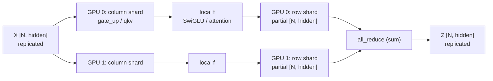

# Model Building Blocks: the Layers a Transformer Is Made Of

> [!abstract] In one line
> Seven small files give you every layer Qwen3 needs: fused activation and norm, RoPE, a sampler, tensor-parallel linears and embeddings, and an attention layer that writes into the paged KV cache and reads back from it with FlashAttention.

## Why this exists

A Hugging Face model is written for training: one GPU, padded batches, no cache that outlives a forward pass. An inference engine needs three things it does not have. First, the layers must run on **flat, unpadded batches**, where the tokens of many sequences are concatenated into one `[num_tokens, hidden]` tensor, as built in [[06 Getting Data onto the GPU]]. Second, attention must **read and write the paged KV cache** from [[04 Memory - Paged KV Cache]] instead of recomputing keys and values every step. Third, when the model is too big for one GPU, every weight matrix must be **sharded across GPUs** with as little communication as possible.

`nanovllm/layers/` is where those three needs are met. Every file here is small; most of the ideas are in how the pieces fit. We go from the simplest layers (activation, norm) through the math-heavy ones (RoPE, sampler) to the systems-heavy ones (tensor-parallel linears, embeddings, attention).

Throughout, `N` means the number of tokens in the flat batch, `B` the number of sequences, and `tp` the tensor-parallel world size.

---

## `activation.py`: SwiGLU in two lines

### `SiluAndMul`: split the last dimension, gate one half with the other

*`nanovllm/layers/activation.py` L1–11*
```python
import torch
from torch import nn
import torch.nn.functional as F


class SiluAndMul(nn.Module):

    @torch.compile
    def forward(self, x: torch.Tensor) -> torch.Tensor:
        x, y = x.chunk(2, -1)
        return F.silu(x) * y
```

Qwen3's MLP is a **SwiGLU** block:

$$
\text{MLP}(h) = W_\text{down}\big(\text{SiLU}(W_\text{gate}\,h) \odot (W_\text{up}\,h)\big), \qquad \text{SiLU}(z) = z \cdot \sigma(z) = \frac{z}{1+e^{-z}}
$$

Instead of two separate matmuls for gate and up, the model uses one matmul whose output is `[gate | up]` concatenated on the last dimension (that is `MergedColumnParallelLinear`, below). So the input here has shape `[N, 2I]`, where `I` is the intermediate size.

- `x.chunk(2, -1)` splits the last dim into two views of shape `[N, I]`: the first half is the gate, the second is the up projection.
- `F.silu(x) * y` is the elementwise gate. Output `[N, I]`.
- `@torch.compile` fuses the SiLU and the multiply into one kernel, so the `[N, I]` intermediate `silu(x)` never goes to GPU memory.

> [!important] The half-split must line up with how the weights were loaded
> `chunk(2, -1)` assumes the first half of the last dimension is *gate* and the second half is *up*, on every GPU. `MergedColumnParallelLinear` below is written precisely so that each rank's local output is `[gate_shard | up_shard]`. Keep that in mind when you get to it.

---

## `layernorm.py`: RMSNorm, with the residual add fused in

RMSNorm rescales each token vector to unit root-mean-square, then applies a learned per-channel gain $g$:

$$
\text{RMSNorm}(x)_j = \frac{x_j}{\sqrt{\frac{1}{d}\sum_{k=1}^{d} x_k^2 + \varepsilon}} \cdot g_j
$$

Unlike LayerNorm there is no mean subtraction and no bias.

### Parameters: just a gain vector

*`nanovllm/layers/layernorm.py` L1–14*
```python
import torch
from torch import nn


class RMSNorm(nn.Module):

    def __init__(
        self,
        hidden_size: int,
        eps: float = 1e-6,
    ) -> None:
        super().__init__()
        self.eps = eps
        self.weight = nn.Parameter(torch.ones(hidden_size))
```

`weight` is $g$, shape `[hidden_size]`, initialised to ones and overwritten by the checkpoint. Note that `hidden_size` does not have to be the model width: Qwen3 also uses `RMSNorm(head_dim)` on each head of q and k (see [[08 The Full Model]]), where the input is `[N, num_heads, head_dim]`. The norm always acts on the last dim, so both uses work.

### `rms_forward`: the plain norm

*`nanovllm/layers/layernorm.py` L16–26*
```python
    @torch.compile
    def rms_forward(
        self,
        x: torch.Tensor,
    ) -> torch.Tensor:
        orig_dtype = x.dtype
        x = x.float()
        var = x.pow(2).mean(dim=-1, keepdim=True)
        x.mul_(torch.rsqrt(var + self.eps))
        x = x.to(orig_dtype).mul_(self.weight)
        return x
```

- `x.float()`: squaring bf16 values and averaging thousands of them loses precision, so the statistic is computed in fp32.
- `var`: shape `[N, 1]`, the mean of squares ("var" is a slight misnomer; there is no mean subtraction).
- `x.mul_(torch.rsqrt(...))`: multiply by $1/\sqrt{\cdot}$. `rsqrt` is one instruction, cheaper than `sqrt` followed by a divide.
- Cast back to bf16, then apply the gain.

### `add_rms_forward`: residual add + norm in one pass

*`nanovllm/layers/layernorm.py` L28–40*
```python
    @torch.compile
    def add_rms_forward(
        self,
        x: torch.Tensor,
        residual: torch.Tensor,
    ) -> tuple[torch.Tensor, torch.Tensor]:
        orig_dtype = x.dtype
        x = x.float().add_(residual.float())
        residual = x.to(orig_dtype)
        var = x.pow(2).mean(dim=-1, keepdim=True)
        x.mul_(torch.rsqrt(var + self.eps))
        x = x.to(orig_dtype).mul_(self.weight)
        return x, residual
```

In a pre-norm transformer, every sublayer is followed by the same pattern: add the sublayer output to the residual stream, then normalise the result for the next sublayer. Written naively:

```text
residual = residual + x          # kernel 1: read x, read residual, write residual
h = rmsnorm(residual)            # kernel 2: read residual, write h
```

That is 3 reads and 2 writes of an `[N, hidden]` tensor. The fused version reads `x` and `residual` once, and writes both outputs, the new residual (`x + residual`, cast to bf16) and the normalised value, in the same kernel: 2 reads and 2 writes, and one kernel launch instead of two. These ops are memory-bound (a handful of FLOPs per byte), so bytes moved is the cost, and this happens twice per layer.

The function returns **both** tensors because the caller needs the new residual stream for the next add. This is why the decoder layer in `qwen3.py` threads a `residual` variable through every layer instead of doing `h = h + sublayer(h)`.

### `forward`: pick the path by whether a residual was passed

*`nanovllm/layers/layernorm.py` L42–50*
```python
    def forward(
        self,
        x: torch.Tensor,
        residual: torch.Tensor | None = None,
    ) -> torch.Tensor | tuple[torch.Tensor, torch.Tensor]:
        if residual is None:
            return self.rms_forward(x)
        else:
            return self.add_rms_forward(x, residual)
```

The very first layer has no residual yet (it is just the embedding), so it calls the plain path; every other norm call is the fused one.

> [!warning] In-place ops on a possibly-aliased tensor
> `x.float()` returns a *new* tensor when `x` is bf16, so `mul_` / `add_` are safe. If `x` were already fp32, `.float()` returns `x` itself and the in-place ops would mutate the caller's tensor. The engine always runs in bf16/fp16, so this never bites, but if you copy the trick into an fp32 test harness, remember it.

---

## `rotary_embedding.py`: RoPE

### The math: rotate each pair of channels by an angle proportional to position

Attention scores depend on $q_m \cdot k_n$. RoPE makes that dot product depend on positions only through $m - n$ by rotating $q$ and $k$ before the dot product. Split the head dimension $d$ into $d/2$ pairs. Pair $i$ gets a frequency

$$
\theta_i = \text{base}^{-2i/d}, \qquad i = 0, \dots, d/2 - 1
$$

and at position $m$ the pair $(x^{(1)}_i, x^{(2)}_i)$ is rotated by angle $m\theta_i$:

$$
\begin{pmatrix} y^{(1)}_i \\ y^{(2)}_i \end{pmatrix}
=
\begin{pmatrix} \cos m\theta_i & -\sin m\theta_i \\ \sin m\theta_i & \cos m\theta_i \end{pmatrix}
\begin{pmatrix} x^{(1)}_i \\ x^{(2)}_i \end{pmatrix}
$$

Since rotations compose, $R(m\theta)^\top R(n\theta) = R((n-m)\theta)$, so $\langle R_m q, R_n k\rangle = \langle q, R_{n-m} k\rangle$: only the relative offset survives. Low $i$ rotates fast (fine position), high $i$ rotates slowly (coarse position).

### `apply_rotary_emb`: the half-split layout

*`nanovllm/layers/rotary_embedding.py` L1–14*
```python
from functools import lru_cache
import torch
from torch import nn


def apply_rotary_emb(
    x: torch.Tensor,
    cos: torch.Tensor,
    sin: torch.Tensor,
) -> torch.Tensor:
    x1, x2 = torch.chunk(x.float(), 2, dim=-1)
    y1 = x1 * cos - x2 * sin
    y2 = x2 * cos + x1 * sin
    return torch.cat((y1, y2), dim=-1).to(x.dtype)
```

Which two channels form "pair $i$"? There are two conventions. The original paper pairs adjacent channels $(x_{2i}, x_{2i+1})$. Qwen, Llama (HF) and GPT-NeoX use the **half-split** layout: pair $i$ is $(x_i, x_{i + d/2})$.

```text
head_dim = 8, half-split pairing:

 x = [ x0  x1  x2  x3 | x4  x5  x6  x7 ]
       |   |   |   |    |   |   |   |
       +---|---|---|----+   |   |   |     pair 0 : (x0, x4), angle m*theta_0
           +---|---|--------+   |   |     pair 1 : (x1, x5), angle m*theta_1
               +---|------------+   |     pair 2 : (x2, x6)
                   +----------------+     pair 3 : (x3, x7)
```

This layout is fast: `chunk` gives two contiguous halves `x1`, `x2` (each `[..., d/2]`), and the rotation becomes four elementwise multiplies with no strided gathers. `y1 = x1 cos − x2 sin` and `y2 = x2 cos + x1 sin` are exactly the two rows of the rotation matrix above, applied to all pairs at once. The math is done in fp32 and cast back.

> [!warning] Use the layout the checkpoint was trained with
> Half-split and interleaved RoPE are not interchangeable. Loading a half-split model (Qwen3) with an interleaved implementation gives valid-looking but garbage output.

### Precomputing `cos_sin_cache` for every position

*`nanovllm/layers/rotary_embedding.py` L17–35*
```python
class RotaryEmbedding(nn.Module):

    def __init__(
        self,
        head_size: int,
        rotary_dim: int,
        max_position_embeddings: int,
        base: float,
    ) -> None:
        super().__init__()
        self.head_size = head_size
        assert rotary_dim == head_size
        inv_freq = 1.0 / (base**(torch.arange(0, rotary_dim, 2, dtype=torch.float) / rotary_dim))
        t = torch.arange(max_position_embeddings, dtype=torch.float)
        freqs = torch.einsum("i,j -> ij", t, inv_freq)
        cos = freqs.cos()
        sin = freqs.sin()
        cache = torch.cat((cos, sin), dim=-1).unsqueeze_(1)
        self.register_buffer("cos_sin_cache", cache, persistent=False)
```

The angles never change, so compute them once for every possible position. With `d = rotary_dim` and `P = max_position_embeddings`:

- `inv_freq`: `arange(0, d, 2) / d` is $2i/d$, so this is $\theta_i$. Shape `[d/2]`.
- `t`: positions $0..P-1$, shape `[P]`.
- `freqs = einsum("i,j -> ij")`: the outer product, $m\theta_i$. Shape `[P, d/2]`.
- `cache`: `[cos | sin]` concatenated, shape `[P, d]`, then `unsqueeze_(1)` gives `[P, 1, d]`. The `1` is a heads axis so it broadcasts over all heads.
- `register_buffer(..., persistent=False)`: moves with `.cuda()` / `.to()` like a parameter, but is not a trainable weight and is not expected in the checkpoint.
- `assert rotary_dim == head_size`: partial RoPE (rotating only some channels) is not supported. Qwen3 rotates all of them.

### `forward`: index the cache by position

*`nanovllm/layers/rotary_embedding.py` L37–48*
```python
    @torch.compile
    def forward(
        self,
        positions: torch.Tensor,
        query: torch.Tensor,
        key: torch.Tensor,
    ) -> tuple[torch.Tensor, torch.Tensor]:
        cos_sin = self.cos_sin_cache[positions]
        cos, sin = cos_sin.chunk(2, dim=-1)
        query = apply_rotary_emb(query, cos, sin)
        key = apply_rotary_emb(key, cos, sin)
        return query, key
```

This is why the model runner sends a `positions` tensor alongside `input_ids` ([[06 Getting Data onto the GPU]]). In a flat batch, token $j$'s position is not $j$: two sequences of lengths 3 and 2 give `positions = [0, 1, 2, 0, 1]`, and a decode step for sequences of length 17 and 5 gives `positions = [16, 4]`.

Shapes:

| tensor | shape |
|---|---|
| `positions` | `[N]` |
| `cos_sin` | `[N, 1, d]` |
| `cos`, `sin` | `[N, 1, d/2]` |
| `query` | `[N, num_heads, d]` |
| `key` | `[N, num_kv_heads, d]` |

`cos` broadcasts across the heads axis, so one lookup serves every q and k head. `@torch.compile` fuses the gather and the elementwise rotation of both tensors.

### `get_rope`: one shared instance

*`nanovllm/layers/rotary_embedding.py` L51–59*
```python
@lru_cache(1)
def get_rope(
    head_size: int,
    rotary_dim: int,
    max_position: int,
    base: float,
):
    rotary_emb = RotaryEmbedding(head_size, rotary_dim, max_position, base)
    return rotary_emb
```

Every attention layer calls `get_rope` with the same arguments. `lru_cache(1)` memoises the last call, so all 28 (or however many) layers get **the same module** and there is one `cos_sin_cache` in GPU memory instead of one per layer. With `P = 40960` and `d = 128` in fp32 that is 20 MB saved per layer.

---

## `sampler.py`: sampling with the exponential trick

### The code

*`nanovllm/layers/sampler.py` L1–12*
```python
import torch
from torch import nn


class Sampler(nn.Module):

    @torch.compile
    def forward(self, logits: torch.Tensor, temperatures: torch.Tensor):
        logits = logits.float().div_(temperatures.unsqueeze(dim=1))
        probs = torch.softmax(logits, dim=-1)
        sample_tokens = probs.div_(torch.empty_like(probs).exponential_(1).clamp_min_(1e-10)).argmax(dim=-1)
        return sample_tokens
```

- `logits`: `[B, V]`, one row per sequence (the LM head already kept only the last token of each sequence). `temperatures`: `[B]`, one per sequence, because every request brings its own `SamplingParams`.
- `div_(temperatures.unsqueeze(dim=1))`: `[B, 1]` broadcasts across the vocab. $\text{softmax}(z/T)$.
- `probs`: `[B, V]`.
- The last line draws $E_i \sim \text{Exp}(1)$ independently for every entry, computes $p_i / E_i$, and takes the argmax per row. Output `[B]` token ids.

There is no `torch.multinomial`. Instead:

$$
\arg\max_i \frac{p_i}{E_i}, \quad E_i \overset{\text{iid}}{\sim} \text{Exp}(1) \qquad \text{is distributed exactly as} \qquad i \sim \text{Categorical}(p)
$$

### Why the trick is correct

$\arg\max_i p_i/E_i = \arg\min_i E_i/p_i$. If $E_i \sim \text{Exp}(1)$ then $X_i = E_i / p_i \sim \text{Exp}(\text{rate } p_i)$, because $P(X_i > x) = P(E_i > p_i x) = e^{-p_i x}$.

So we are asking: among independent exponential clocks with rates $p_1, \dots, p_V$, which rings first? The minimum $\min_{j \ne i} X_j$ is exponential with rate $\sum_{j\ne i} p_j = 1 - p_i$, so

$$
P(X_i \text{ is smallest}) = \int_0^\infty p_i e^{-p_i x}\, e^{-(1-p_i)x}\, dx = p_i \int_0^\infty e^{-x}\, dx = p_i .
$$

That is exactly categorical sampling. (Taking logs, $\log p_i - \log E_i$ and $-\log E_i$ is a standard Gumbel variable, so this is the **Gumbel-max trick** in multiplicative form.)

Why bother: `argmax` and elementwise ops are trivially parallel and compile into one fused kernel with the softmax; `multinomial` needs a cumulative sum and a search, and it involves a host sync in some PyTorch paths. `clamp_min_(1e-10)` guards against drawing an exact 0, which would give `p/0 = inf`.

### Why temperature 0 is forbidden

Greedy decoding would be temperature 0, and this sampler has no special case for it: `logits / 0` produces `inf` / `nan`, and softmax of that is `nan`. Rather than add a branch, the engine rejects it at the door:

*`nanovllm/sampling_params.py`* (from [[01 Entry Points and Settings]])
```python
    def __post_init__(self):
        assert self.temperature > 1e-10, "greedy sampling is not permitted"
```

A very small temperature still works and behaves almost greedily: $p$ becomes nearly one-hot, and $p_\text{max}/E$ beats $p_\text{other}/E'$ with overwhelming probability.

> [!note] Sampling only happens on rank 0
> In `model_runner.py` only rank 0 calls the sampler (`token_ids = self.sampler(logits, temperatures).tolist() if self.rank == 0 else None`), which matches the LM head below gathering full logits to rank 0 only.

---

## `linear.py`: tensor parallelism from the ground up

### The problem

A linear layer computes $Y = X W^\top$ with `F.linear(x, W)`, where PyTorch stores `W` as `[out_features, in_features]`. When one GPU cannot hold all the weights, or we want several GPUs working on one forward pass, we split each `W` across `tp` GPUs. There are only two ways to slice a matrix:

**Column parallel: split the outputs.** Each GPU holds a slice of the rows of `W` (rows of `W` = output features = columns of $W^\top$, hence the name). Every GPU sees the full input `X` and produces a slice of the output features. No communication needed: each GPU just ends up owning part of $Y$.

```text
Column parallel, tp = 2        W: [out, in] split on dim 0

        W (out x in)                         X: [N, in] (full, on both GPUs)
   +------------------+
   |   W_0  (out/2)   |  -> GPU 0 :  Y_0 = X W_0^T   [N, out/2]
   +------------------+
   |   W_1  (out/2)   |  -> GPU 1 :  Y_1 = X W_1^T   [N, out/2]
   +------------------+
                              Y = [Y_0 | Y_1]  (never assembled)
```

**Row parallel: split the inputs.** Each GPU holds a slice of the columns of `W` (input features) and must receive the matching slice of `X`. Each GPU computes a full-width but *partial* output; the true output is the sum over GPUs, so this needs an **all-reduce**.

```text
Row parallel, tp = 2           W: [out, in] split on dim 1

      W (out x in)
   +---------+---------+
   |  W_0    |   W_1   |          X = [X_0 | X_1], X_r: [N, in/2]
   | (in/2)  |  (in/2) |
   +---------+---------+
   GPU 0: P_0 = X_0 W_0^T   [N, out]   (partial)
   GPU 1: P_1 = X_1 W_1^T   [N, out]   (partial)
   all_reduce:  Y = P_0 + P_1          on both GPUs
```

### Column then row: one all-reduce per block

Put them back to back. Column parallel leaves GPU $r$ holding $Y_r$, a slice of the output features. That is *exactly* the input slice a row-parallel layer wants. So the pattern is:

$$
Z = f(X A^\top) B^\top, \quad A = \begin{pmatrix}A_0 \\ A_1\end{pmatrix}, \; B = \begin{pmatrix}B_0 & B_1\end{pmatrix}
\;\Rightarrow\;
Z = f(X A_0^\top) B_0^\top + f(X A_1^\top) B_1^\top
$$

This works as long as $f$ acts **independently on each output feature** (or on groups that live on the same GPU). Then each GPU computes its own term with zero communication, and one all-reduce at the end sums them.

- **MLP**: $A$ = gate_up (column), $f$ = SwiGLU, $B$ = down (row). SwiGLU pairs gate channel $j$ with up channel $j$; the loader puts both on the same GPU.
- **Attention**: $A$ = qkv (column, split by heads), $f$ = RoPE + attention, $B$ = o_proj (row). Attention heads are fully independent, so each GPU runs attention for its own heads.

So each transformer layer costs exactly **two all-reduces** (one after attention, one after the MLP), each of size `[N, hidden]`. Everything else (norms, residual adds) runs replicated on every GPU on the full `[N, hidden]` tensor.



With that picture, the code is short.

### `divide` and `LinearBase`: every layer knows its shard dimension

*`nanovllm/layers/linear.py` L1–34*
```python
import torch
from torch import nn
import torch.nn.functional as F
import torch.distributed as dist


def divide(numerator, denominator):
    assert numerator % denominator == 0
    return numerator // denominator


class LinearBase(nn.Module):

    def __init__(
        self,
        input_size: int,
        output_size: int,
        bias: bool = False,
        tp_dim: int | None = None,
    ):
        super().__init__()
        self.tp_dim = tp_dim
        self.tp_rank = dist.get_rank()
        self.tp_size = dist.get_world_size()
        self.weight = nn.Parameter(torch.empty(output_size, input_size))
        self.weight.weight_loader = self.weight_loader
        if bias:
            self.bias = nn.Parameter(torch.empty(output_size))
            self.bias.weight_loader = self.weight_loader
        else:
            self.register_parameter("bias", None)

    def forward(self, x: torch.Tensor) -> torch.Tensor:
        raise NotImplementedError
```

- `divide` insists on exact division: every shard must be the same size.
- `tp_dim`: which dim of `weight` is sharded. `0` for column parallel, `1` for row parallel, `None` for replicated.
- `tp_rank`, `tp_size`: read from `torch.distributed`, which the model runner initialises before building the model ([[06 Getting Data onto the GPU]]). Even with one GPU, a process group of size 1 exists, so these calls always work.
- `torch.empty(output_size, input_size)`: the parameter is created **already at shard size** (subclasses pass the divided sizes). The full matrix never exists on any GPU.
- `self.weight.weight_loader = self.weight_loader`: attach a function *to the parameter object itself*. The checkpoint loader (`utils/loader.py`, [[08 The Full Model]]) finds each parameter by name and calls `param.weight_loader(param, full_tensor_from_disk)`. Each layer type thus decides how to cut its own slice out of the full checkpoint tensor.

### `ReplicatedLinear`: the no-op baseline

*`nanovllm/layers/linear.py` L37–51*
```python
class ReplicatedLinear(LinearBase):

    def __init__(
        self,
        input_size: int,
        output_size: int,
        bias: bool = False,
    ):
        super().__init__(input_size, output_size, bias)

    def weight_loader(self, param: nn.Parameter, loaded_weight: torch.Tensor):
        param.data.copy_(loaded_weight)

    def forward(self, x: torch.Tensor) -> torch.Tensor:
        return F.linear(x, self.weight, self.bias)
```

Every GPU holds the full matrix and copies the whole checkpoint tensor. Qwen3 does not use it; it is here for completeness and as the simplest example of the `weight_loader` contract.

### `ColumnParallelLinear`: shard dim 0, narrow the checkpoint

*`nanovllm/layers/linear.py` L54–73*
```python
class ColumnParallelLinear(LinearBase):

    def __init__(
        self,
        input_size: int,
        output_size: int,
        bias: bool = False,
    ):
        tp_size = dist.get_world_size()
        super().__init__(input_size, divide(output_size, tp_size), bias, 0)

    def weight_loader(self, param: nn.Parameter, loaded_weight: torch.Tensor):
        param_data = param.data
        shard_size = param_data.size(self.tp_dim)
        start_idx = self.tp_rank * shard_size
        loaded_weight = loaded_weight.narrow(self.tp_dim, start_idx, shard_size)
        param_data.copy_(loaded_weight)

    def forward(self, x: torch.Tensor) -> torch.Tensor:
        return F.linear(x, self.weight, self.bias)
```

- The local weight is `[out/tp, in]`, sharded on `tp_dim = 0`.
- `weight_loader`: rank $r$ takes rows `[r * shard_size, (r+1) * shard_size)` of the checkpoint. `narrow(dim, start, length)` is a zero-copy view; only `copy_` moves data. The same function works for the bias (1-D, dim 0 is its only dim).
- `forward`: a plain local matmul. Input `[N, in]` (full), output `[N, out/tp]` (this rank's slice). No communication.

Example: `out = 6144`, `tp = 2`. Rank 0 loads rows 0–3071, rank 1 loads rows 3072–6143.

### `MergedColumnParallelLinear`: gate and up in one matrix, sharded the right way

*`nanovllm/layers/linear.py` L76–93*
```python
class MergedColumnParallelLinear(ColumnParallelLinear):

    def __init__(
        self,
        input_size: int,
        output_sizes: list[int],
        bias: bool = False,
    ):
        self.output_sizes = output_sizes
        super().__init__(input_size, sum(output_sizes), bias)

    def weight_loader(self, param: nn.Parameter, loaded_weight: torch.Tensor, loaded_shard_id: int):
        param_data = param.data
        shard_offset = sum(self.output_sizes[:loaded_shard_id]) // self.tp_size
        shard_size = self.output_sizes[loaded_shard_id] // self.tp_size
        param_data = param_data.narrow(self.tp_dim, shard_offset, shard_size)
        loaded_weight = loaded_weight.chunk(self.tp_size, self.tp_dim)[self.tp_rank]
        param_data.copy_(loaded_weight)
```

The checkpoint stores `gate_proj` and `up_proj` as separate `[I, hidden]` tensors. The model fuses them into one `gate_up_proj` with `output_sizes = [I, I]` so one matmul does both. The loader is called twice, once per checkpoint tensor, with `loaded_shard_id` 0 (gate) or 1 (up), via the model's `packed_modules_mapping` (`"gate_proj": ("gate_up_proj", 0)`, `"up_proj": ("gate_up_proj", 1)`).

Why not simply concatenate gate and up and then take the rank's contiguous chunk of rows? Because with `tp = 2`, rank 0 would get all of gate and rank 1 all of up, and SwiGLU could not run locally. Instead, each rank's local weight is laid out as `[my gate slice | my up slice]`:

```text
I = 3072, tp = 2; local weight per rank = [2I/tp, hidden] = [3072, hidden]

checkpoint gate [3072, h]        checkpoint up [3072, h]
 +------------+                   +------------+
 | gate rows  |  -> rank 0        |  up rows   |  -> rank 0
 |   0..1535  |                   |   0..1535  |
 +------------+                   +------------+
 | gate rows  |  -> rank 1        |  up rows   |  -> rank 1
 | 1536..3071 |                   | 1536..3071 |
 +------------+                   +------------+

rank 0 local:  [ gate 0..1535    | up 0..1535    ]   rows 0..1535 | 1536..3071
rank 1 local:  [ gate 1536..3071 | up 1536..3071 ]
```

- `shard_offset = sum(output_sizes[:id]) // tp_size`: where this sub-matrix starts **in the local weight**. Gate: `0`. Up: `3072 // 2 = 1536`.
- `shard_size = output_sizes[id] // tp_size`: `1536` rows.
- `param_data.narrow(...)`: view of the destination region in the local weight.
- `loaded_weight.chunk(tp_size, tp_dim)[tp_rank]`: this rank's slice of the source checkpoint tensor.

Local output is `[N, 2I/tp]` = `[gate_r | up_r]`, which is exactly what `SiluAndMul`'s `chunk(2, -1)` expects. Gate channel $j$ and up channel $j$ are on the same GPU.

### `QKVParallelLinear`: q, k, v fused, sharded by heads

*`nanovllm/layers/linear.py` L96–112*
```python
class QKVParallelLinear(ColumnParallelLinear):

    def __init__(
        self,
        hidden_size: int,
        head_size: int,
        total_num_heads: int,
        total_num_kv_heads: int | None = None,
        bias: bool = False,
    ):
        tp_size = dist.get_world_size()
        total_num_kv_heads = total_num_kv_heads or total_num_heads
        self.head_size = head_size
        self.num_heads = divide(total_num_heads, tp_size)
        self.num_kv_heads = divide(total_num_kv_heads, tp_size)
        output_size = (total_num_heads + 2 * total_num_kv_heads) * self.head_size
        super().__init__(hidden_size, output_size, bias)
```

Same idea as the merged MLP, with three sub-matrices of different sizes. With grouped-query attention (GQA) there are fewer k/v heads than q heads.

- `total_num_kv_heads or total_num_heads`: if not given, plain multi-head attention.
- `num_heads`, `num_kv_heads`: heads **per rank**. `divide` requires both to split evenly; unlike full vLLM, nano-vllm does not replicate kv heads when `tp > num_kv_heads`.
- `output_size`: the full fused width; `ColumnParallelLinear` divides it by `tp`.

Concrete (Qwen3-0.6B-like): 16 q heads, 8 kv heads, head_size 128, `tp = 2`. Per rank: `num_heads = 8`, `num_kv_heads = 4`. Full output `(16 + 16) * 128 = 4096`, local `2048`.

### The q/k/v shard offsets

*`nanovllm/layers/linear.py` L114–128*
```python
    def weight_loader(self, param: nn.Parameter, loaded_weight: torch.Tensor, loaded_shard_id: str):
        param_data = param.data
        assert loaded_shard_id in ["q", "k", "v"]
        if loaded_shard_id == "q":
            shard_size = self.num_heads * self.head_size
            shard_offset = 0
        elif loaded_shard_id == "k":
            shard_size = self.num_kv_heads * self.head_size
            shard_offset = self.num_heads * self.head_size
        else:
            shard_size = self.num_kv_heads * self.head_size
            shard_offset = self.num_heads * self.head_size + self.num_kv_heads * self.head_size
        param_data = param_data.narrow(self.tp_dim, shard_offset, shard_size)
        loaded_weight = loaded_weight.chunk(self.tp_size, self.tp_dim)[self.tp_rank]
        param_data.copy_(loaded_weight)
```

The local weight on every rank is `[q heads | k heads | v heads]` for *this rank's* heads. In the example:

```text
local qkv weight rows (per rank), head_size = 128

 0            1024          1536          2048
 +-------------+-------------+-------------+
 | q: 8 heads  | k: 4 heads  | v: 4 heads  |
 +-------------+-------------+-------------+
 rank 0 holds q heads 0-7,  kv heads 0-3
 rank 1 holds q heads 8-15, kv heads 4-7
```

- `q`: offset 0, size `8 * 128 = 1024`.
- `k`: offset `1024`, size `4 * 128 = 512`.
- `v`: offset `1024 + 512 = 1536`, size `512`.
- `loaded_weight.chunk(tp_size, 0)[tp_rank]`: q_proj `[2048, h]` is chunked into two `[1024, h]` slices, i.e. heads 0–7 and 8–15. Because heads are contiguous blocks of `head_size` rows, chunking rows chunks heads.

Rank 1 gets q heads 8–15 and kv heads 4–7. With 2 q heads per kv head, q heads 8–15 are exactly the ones that attend to kv heads 4–7, so GQA grouping stays local. In `qwen3.py` the local output is then split as `qkv.split([q_size, kv_size, kv_size], dim=-1)` and viewed as `[N, num_heads, head_dim]` and `[N, num_kv_heads, head_dim]`.

### `RowParallelLinear`: shard dim 1, bias once, all-reduce

*`nanovllm/layers/linear.py` L131–156*
```python
class RowParallelLinear(LinearBase):

    def __init__(
        self,
        input_size: int,
        output_size: int,
        bias: bool = False,
    ):
        tp_size = dist.get_world_size()
        super().__init__(divide(input_size, tp_size), output_size, bias, 1)

    def weight_loader(self, param: nn.Parameter, loaded_weight: torch.Tensor):
        param_data = param.data
        if param_data.ndim == 1:
            param_data.copy_(loaded_weight)
            return
        shard_size = param_data.size(self.tp_dim)
        start_idx = self.tp_rank * shard_size
        loaded_weight = loaded_weight.narrow(self.tp_dim, start_idx, shard_size)
        param_data.copy_(loaded_weight)

    def forward(self, x: torch.Tensor) -> torch.Tensor:
        y = F.linear(x, self.weight, self.bias if self.tp_rank == 0 else None)
        if self.tp_size > 1:
            dist.all_reduce(y)
        return y
```

- Local weight `[out, in/tp]`, sharded on `tp_dim = 1`.
- `weight_loader`: the bias is 1-D and has shape `[out]`, which is not sharded, so it is copied whole (`ndim == 1` branch). The weight is narrowed on columns.
- `forward`: input `x` is `[N, in/tp]`, which is precisely the output of the preceding column-parallel layer (after SwiGLU or attention). Output is a partial `[N, out]`.
- `self.bias if self.tp_rank == 0 else None`: every rank's partial output is summed by the all-reduce. If every rank added the bias, the result would contain `tp * bias`. So only rank 0 adds it.
- `dist.all_reduce(y)`: in-place sum across ranks (default op is SUM). Afterwards every rank has the full, identical `[N, out]`. Skipped when `tp = 1`.

> [!important] The one invariant of this file
> After every row-parallel layer, all ranks hold identical activations. Everything that is not a linear (norms, residual adds, RoPE tables) is simply replicated and computed redundantly on each rank. Communication happens only inside `RowParallelLinear` and the two vocab-parallel layers below.

---

## `embed_head.py`: splitting the vocabulary

The embedding table and the LM head are `[V, hidden]` with `V ≈ 152k` for Qwen3: the largest matrices in a small model. Both are sharded along the vocab dimension.

### `VocabParallelEmbedding`: each rank owns a vocab range

*`nanovllm/layers/embed_head.py` L1–32*
```python
import torch
from torch import nn
import torch.nn.functional as F
import torch.distributed as dist

from nanovllm.utils.context import get_context


class VocabParallelEmbedding(nn.Module):

    def __init__(
        self,
        num_embeddings: int,
        embedding_dim: int,
    ):
        super().__init__()
        self.tp_rank = dist.get_rank()
        self.tp_size = dist.get_world_size()
        assert num_embeddings % self.tp_size == 0
        self.num_embeddings = num_embeddings
        self.num_embeddings_per_partition = self.num_embeddings // self.tp_size
        self.vocab_start_idx = self.num_embeddings_per_partition * self.tp_rank
        self.vocab_end_idx = self.vocab_start_idx + self.num_embeddings_per_partition
        self.weight = nn.Parameter(torch.empty(self.num_embeddings_per_partition, embedding_dim))
        self.weight.weight_loader = self.weight_loader

    def weight_loader(self, param: nn.Parameter, loaded_weight: torch.Tensor):
        param_data = param.data
        shard_size = param_data.size(0)
        start_idx = self.tp_rank * shard_size
        loaded_weight = loaded_weight.narrow(0, start_idx, shard_size)
        param_data.copy_(loaded_weight)
```

Rank $r$ owns token ids `[vocab_start_idx, vocab_end_idx)` and stores those rows, `[V/tp, hidden]`. With `V = 151936`, `tp = 2`: rank 0 owns ids 0–75967, rank 1 owns 75968–151935. The loader is the same narrow-on-dim-0 as column parallel.

### `forward`: mask, look up, zero, all-reduce

*`nanovllm/layers/embed_head.py` L34–42*
```python
    def forward(self, x: torch.Tensor):
        if self.tp_size > 1:
            mask = (x >= self.vocab_start_idx) & (x < self.vocab_end_idx)
            x = mask * (x - self.vocab_start_idx)
        y = F.embedding(x, self.weight)
        if self.tp_size > 1:
            y = mask.unsqueeze(1) * y
            dist.all_reduce(y)
        return y
```

Every rank receives the same `input_ids` `[N]`, but can only embed the ids it owns.

- `mask`: `[N]` bool, true where the id is in this rank's range.
- `x = mask * (x - start)`: in-range ids become local row indices; out-of-range ids become 0 (a valid index, so `F.embedding` does not fault).
- `y = F.embedding(...)`: `[N, hidden]`. Rows for foreign ids are garbage (row 0).
- `mask.unsqueeze(1) * y`: `[N, 1]` broadcast zeroes those rows.
- `all_reduce`: every token id is owned by exactly one rank, so the sum over ranks is the correct embedding, now replicated everywhere.

Example, `tp = 2`, ids `[5, 80000]`: rank 0 produces `[E[5], 0]`, rank 1 produces `[0, E[80000]]`, the sum is `[E[5], E[80000]]`.

### `ParallelLMHead`: last tokens only, then gather to rank 0

*`nanovllm/layers/embed_head.py` L45–66*
```python
class ParallelLMHead(VocabParallelEmbedding):

    def __init__(
        self,
        num_embeddings: int,
        embedding_dim: int,
        bias: bool = False,
    ):
        assert not bias
        super().__init__(num_embeddings, embedding_dim)

    def forward(self, x: torch.Tensor):
        context = get_context()
        if context.is_prefill:
            last_indices = context.cu_seqlens_q[1:] - 1
            x = x[last_indices].contiguous()
        logits = F.linear(x, self.weight)
        if self.tp_size > 1:
            all_logits = [torch.empty_like(logits) for _ in range(self.tp_size)] if self.tp_rank == 0 else None
            dist.gather(logits, all_logits, 0)
            logits = torch.cat(all_logits, -1) if self.tp_rank == 0 else None
        return logits
```

The LM head reuses the embedding's sharding (same `[V/tp, hidden]` weight, and with tied embeddings, literally the same tensor). It is a column-parallel linear in disguise: `F.linear(x, weight)` gives each rank the logits for its vocab range.

**Only the last token per sequence.** In prefill, `x` is `[N, hidden]` for every prompt token, but we only need the next-token distribution at the end of each sequence. Computing `[N, V]` logits for a 2000-token prompt would be 2000 × 152k floats of waste. `cu_seqlens_q` (from [[06 Getting Data onto the GPU]]) holds cumulative token counts:

```text
3 sequences with 4, 2, 5 scheduled tokens
cu_seqlens_q  = [0, 4, 6, 11]
last_indices  = cu_seqlens_q[1:] - 1 = [3, 5, 10]
x[last_indices] : [N=11, hidden] -> [B=3, hidden]
```

In decode, `x` is already one token per sequence, `[B, hidden]`, so nothing is sliced. Either way `logits` is `[B, V/tp]`.

With chunked prefill a sequence may only have part of its prompt in this batch; it still yields a row of logits and a sampled token, which `Scheduler.postprocess` simply discards until the prompt is complete ([[05 Scheduling - Continuous Batching]]).

**Gather, not all-reduce.** Each rank holds a *different* slice of the vocab, so the full logits are a concatenation, not a sum. And only rank 0 samples, so only rank 0 needs them.

- `all_logits`: on rank 0, a list of `tp` receive buffers `[B, V/tp]`; `None` elsewhere.
- `dist.gather(logits, all_logits, 0)`: every rank sends its slice to rank 0.
- `torch.cat(all_logits, -1)`: `[B, V]` on rank 0 in vocab order (rank 0's range first). Other ranks return `None`.

---

## `attention.py`: writing to and reading from the paged KV cache

### What attention consumes: the `Context`

Attention needs more than `q, k, v`: it needs to know where each sequence starts, where its cache blocks live, and whether this is prefill or decode. Passing all that through every layer's `forward` signature would be clumsy, so the runner stores it in a module-level global before the forward pass.

*`nanovllm/utils/context.py` L1–27*
```python
from dataclasses import dataclass
import torch


@dataclass(slots=True)
class Context:
    is_prefill: bool = False
    cu_seqlens_q: torch.Tensor | None = None
    cu_seqlens_k: torch.Tensor | None = None
    max_seqlen_q: int = 0
    max_seqlen_k: int = 0
    slot_mapping: torch.Tensor | None = None
    context_lens: torch.Tensor | None = None
    block_tables: torch.Tensor | None = None

_CONTEXT = Context()

def get_context():
    return _CONTEXT

def set_context(is_prefill, cu_seqlens_q=None, cu_seqlens_k=None, max_seqlen_q=0, max_seqlen_k=0, slot_mapping=None, context_lens=None, block_tables=None):
    global _CONTEXT
    _CONTEXT = Context(is_prefill, cu_seqlens_q, cu_seqlens_k, max_seqlen_q, max_seqlen_k, slot_mapping, context_lens, block_tables)

def reset_context():
    global _CONTEXT
    _CONTEXT = Context()
```

(Built in detail in [[06 Getting Data onto the GPU]].) What each field means for this layer:

| field | shape | used in |
|---|---|---|
| `slot_mapping` | `[N]` int32 | both: where to write each new token's k/v |
| `cu_seqlens_q` / `cu_seqlens_k` | `[B+1]` int32 | prefill: token boundaries of q and of k |
| `max_seqlen_q` / `max_seqlen_k` | int | prefill: kernel launch bounds |
| `block_tables` | `[B, max_blocks]` int32, `-1` padded | prefix-cached prefill and decode |
| `context_lens` | `[B]` int32 | decode: how many cached tokens each sequence has |

### The cache layout

`model_runner.allocate_kv_cache` makes one big tensor and hands each `Attention` layer two views:

```text
kv_cache : [2, num_layers, num_blocks, block_size, num_kv_heads, head_dim]
k_cache  = kv_cache[0, layer] : [num_blocks, block_size, num_kv_heads, head_dim]
v_cache  = kv_cache[1, layer] : same

A "slot" is one token position in the cache:   slot = block_id * block_size + offset
Flattened, slot s starts at element s * D, where D = num_kv_heads * head_dim.
```

### `store_kvcache_kernel`: one Triton program per token

*`nanovllm/layers/attention.py` L1–30*
```python
import torch
from torch import nn
import triton
import triton.language as tl

from flash_attn import flash_attn_varlen_func, flash_attn_with_kvcache
from nanovllm.utils.context import get_context


@triton.jit
def store_kvcache_kernel(
    key_ptr,
    key_stride,
    value_ptr,
    value_stride,
    k_cache_ptr,
    v_cache_ptr,
    slot_mapping_ptr,
    D: tl.constexpr,
):
    idx = tl.program_id(0)
    slot = tl.load(slot_mapping_ptr + idx)
    if slot == -1: return
    key_offsets = idx * key_stride + tl.arange(0, D)
    value_offsets = idx * value_stride + tl.arange(0, D)
    key = tl.load(key_ptr + key_offsets)
    value = tl.load(value_ptr + value_offsets)
    cache_offsets = slot * D + tl.arange(0, D)
    tl.store(k_cache_ptr + cache_offsets, key)
    tl.store(v_cache_ptr + cache_offsets, value)
```

The job: token `idx` of the batch has just produced its key and value (`[num_kv_heads, head_dim]` each, i.e. `D` numbers). Copy them to slot `slot_mapping[idx]` of the cache. The tokens' slots are scattered across non-contiguous blocks, so this is a scatter, which is exactly what a tiny custom kernel is good at.

- `idx = tl.program_id(0)`: the kernel is launched with one program per token.
- `slot = tl.load(slot_mapping_ptr + idx)`: where this token goes.
- `if slot == -1: return`: `-1` means "do not store". The CUDA-graph replay path pads `slot_mapping` with `-1` for unused batch slots (`graph_vars["slot_mapping"].fill_(-1)` in `model_runner.py`), so padded rows must not write anywhere.
- `key_offsets = idx * key_stride + tl.arange(0, D)`: the `D` contiguous elements of token `idx`. `key_stride` is `key.stride(0)`, which is *not* necessarily `D`: `k` is a view into the fused qkv output, so consecutive tokens are `(q_size + 2 * kv_size)` apart (after RoPE `k` may be a fresh tensor; passing the stride handles both).
- `cache_offsets = slot * D + tl.arange(0, D)`: slot `s` in the flattened cache.
- `tl.store`: write key and value. `D` is `tl.constexpr` so `tl.arange(0, D)` is a compile-time vector (Triton requires a power of two here; e.g. `8 * 128 = 1024`).

Example: `block_size = 256`, a sequence with `block_table = [7, 2]` at positions 255, 256 → slots `7*256 + 255 = 2047` and `2*256 + 0 = 512`.

### `store_kvcache`: the launcher and its layout checks

*`nanovllm/layers/attention.py` L33–40*
```python
def store_kvcache(key: torch.Tensor, value: torch.Tensor, k_cache: torch.Tensor, v_cache: torch.Tensor, slot_mapping: torch.Tensor):
    N, num_heads, head_dim = key.shape
    D = num_heads * head_dim
    assert key.stride(-1) == 1 and value.stride(-1) == 1
    assert key.stride(1) == head_dim and value.stride(1) == head_dim
    assert k_cache.stride(1) == D and v_cache.stride(1) == D
    assert slot_mapping.numel() == N
    store_kvcache_kernel[(N,)](key, key.stride(0), value, value.stride(0), k_cache, v_cache, slot_mapping, D)
```

The kernel treats each token's k as `D` contiguous numbers and the cache as flat slots of `D`. The asserts check exactly those assumptions:

- `stride(-1) == 1` and `stride(1) == head_dim`: within one token, heads and dims are packed contiguously (only the token stride may be irregular).
- `k_cache.stride(1) == D`: within the cache, moving one position in the block is `D` elements, so `slot * D` indexing is valid across the `[num_blocks, block_size]` axes.
- `slot_mapping.numel() == N`: one slot per token.
- `[(N,)]`: the launch grid, N programs.

### `Attention.__init__`: the cache is attached later

*`nanovllm/layers/attention.py` L43–57*
```python
class Attention(nn.Module):

    def __init__(
        self,
        num_heads,
        head_dim,
        scale,
        num_kv_heads,
    ):
        super().__init__()
        self.num_heads = num_heads
        self.head_dim = head_dim
        self.scale = scale
        self.num_kv_heads = num_kv_heads
        self.k_cache = self.v_cache = torch.tensor([])
```

The layer owns no weights (the projections live in `Qwen3Attention`). `k_cache` / `v_cache` start empty; the model runner first does a warmup forward to measure peak memory, then sizes the cache from what is left and assigns each layer its views ([[06 Getting Data onto the GPU]]). `num_heads` and `num_kv_heads` here are **per rank**.

### `forward`: store first, then attend

*`nanovllm/layers/attention.py` L59–75*
```python
    def forward(self, q: torch.Tensor, k: torch.Tensor, v: torch.Tensor):
        context = get_context()
        k_cache, v_cache = self.k_cache, self.v_cache
        if k_cache.numel() and v_cache.numel():
            store_kvcache(k, v, k_cache, v_cache, context.slot_mapping)
        if context.is_prefill:
            if context.block_tables is not None:    # prefix cache
                k, v = k_cache, v_cache
            o = flash_attn_varlen_func(q, k, v,
                                       max_seqlen_q=context.max_seqlen_q, cu_seqlens_q=context.cu_seqlens_q,
                                       max_seqlen_k=context.max_seqlen_k, cu_seqlens_k=context.cu_seqlens_k,
                                       softmax_scale=self.scale, causal=True, block_table=context.block_tables)
        else:    # decode
            o = flash_attn_with_kvcache(q.unsqueeze(1), k_cache, v_cache,
                                        cache_seqlens=context.context_lens, block_table=context.block_tables, 
                                        softmax_scale=self.scale, causal=True)
        return o
```

Inputs (per rank): `q` `[N, num_heads, head_dim]`, `k`, `v` `[N, num_kv_heads, head_dim]`, already RoPE'd.

**Step 1, store.** `if k_cache.numel()`: during the warmup forward the cache does not exist yet, so skip. Otherwise scatter this step's new k/v into the cache. This happens **before** attention, so the attention kernels below can read the current tokens out of the cache along with the old ones.

**Step 2a, prefill without cached prefix** (`block_tables is None`). All keys this batch attends to are the ones just computed, so pass the fresh `k`, `v` directly. `flash_attn_varlen_func` handles the flat, unpadded batch:

```text
q : [N_q, H, d]       k, v : [N_k, H_kv, d]      here N_k = N_q
cu_seqlens_q = cu_seqlens_k = [0, 4, 6, 11]
sequence 0 = tokens 0..3, sequence 1 = 4..5, sequence 2 = 6..10
o : [N_q, H, d]
```

It never attends across sequence boundaries, and `causal=True` applies the causal mask inside each sequence. `max_seqlen_*` are upper bounds it uses to size its launch grid. GQA (`H` a multiple of `H_kv`) is handled natively by FlashAttention.

**Step 2b, prefill with cached tokens** (`block_tables` set). The runner sets `block_tables` when `cu_seqlens_k[-1] > cu_seqlens_q[-1]`, i.e. some sequence already has tokens in the cache, either from a prefix-cache hit ([[04 Memory - Paged KV Cache]]) or from an earlier chunk of a chunked prefill. The queries are only the new tokens, but the keys must include the cached ones, which exist only in the cache. So `k, v = k_cache, v_cache` and FlashAttention reads them through the block table (paged mode):

```text
seq A: 256 tokens cached, 100 new  -> seqlen_q = 100, seqlen_k = 356
seq B: 0 cached, 50 new            -> seqlen_q = 50,  seqlen_k = 50
cu_seqlens_q = [0, 100, 150]      cu_seqlens_k = [0, 356, 406]

q            : [150, H, d]
k_cache      : [num_blocks, block_size, H_kv, d]
block_tables : [2, max_blocks]   e.g. [[7, 2], [5, -1]]
```

With `seqlen_q < seqlen_k`, FlashAttention aligns the causal mask to the bottom-right: new token $j$ sees all cached tokens plus new tokens $\le j$. That is the correct mask for "continue a sequence".

**Step 2c, decode.** Every sequence has exactly one new token, and every key is in the cache. `flash_attn_with_kvcache` is the kernel built for this:

```text
q.unsqueeze(1) : [B, 1, H, d]          (seqlen_q = 1 per sequence)
k_cache/v_cache: [num_blocks, block_size, H_kv, d]
cache_seqlens  : context_lens  [B]     number of tokens in cache per seq, including the one just stored
block_table    : [B, max_blocks]
o              : [B, 1, H, d]
```

For each sequence it walks the blocks in its row of the block table and attends over the first `context_lens[b]` slots. `causal=True` is harmless with one query.

Either way, `Qwen3Attention` then does `o.flatten(1, -1)`, giving `[N, H*d]` (prefill) or `[B, H*d]` (decode), and feeds it to the row-parallel `o_proj`.

> [!important] The write-then-read order is what makes paging work
> Store happens before the kernel call in every path. In paged prefill and in decode, the new tokens' keys are read *from the cache*, so they must be there first. If you reorder these two steps, the model silently attends to stale slot contents.

> [!question] Check yourself
> 1. Why does `RowParallelLinear` add the bias only on rank 0?
> 2. Why can't `MergedColumnParallelLinear` just take a contiguous `1/tp` chunk of the concatenated `[gate; up]` matrix?
> 3. Why does the embedding use `all_reduce` but the LM head uses `gather`?
> 4. In prefill, when is `k, v` replaced by the whole cache, and why is it needed?
> 5. What does `slot == -1` protect against?
>
> > [!success]- Answer
> > 1. The all-reduce sums the partial outputs of all ranks; a bias added on every rank would appear `tp` times.
> > 2. That would put all of gate on some ranks and all of up on others, and SwiGLU needs gate channel $j$ and up channel $j$ on the same GPU. The loader places `[gate_r | up_r]` on each rank so `chunk(2, -1)` works locally.
> > 3. Embedding: each rank produces a full-width `[N, hidden]` where only its own ids are nonzero, so summing gives the answer. LM head: each rank produces a *different* vocab slice `[B, V/tp]`; the full result is a concatenation, and only rank 0 samples, so a gather to rank 0 is enough.
> > 4. When `block_tables` is set, i.e. some sequence has tokens already in the cache (prefix hit or earlier prefill chunk). Those keys are not in the freshly computed `k`, only in the cache, so attention must read everything through the block table.
> > 5. Padded batch entries in CUDA-graph replay. Without the check, padding rows would overwrite real cache slots.

---

## Build it yourself

> [!tip] Suggested order
> Write the single-GPU version of each layer first, test each one against the Hugging Face layer on random inputs, then add tensor parallelism, then attention with the cache.

- [ ] `SiluAndMul`: `chunk(2, -1)`, `silu(a) * b`.
- [ ] `RMSNorm` with both paths; the fused one returns `(normed, new_residual)`. Compute the statistic in fp32.
- [ ] `RotaryEmbedding`: precompute `[P, 1, d]` `cos|sin` cache, index by `positions`, rotate with the half-split layout. Share one instance across layers.
- [ ] `Sampler`: temperature divide, softmax, `argmax(p / Exp(1))`. Reject temperature 0 in `SamplingParams`.
- [ ] `LinearBase` with `param.weight_loader`, then `ColumnParallelLinear`, `RowParallelLinear` (bias on rank 0, all-reduce), then the merged gate_up and qkv loaders.
- [ ] `VocabParallelEmbedding` (mask, lookup, zero, all-reduce) and `ParallelLMHead` (last token per sequence in prefill, gather to rank 0).
- [ ] `store_kvcache` Triton kernel with the `-1` skip, then `Attention.forward` with the three paths: varlen prefill, paged varlen prefill, decode with kvcache.

Invariants your version must preserve:

- Each rank's `gate_up` output is `[gate_r | up_r]`; each rank's `qkv` output is `[q_r | k_r | v_r]` for a contiguous block of heads.
- After every row-parallel layer and the embedding, all ranks hold identical activations.
- The sharded dims (`out` for column, `in` for row, `V`, head counts) divide evenly by `tp`.
- `slot_mapping` has one entry per token in the flat batch; `-1` means skip.
- Store k/v into the cache before calling attention.
- The LM head returns `[B, V]` logits on rank 0 only, one row per sequence.

← [[06 Getting Data onto the GPU]] | [[08 The Full Model]] →
