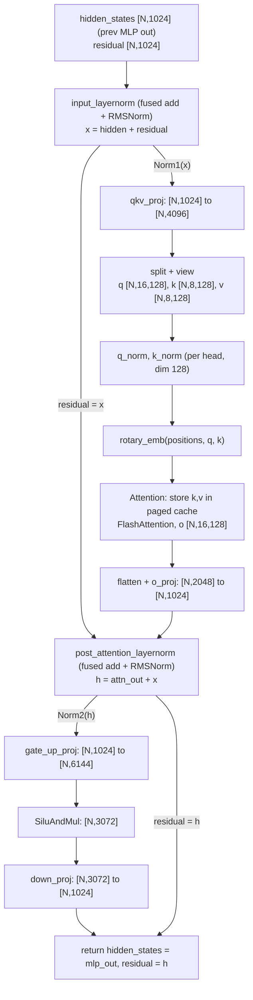

# The Full Model: Qwen3 and Loading Its Weights

> [!abstract] In one line
> `qwen3.py` stacks the building blocks from [[07 Model Building Blocks]] into a Qwen3 transformer whose weight tensors are fused and split across GPUs, and `loader.py` streams the checkpoint's unfused, unsplit tensors into exactly the right slice of those parameters.

<br>

## Why this exists

In [[07 Model Building Blocks]] we built the parts: tensor-parallel linear layers, RMSNorm with a fused residual add, RoPE, the paged-attention `Attention` module, the vocab-parallel embedding and LM head. None of them knows what a Qwen3 is. Something has to say "28 decoder layers, each with attention then an MLP, pre-norm, residual connections, a final norm, tied embeddings", and that is `qwen3.py`. It is a normal PyTorch model definition, about 200 lines, and it looks almost identical to the Hugging Face one, with one important difference: its parameters are **not shaped like the checkpoint's**.

The Hugging Face checkpoint stores `q_proj`, `k_proj`, `v_proj` as three separate matrices, and `gate_proj`, `up_proj` as two. nano-vLLM fuses each group into one matrix (`qkv_proj`, `gate_up_proj`) so one GEMM replaces three or two, and with tensor parallelism each GPU holds only a slice of every fused matrix. So `model.load_state_dict(checkpoint)` would fail: the names differ, the shapes differ, and each rank needs a different piece.

`loader.py` solves this in 28 lines. It walks the checkpoint tensor by tensor, renames `q_proj` to `qkv_proj` (remembering "this is the q part"), and hands the full tensor to a `weight_loader` method that the parameter itself carries. That method knows which rows of the fused matrix belong to q, and which slice of those rows belongs to this rank.

<br>

## The running example: Qwen3-0.6B

All shapes in this note use the real `config.json` of `Qwen/Qwen3-0.6B`:

| field | value | used for |
|---|---|---|
| `hidden_size` | 1024 | residual stream width |
| `num_attention_heads` | 16 | query heads |
| `num_key_value_heads` | 8 | KV heads (GQA, 2 query heads share one KV head) |
| `head_dim` | 128 | per-head width (set explicitly, see below) |
| `intermediate_size` | 3072 | MLP width |
| `num_hidden_layers` | 28 | decoder layers |
| `vocab_size` | 151936 | embedding / logits |
| `attention_bias` | false | turns on `q_norm` / `k_norm` |
| `rope_theta` | 1000000 | RoPE base |
| `rms_norm_eps` | 1e-6 | |
| `tie_word_embeddings` | true | `lm_head` shares the embedding matrix |
| `max_position_embeddings` | 40960 | RoPE table length |

We write $N$ for the number of tokens in the current batch (all sequences flattened together, as explained in [[06 Getting Data onto the GPU]]), and $\text{tp}$ for the tensor-parallel world size. Unless stated otherwise, shapes are for $\text{tp}=1$.

> [!important] `head_dim × num_heads ≠ hidden_size` in Qwen3
> $16 \times 128 = 2048$, twice the hidden size of 1024. Many older models have `head_dim = hidden_size // num_heads`, and the code falls back to that when `head_dim` is missing from the config. For Qwen3 the fallback would give 64, which is wrong. So the attention's inner width (2048) and the residual width (1024) are different numbers, and `o_proj` maps 2048 back to 1024.

A quick sanity check that the shapes add up to "0.6B":

$$
\underbrace{151936 \cdot 1024}_{\text{embedding}\ \approx\ 155.6\text{M}} \;+\; 28 \cdot \Big(\underbrace{4096 \cdot 1024}_{\text{qkv}} + \underbrace{1024 \cdot 2048}_{\text{o}} + \underbrace{3 \cdot 3072 \cdot 1024}_{\text{gate, up, down}}\Big) \approx 155.6\text{M} + 28 \cdot 15.7\text{M} \approx 596\text{M}
$$

(Norm weights add a few thousand per layer; the LM head adds nothing because it is tied.) In bf16 that is about 1.2 GB.

<br>

## Walkthrough: `nanovllm/models/qwen3.py`

### Imports: every layer comes from part 07

*`nanovllm/models/qwen3.py` L1–11*
```python
import torch
from torch import nn
import torch.distributed as dist
from transformers import Qwen3Config

from nanovllm.layers.activation import SiluAndMul
from nanovllm.layers.attention import Attention
from nanovllm.layers.layernorm import RMSNorm
from nanovllm.layers.linear import QKVParallelLinear, MergedColumnParallelLinear, RowParallelLinear
from nanovllm.layers.rotary_embedding import get_rope
from nanovllm.layers.embed_head import VocabParallelEmbedding, ParallelLMHead
```

Only `Qwen3Config` comes from `transformers`, and only as a type for the config object that `Config` loaded with `AutoConfig.from_pretrained` (see [[01 Entry Points and Settings]]). No Hugging Face modeling code is used. Everything else is from [[07 Model Building Blocks]].

<br>

### Qwen3Attention: working out per-rank head counts

*`nanovllm/models/qwen3.py` L14–40*
```python
class Qwen3Attention(nn.Module):

    def __init__(
        self,
        hidden_size: int,
        num_heads: int,
        num_kv_heads: int,
        max_position: int = 4096 * 32,
        head_dim: int | None = None,
        rms_norm_eps: float = 1e-06,
        qkv_bias: bool = False,
        rope_theta: float = 10000,
        rope_scaling: dict | None = None,
    ) -> None:
        super().__init__()
        tp_size = dist.get_world_size()
        self.total_num_heads = num_heads
        assert self.total_num_heads % tp_size == 0
        self.num_heads = self.total_num_heads // tp_size
        self.total_num_kv_heads = num_kv_heads
        assert self.total_num_kv_heads % tp_size == 0
        self.num_kv_heads = self.total_num_kv_heads // tp_size
        self.head_dim = head_dim or hidden_size // self.total_num_heads
        self.q_size = self.num_heads * self.head_dim
        self.kv_size = self.num_kv_heads * self.head_dim
        self.scaling = self.head_dim ** -0.5
        self.qkv_bias = qkv_bias
```

Tensor parallelism for attention is simple because heads are independent: give each GPU a subset of heads, and each GPU computes full attention for its heads with no communication. So the first job is to count heads per rank.

- `total_num_heads` / `total_num_kv_heads`: the model's true head counts, 16 and 8.
- `num_heads` / `num_kv_heads`: this rank's share. The asserts require even division. With $\text{tp}=2$: 8 query heads and 4 KV heads per rank. The ratio 2:1 is preserved, so each rank's query heads still map onto its own KV heads.
- `head_dim`: 128 from the config; only falls back to `hidden_size // total_num_heads` if the config has none.
- `q_size`, `kv_size`: widths **on this rank**, used to split the fused output. $\text{tp}=1$: 2048 and 1024. $\text{tp}=2$: 1024 and 512.
- `scaling`: the softmax temperature $1/\sqrt{d_{\text{head}}} = 1/\sqrt{128} \approx 0.0884$, from

$$
\text{Attention}(Q,K,V) = \text{softmax}\!\left(\frac{QK^\top}{\sqrt{d_{\text{head}}}}\right)V
$$

`dist.get_world_size()` works here because `ModelRunner` has already called `dist.init_process_group` before building the model (even for a single GPU, world size 1).

<br>

### The fused QKV projection and the output projection

*`nanovllm/models/qwen3.py` L42–53*
```python
        self.qkv_proj = QKVParallelLinear(
            hidden_size,
            self.head_dim,
            self.total_num_heads,
            self.total_num_kv_heads,
            bias=qkv_bias,
        )
        self.o_proj = RowParallelLinear(
            self.total_num_heads * self.head_dim,
            hidden_size,
            bias=False,
        )
```

This is the classic Megatron pairing covered in [[07 Model Building Blocks]]: a column-parallel layer followed by a row-parallel one, so the only communication is one all-reduce at the end of `o_proj`.

- `qkv_proj` is passed **total** head counts; it divides by `tp_size` internally. Its full output width is $(16 + 2\cdot 8)\cdot 128 = 4096$, and each rank stores `weight` of shape `[4096 / tp, 1024]`. The rows on each rank are laid out as `[q rows for my heads | k rows for my kv heads | v rows for my kv heads]`.
- `o_proj` takes the 2048-wide concatenated head outputs back to the 1024-wide residual stream. Row-parallel means each rank holds `weight` of shape `[1024, 2048 / tp]`, multiplies its own heads' outputs, and the partial sums are all-reduced.

<br>

### Rotary embeddings

*`nanovllm/models/qwen3.py` L54–61*
```python
        if isinstance(rope_scaling, dict):
            rope_theta = rope_scaling.get("rope_theta", rope_theta)
        self.rotary_emb = get_rope(
            self.head_dim,
            rotary_dim=self.head_dim,
            max_position=max_position,
            base=rope_theta,
        )
```

- The `rope_scaling` branch only reads an overriding `rope_theta` out of it, if present. Qwen3-0.6B has `rope_scaling: null`, so `rope_theta` stays 1,000,000. Real scaling schemes (YaRN etc.) are not implemented.
- `rotary_dim=self.head_dim`: all 128 dimensions of each head are rotated.
- `get_rope` is wrapped in `@lru_cache(1)`, so all 28 layers receive **the same** `RotaryEmbedding` object with one shared cos/sin table of `max_position = 40960` rows. The rotation itself was derived in [[07 Model Building Blocks]].

<br>

### The attention kernel wrapper and Qwen3's per-head norms

*`nanovllm/models/qwen3.py` L62–70*
```python
        self.attn = Attention(
            self.num_heads,
            self.head_dim,
            self.scaling,
            self.num_kv_heads,
        )
        if not self.qkv_bias:
            self.q_norm = RMSNorm(self.head_dim, eps=rms_norm_eps)
            self.k_norm = RMSNorm(self.head_dim, eps=rms_norm_eps)
```

- `Attention` gets the **per-rank** head counts, because it runs on this rank's slice only. It owns the `k_cache` / `v_cache` views that `ModelRunner.allocate_kv_cache` attaches later ([[06 Getting Data onto the GPU]]), writes new K/V into the paged cache, and calls FlashAttention.
- `q_norm` and `k_norm` are the one architectural feature that separates Qwen3 from Qwen2. They are RMSNorms of size `head_dim` = 128, applied to each head's query and key vector separately (called **QK-norm**). They keep the dot products $q\cdot k$ in a bounded range, which stabilises training. There is one learned weight vector of length 128 per norm, shared by all heads.
- The condition `if not self.qkv_bias` is a heuristic: Qwen2 had a bias on q/k/v and no QK-norm; Qwen3 has no bias and has QK-norm. The code uses the bias flag to detect which family it is.

<br>

### Qwen3Attention.forward: shapes at every step

*`nanovllm/models/qwen3.py` L72–88*
```python
    def forward(
        self,
        positions: torch.Tensor,
        hidden_states: torch.Tensor,
    ) -> torch.Tensor:
        qkv = self.qkv_proj(hidden_states)
        q, k, v = qkv.split([self.q_size, self.kv_size, self.kv_size], dim=-1)
        q = q.view(-1, self.num_heads, self.head_dim)
        k = k.view(-1, self.num_kv_heads, self.head_dim)
        v = v.view(-1, self.num_kv_heads, self.head_dim)
        if not self.qkv_bias:
            q = self.q_norm(q)
            k = self.k_norm(k)
        q, k = self.rotary_emb(positions, q, k)
        o = self.attn(q, k, v)
        output = self.o_proj(o.flatten(1, -1))
        return output
```

There is no batch dimension anywhere. All tokens of all sequences are packed into one `[N, ...]` tensor, and `positions` (shape `[N]`) tells RoPE where each token sits in its own sequence. The attention kernel finds sequence boundaries from the global context (`cu_seqlens_q`, `block_tables`, ...) set by the model runner.

Shapes for Qwen3-0.6B, $\text{tp}=1$ (in brackets: $\text{tp}=2$, per rank):

| step | tensor | shape |
|---|---|---|
| input | `hidden_states` | `[N, 1024]` |
| `qkv_proj` | `qkv` | `[N, 4096]` (`[N, 2048]`) |
| `split` | `q` / `k` / `v` | `[N, 2048]` / `[N, 1024]` / `[N, 1024]` (`[N,1024]` / `[N,512]` / `[N,512]`) |
| `view` | `q` | `[N, 16, 128]` (`[N, 8, 128]`) |
| `view` | `k`, `v` | `[N, 8, 128]` (`[N, 4, 128]`) |
| `q_norm`, `k_norm` | `q`, `k` | unchanged; normalised over the last dim (128), i.e. per head |
| `rotary_emb` | `q`, `k` | unchanged |
| `attn` | `o` | `[N, 16, 128]` (`[N, 8, 128]`) |
| `flatten(1, -1)` | | `[N, 2048]` (`[N, 1024]`) |
| `o_proj` | `output` | `[N, 1024]` on every rank (after all-reduce) |

Line by line:

- **`split`** works because of the row layout `QKVParallelLinear` guarantees (and the loader enforces, below): the first `q_size` output columns are q, then `kv_size` of k, then `kv_size` of v. `split` returns views, no copies.
- **`view(-1, heads, head_dim)`** exposes the head axis. Since `split` slices along the last dim, `q` is non-contiguous in memory, but `view` still works because each row's 2048 q-values are contiguous and only the row stride differs.
- **QK-norm before RoPE.** Because `RMSNorm` normalises over `dim=-1`, passing a `[N, 16, 128]` tensor makes it a per-head norm automatically. For one head vector $x \in \mathbb{R}^{128}$:
  $$
  \text{RMSNorm}(x) = \frac{x}{\sqrt{\frac{1}{128}\sum_i x_i^2 + \epsilon}} \odot w
  $$
  The order matters: normalise first, then rotate. Rotation preserves the norm, so RoPE does not undo it.
- **`rotary_emb(positions, q, k)`** rotates q and k by each token's position. `v` is never rotated.
- **`attn(q, k, v)`** stores k and v into the paged KV cache and computes attention. With GQA, FlashAttention maps query heads 0,1 to KV head 0, heads 2,3 to KV head 1, and so on. This is why the cache holds only 8 heads: per token and layer it stores $2 \times 8 \times 128 \times 2$ bytes $= 4$ KB, so $28 \times 4 = 112$ KB per token for the whole model (the number used in the memory budget in [[06 Getting Data onto the GPU]]).
- **`flatten(1, -1)`** concatenates heads back into one vector per token for `o_proj`.

<br>

### Qwen3MLP: gate_up → SiluAndMul → down

*`nanovllm/models/qwen3.py` L91–117*
```python
class Qwen3MLP(nn.Module):

    def __init__(
        self,
        hidden_size: int,
        intermediate_size: int,
        hidden_act: str,
    ) -> None:
        super().__init__()
        self.gate_up_proj = MergedColumnParallelLinear(
            hidden_size,
            [intermediate_size] * 2,
            bias=False,
        )
        self.down_proj = RowParallelLinear(
            intermediate_size,
            hidden_size,
            bias=False,
        )
        assert hidden_act == "silu"
        self.act_fn = SiluAndMul()

    def forward(self, x):
        gate_up = self.gate_up_proj(x)
        x = self.act_fn(gate_up)
        x = self.down_proj(x)
        return x
```

The SwiGLU MLP computes

$$
\text{MLP}(x) = W_{\text{down}}\big(\text{silu}(W_{\text{gate}}x) \odot W_{\text{up}}x\big)
$$

Hugging Face computes $W_{\text{gate}}x$ and $W_{\text{up}}x$ as two matmuls. Here both matrices are stacked into `gate_up_proj`, with `output_sizes = [3072, 3072]`, so one matmul produces both.

| step | shape ($\text{tp}=1$) | per rank, $\text{tp}=2$ |
|---|---|---|
| `x` | `[N, 1024]` | `[N, 1024]` |
| `gate_up_proj` | `[N, 6144]` = `[gate | up]` | `[N, 3072]` = `[my gate half | my up half]` |
| `act_fn` | `[N, 3072]` | `[N, 1536]` |
| `down_proj` | `[N, 1024]` | `[N, 1024]` after all-reduce |

`SiluAndMul` does `x, y = x.chunk(2, -1); return F.silu(x) * y`. For that to be correct under tensor parallelism, each rank's output must be `[its slice of gate | its matching slice of up]`, not the first half of the concatenated `[gate | up]` matrix. `MergedColumnParallelLinear.weight_loader` builds exactly this layout (see the loader section). The `assert hidden_act == "silu"` documents that nothing else is supported.

<br>

### Qwen3DecoderLayer: wiring config fields into submodules

*`nanovllm/models/qwen3.py` L120–144*
```python
class Qwen3DecoderLayer(nn.Module):

    def __init__(
        self,
        config: Qwen3Config,
    ) -> None:
        super().__init__()
        self.self_attn = Qwen3Attention(
            hidden_size=config.hidden_size,
            num_heads=config.num_attention_heads,
            num_kv_heads=config.num_key_value_heads,
            max_position=config.max_position_embeddings,
            rms_norm_eps=config.rms_norm_eps,
            qkv_bias=getattr(config, 'attention_bias', True),
            head_dim=getattr(config, 'head_dim', None),
            rope_theta=getattr(config, "rope_theta", 1000000),
            rope_scaling=getattr(config, "rope_scaling", None),
        )
        self.mlp = Qwen3MLP(
            hidden_size=config.hidden_size,
            intermediate_size=config.intermediate_size,
            hidden_act=config.hidden_act,
        )
        self.input_layernorm = RMSNorm(config.hidden_size, eps=config.rms_norm_eps)
        self.post_attention_layernorm = RMSNorm(config.hidden_size, eps=config.rms_norm_eps)
```

Mostly plumbing. The attribute names matter: `self_attn`, `mlp`, `input_layernorm`, `post_attention_layernorm` are exactly the names in the Hugging Face checkpoint (`model.layers.5.self_attn.o_proj.weight`, `model.layers.5.input_layernorm.weight`, ...). The loader relies on this, since it looks parameters up by the checkpoint's own names.

- `qkv_bias=getattr(config, 'attention_bias', True)`: Qwen3's config says `false`, which enables QK-norm. A config that lacks the field defaults to `True` (Qwen2-style: bias, no QK-norm).
- `getattr` with defaults is used for fields that are not present in every config version.

<br>

### Qwen3DecoderLayer.forward: pre-norm with a deferred residual add

*`nanovllm/models/qwen3.py` L146–159*
```python
    def forward(
        self,
        positions: torch.Tensor,
        hidden_states: torch.Tensor,
        residual: torch.Tensor | None,
    ) -> tuple[torch.Tensor, torch.Tensor]:
        if residual is None:
            hidden_states, residual = self.input_layernorm(hidden_states), hidden_states
        else:
            hidden_states, residual = self.input_layernorm(hidden_states, residual)
        hidden_states = self.self_attn(positions, hidden_states)
        hidden_states, residual = self.post_attention_layernorm(hidden_states, residual)
        hidden_states = self.mlp(hidden_states)
        return hidden_states, residual
```

A textbook pre-norm layer is

$$
h = x + \text{Attn}(\text{Norm}_1(x)), \qquad x' = h + \text{MLP}(\text{Norm}_2(h))
$$

Written that way, each `+` is a separate kernel that reads and writes the whole `[N, 1024]` tensor, and then the norm reads it again. nano-vLLM instead **defers every residual add into the next norm**, using the fused `add_rms_forward` from [[07 Model Building Blocks]]: called as `norm(x, residual)`, it computes `s = x + residual`, returns `(RMSNorm(s), s)`. One compiled kernel does add + norm and hands back the new residual.

So a layer does not return $x'$. It returns the pair `(mlp_out, h)`, whose **sum** is $x'$. The next layer's `input_layernorm(hidden_states, residual)` performs that sum as its first step.

Walking through it:

- **First layer** (`residual is None`): there is nothing to add yet. `hidden_states` is the raw embedding $x$. Normalise it with the plain `rms_forward`, and keep $x$ itself as `residual`. Note the tuple assignment evaluates the right side first, so `residual` gets the un-normalised embedding.
- **Later layers**: `input_layernorm(mlp_out_prev, residual_prev)` computes $x = \text{mlp\_out}_{\text{prev}} + \text{residual}_{\text{prev}}$ (the true input of this layer), returns `Norm₁(x)` and stores $x$ as `residual`.
- **`self_attn`**: `hidden_states` becomes the attention output, not yet added.
- **`post_attention_layernorm(attn_out, residual)`**: computes $h = \text{attn\_out} + x$, returns `Norm₂(h)` and $h$ as the new `residual`.
- **`mlp`**: `hidden_states` becomes the MLP output, not yet added. Return `(mlp_out, h)`.

> [!important] Invariant at every layer boundary
> The real hidden state of the transformer is `hidden_states + residual`, never `hidden_states` alone (except before layer 0, where `residual` is `None`). Any code that reads the model's state between layers, or after the last one, must perform that add. `Qwen3Model.forward` does it in the final norm.

One more detail from `add_rms_forward`: the add is done in fp32, and the residual is then rounded back to bf16. So the residual stream is stored in bf16 between layers, the same as Hugging Face.



<br>

### Qwen3Model: embed, 28 layers, final norm

*`nanovllm/models/qwen3.py` L162–183*
```python
class Qwen3Model(nn.Module):

    def __init__(
        self,
        config: Qwen3Config,
    ) -> None:
        super().__init__()
        self.embed_tokens = VocabParallelEmbedding(config.vocab_size, config.hidden_size)
        self.layers = nn.ModuleList([Qwen3DecoderLayer(config) for _ in range(config.num_hidden_layers)])
        self.norm = RMSNorm(config.hidden_size, eps=config.rms_norm_eps)

    def forward(
        self,
        input_ids: torch.Tensor,
        positions: torch.Tensor,
    ) -> torch.Tensor:
        hidden_states = self.embed_tokens(input_ids)
        residual = None
        for layer in self.layers:
            hidden_states, residual = layer(positions, hidden_states, residual)
        hidden_states, _ = self.norm(hidden_states, residual)
        return hidden_states
```

- `embed_tokens`: `[N]` token ids → `[N, 1024]`. With tensor parallelism each rank holds `151936 / tp` rows of the table and an all-reduce assembles the full embedding ([[07 Model Building Blocks]]).
- `layers`: 28 `Qwen3DecoderLayer`s. Being an `nn.ModuleList`, their parameters are named `layers.0.…` to `layers.27.…`, matching the checkpoint.
- The loop threads the `(hidden_states, residual)` pair through all layers, starting with `residual = None`.
- `self.norm(hidden_states, residual)`: the final fused add + norm. This performs the last layer's deferred residual add and applies the final RMSNorm. The returned sum is not needed any more, so it is discarded with `_`.
- Output: `[N, 1024]`, one normalised hidden vector per input token. Logits are **not** computed here; that is a separate call (next chunk). This split exists because CUDA graphs capture `model(...)` only, and the LM head runs afterwards ([[06 Getting Data onto the GPU]]).

<br>

### packed_modules_mapping: the checkpoint-to-model rename table

*`nanovllm/models/qwen3.py` L186–193*
```python
class Qwen3ForCausalLM(nn.Module):
    packed_modules_mapping = {
        "q_proj": ("qkv_proj", "q"),
        "k_proj": ("qkv_proj", "k"),
        "v_proj": ("qkv_proj", "v"),
        "gate_proj": ("gate_up_proj", 0),
        "up_proj": ("gate_up_proj", 1),
    }
```

A class attribute that tells the loader: "a checkpoint tensor whose name contains key `k` belongs inside my parameter named with `v`, as shard `shard_id`". Read each line as:

- `q_proj` → part `"q"` of `qkv_proj`; likewise `"k"`, `"v"`. `QKVParallelLinear.weight_loader` takes these string ids because q and kv shards have different sizes.
- `gate_proj` → shard `0` of `gate_up_proj`, `up_proj` → shard `1`. `MergedColumnParallelLinear.weight_loader` takes an integer index into `output_sizes`.

The model defines the table because only the model knows which modules it fused. The loader stays generic: a different model with different fusions would just define a different table.

<br>

### Qwen3ForCausalLM: tied LM head and compute_logits

*`nanovllm/models/qwen3.py` L195–216*
```python
    def __init__(
        self,
        config: Qwen3Config
    ) -> None:
        super().__init__()
        self.model = Qwen3Model(config)
        self.lm_head = ParallelLMHead(config.vocab_size, config.hidden_size)
        if config.tie_word_embeddings:
            self.lm_head.weight.data = self.model.embed_tokens.weight.data

    def forward(
        self,
        input_ids: torch.Tensor,
        positions: torch.Tensor,
    ) -> torch.Tensor:
        return self.model(input_ids, positions)

    def compute_logits(
        self,
        hidden_states: torch.Tensor,
    ) -> torch.Tensor:
        return self.lm_head(hidden_states)
```

- `self.model` / `self.lm_head`: again named to match the checkpoint (`model.embed_tokens.weight`, `lm_head.weight`).
- **Tied embeddings.** In Qwen3-0.6B the output projection is the transpose of the input embedding, and the checkpoint stores only `model.embed_tokens.weight` (`[151936, 1024]`, about 311 MB in bf16). Assigning `.data` makes `lm_head.weight` a separate `Parameter` object that points to the **same storage**. Nothing is copied, and when the loader later fills the embedding, the LM head sees the same values. Both are vocab-parallel with the same row split, so the sharing is also correct per rank.
- `forward` returns hidden states, `[N, 1024]`, not logits.
- `compute_logits` runs `ParallelLMHead` ([[07 Model Building Blocks]]). During prefill it first keeps only the last token of each sequence (using `cu_seqlens_q`), because only that token's next-token distribution is sampled. So for 3 prompts with lengths 4, 2, 5, `hidden_states` is `[11, 1024]` and the logits are `[3, 151936]`. During decode every row already is one sequence's last token. With $\text{tp}>1$, each rank computes logits for its vocab slice and rank 0 gathers them; other ranks get `None`.

The model runner calls this as `self.model.compute_logits(self.model(input_ids, positions))`.

<br>

## Walkthrough: `nanovllm/utils/loader.py`

Before this runs, `ModelRunner.__init__` has done:

```python
        torch.set_default_dtype(hf_config.dtype)
        torch.set_default_device("cuda")
        self.model = Qwen3ForCausalLM(hf_config)
        load_model(self.model, config.model)
```

So every parameter already exists **on the GPU**, in bf16, at its per-rank shape, filled with garbage from `torch.empty` (RMSNorm weights are `torch.ones`). The loader's job is to overwrite each one with the right bytes.

<br>

### The fallback: copy the whole tensor

*`nanovllm/utils/loader.py` L1–9*
```python
import os
from glob import glob
import torch
from torch import nn
from safetensors import safe_open


def default_weight_loader(param: nn.Parameter, loaded_weight: torch.Tensor):
    param.data.copy_(loaded_weight)
```

`default_weight_loader` is for parameters that are neither fused nor sharded: the RMSNorm weights (`input_layernorm`, `post_attention_layernorm`, `q_norm`, `k_norm`, `model.norm`). Their shape in the file equals their shape in the model, so a plain `copy_` is enough. `copy_` from a CPU tensor into a CUDA tensor performs the host-to-device transfer (and would cast dtype if the two differed).

<br>

### Iterating over safetensors files

*`nanovllm/utils/loader.py` L12–16*
```python
def load_model(model: nn.Module, path: str):
    packed_modules_mapping = getattr(model, "packed_modules_mapping", {})
    for file in glob(os.path.join(path, "*.safetensors")):
        with safe_open(file, "pt", "cpu") as f:
            for weight_name in f.keys():
```

- `packed_modules_mapping` is read from the model class; a model without fusions gets `{}` and every tensor takes the plain path.
- `glob(... "*.safetensors")`: larger checkpoints are split into several shard files (`model-00001-of-00004.safetensors`, ...). Order does not matter, since every tensor is placed by name. Qwen3-0.6B ships a single `model.safetensors`.
- `safe_open(file, "pt", "cpu")`: safetensors files are a small JSON header (name → dtype, shape, byte offset) followed by raw bytes. `safe_open` memory-maps the file and reads only the header; `f.get_tensor(name)` later materialises one tensor on the CPU. So the loader never holds the whole checkpoint in memory at once, only one tensor at a time.
- `f.keys()`: names like `model.layers.0.self_attn.q_proj.weight`.

The loop is driven by **the file's** tensor names, not the model's parameters. Every name in the file must exist in the model (otherwise `get_parameter` raises), but the reverse is not checked.

<br>

### Fused weights: rename, then load one shard

*`nanovllm/utils/loader.py` L17–24*
```python
                for k in packed_modules_mapping:
                    if k in weight_name:
                        v, shard_id = packed_modules_mapping[k]
                        param_name = weight_name.replace(k, v)
                        param = model.get_parameter(param_name)
                        weight_loader = getattr(param, "weight_loader")
                        weight_loader(param, f.get_tensor(weight_name), shard_id)
                        break
```

For each tensor name, try each key of the mapping as a **substring**:

- `if k in weight_name`: e.g. `"q_proj" in "model.layers.0.self_attn.q_proj.weight"`.
- `v, shard_id`: `("qkv_proj", "q")`.
- `param_name`: string replace gives `model.layers.0.self_attn.qkv_proj.weight`, which is the fused parameter's real name in our model.
- `model.get_parameter(param_name)`: standard PyTorch lookup by dotted path.
- `getattr(param, "weight_loader")`: no default here. A fused parameter must carry a loader, since a plain copy could never be correct. Where does the attribute come from? `LinearBase.__init__` in [[07 Model Building Blocks]] does `self.weight.weight_loader = self.weight_loader`: it attaches the **bound method** of the owning layer to the `Parameter` object. This is the trick that makes the loader generic: given only a parameter, it can call the code of the layer that owns it, with access to that layer's `tp_rank`, `tp_size`, `num_heads` and so on.
- The call passes the **full, unsharded** checkpoint tensor plus the shard id; the layer decides what to keep.
- `break` stops after the first matching key, and also skips the `else` below.

> [!warning] Substring matching is fragile
> Matching is `k in weight_name`, not an exact match on a name component. It works for Qwen3 because no checkpoint name accidentally contains `q_proj`, `k_proj`, `v_proj`, `gate_proj` or `up_proj` except the intended ones (`o_proj` and `down_proj` contain none of them). A model with, say, a module called `kv_proj` would need care. Your own version can match on the dotted component instead.

<br>

### Everything else: the parameter's own loader, or the default

*`nanovllm/utils/loader.py` L25–28*
```python
                else:
                    param = model.get_parameter(weight_name)
                    weight_loader = getattr(param, "weight_loader", default_weight_loader)
                    weight_loader(param, f.get_tensor(weight_name))
```

This `else` belongs to the `for` loop, not the `if`: Python runs a `for`'s `else` block only when the loop finished **without** `break`. So this is "no mapping key matched".

- The name is used as-is.
- If the parameter has a `weight_loader` (row-parallel `o_proj` / `down_proj`, the vocab-parallel `embed_tokens`, an untied `lm_head`), that loader slices out this rank's part, with no shard id.
- Otherwise (the norms), `default_weight_loader` copies the whole tensor.

For Qwen3-0.6B, `lm_head.weight` is not in the file, so it is never visited, and it gets its values through the storage it shares with `embed_tokens`.

> [!warning] Missing tensors are silent
> Nothing checks that every model parameter was written. If a checkpoint lacks a tensor (or a name mismatch leads to it never being loaded), that parameter keeps whatever `torch.empty` left in GPU memory, and the model produces garbage without any error. A cheap safeguard in your own version: collect the set of loaded parameter names and compare with `model.named_parameters()`.

<br>

### One weight's full path, from file to GPU shard

Take `model.layers.3.self_attn.k_proj.weight` with $\text{tp}=2$, on rank 1.

**1. In the file.** Shape `[1024, 1024]`: 8 KV heads × 128 = 1024 output rows, 1024 input columns. Rows 0–127 are KV head 0, rows 128–255 KV head 1, and so on.

**2. Name matching.** The mapping is tried in order: `"q_proj"` is not a substring, `"k_proj"` is. So `v, shard_id = ("qkv_proj", "k")` and `param_name = "model.layers.3.self_attn.qkv_proj.weight"`.

**3. The target parameter.** On this rank, `QKVParallelLinear` has `num_heads = 16 / 2 = 8`, `num_kv_heads = 8 / 2 = 4`, and `weight` of shape `[(16 + 16)·128 / 2, 1024] = [2048, 1024]`, already on `cuda:1` in bf16. Its row layout is:

```text
rank-local qkv_proj.weight  [2048, 1024]
rows    0 .. 1023   q   (8 q heads  x 128)
rows 1024 .. 1535   k   (4 kv heads x 128)   <-- we are filling this
rows 1536 .. 2047   v   (4 kv heads x 128)
```

**4. `f.get_tensor(...)`** reads the full `[1024, 1024]` tensor from the mmap into CPU memory.

**5. `QKVParallelLinear.weight_loader(param, loaded_weight, "k")`** from [[07 Model Building Blocks]]:

```python
        elif loaded_shard_id == "k":
            shard_size = self.num_kv_heads * self.head_size
            shard_offset = self.num_heads * self.head_size
        ...
        param_data = param_data.narrow(self.tp_dim, shard_offset, shard_size)
        loaded_weight = loaded_weight.chunk(self.tp_size, self.tp_dim)[self.tp_rank]
        param_data.copy_(loaded_weight)
```

- `shard_size = 4 · 128 = 512`, `shard_offset = 8 · 128 = 1024`.
- `param_data.narrow(0, 1024, 512)`: a view of rows 1024–1535 of the GPU parameter, the k region.
- `loaded_weight.chunk(2, 0)[1]`: rows 512–1023 of the file tensor, which are KV heads 4–7. Rank 0 takes heads 0–3.
- `copy_`: transfers those 512 × 1024 values from CPU to `cuda:1`, writing through the view into the fused parameter.

**6. Result.** After `q_proj`, `k_proj`, `v_proj` of layer 3 have all been visited (in whatever order they appear in the file), rank 1's `qkv_proj.weight` holds q heads 8–15, KV heads 4–7 for k, and KV heads 4–7 for v. Query heads 8–15 are exactly the ones that use KV heads 4–7 under GQA, so rank 1 can compute attention for its heads with no communication. At forward time, `qkv.split([1024, 512, 512])` finds q, k and v precisely where the loader put them.

The same story for `gate_proj` (shard `0`): `MergedColumnParallelLinear.weight_loader` computes `shard_offset = sum([3072, 3072][:0]) // 2 = 0`, `shard_size = 3072 // 2 = 1536`, and copies half of the file's `[3072, 1024]` gate matrix into rows 0–1535. `up_proj` (shard `1`) lands in rows 1536–3071. That gives the `[my gate | my up]` layout `SiluAndMul` needs.

> [!question] Check yourself
> 1. Why does `Qwen3Attention` compute `q_size` from the per-rank `num_heads`, while it passes the total head counts to `QKVParallelLinear`?
> 2. After layer 10 returns `(hidden_states, residual)`, what tensor is the true input to layer 11?
> 3. Qwen3-0.6B's checkpoint has no `lm_head.weight`. How does the LM head end up with correct values?
> 4. What would go wrong at inference time if `MergedColumnParallelLinear.weight_loader` just copied rank `r`'s contiguous `1/tp` of the stacked `[gate; up]` rows?
>
> > [!success]- Answer
> > 1. `q_size` is used to split this rank's `qkv` output, which only contains this rank's heads. `QKVParallelLinear` does the division by `tp_size` itself, so it needs the totals.
> > 2. `hidden_states + residual` (the MLP output of layer 10 plus the post-attention sum $h$). Layer 11's `input_layernorm` computes that sum in its fused kernel.
> > 3. `lm_head.weight.data` is set to the embedding's `.data` at construction, so both parameters share storage. Loading `model.embed_tokens.weight` fills both.
> > 4. With $\text{tp}=2$, rank 0 would get all of gate and rank 1 all of up. `SiluAndMul` splits its input in half and multiplies, so it would multiply half of gate by the other half of gate. The result is wrong but raises no error.

<br>

## Build it yourself

> [!tip] Order of work
> Write the model first with $\text{tp}=1$ and check it against Hugging Face logits on one prompt, then add the loader's fused path, then turn on $\text{tp}=2$.

- [ ] `Attention` block: per-rank head counts, fused `qkv_proj`, `split` into q/k/v by per-rank sizes, `view` to `[N, heads, head_dim]`, QK-norm, RoPE, paged attention, `flatten`, `o_proj`.
- [ ] Read `head_dim` from the config; do not derive it from `hidden_size`.
- [ ] MLP: `gate_up_proj` → `SiluAndMul` → `down_proj`.
- [ ] Decoder layer returning `(hidden_states, residual)` with the residual add deferred into the next fused norm; first layer handles `residual is None`.
- [ ] Model: embedding, `ModuleList` of layers, final fused norm that performs the last add.
- [ ] `ForCausalLM`: `forward` returns hidden states, separate `compute_logits`; tie `lm_head` to the embedding by sharing `.data` when the config says so.
- [ ] `packed_modules_mapping` for q/k/v and gate/up.
- [ ] Loader: iterate `*.safetensors` with `safe_open`, rename packed names, dispatch to `param.weight_loader` (with shard id for packed ones), fall back to a plain copy.
- [ ] Optional: assert that every model parameter was loaded.

Invariants your version must preserve:

- Module attribute names match the checkpoint's names, so lookups by name succeed.
- Each rank's fused `qkv_proj` rows are `[q for my heads | k for my kv heads | v for my kv heads]`, and the forward `split` sizes use the same per-rank widths.
- Each rank's `gate_up_proj` rows are `[my gate slice | my matching up slice]`.
- Between layers, the true hidden state is `hidden_states + residual`.
- All parameters are created on the GPU in the model's dtype before loading; the loader only slices and copies.

<br>

← [[07 Model Building Blocks]] | [[09 Measuring Speed]] →
