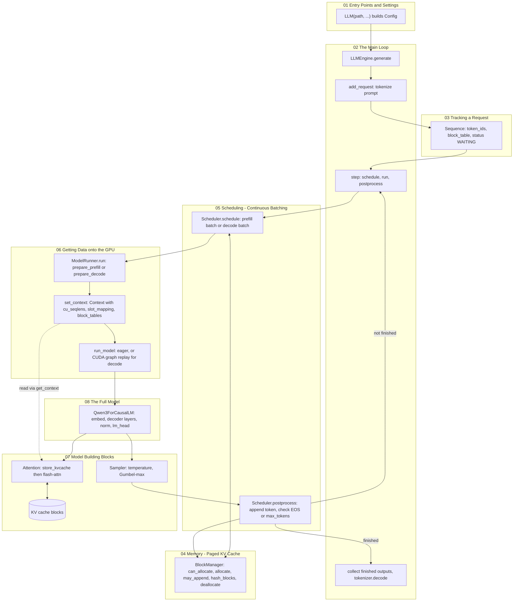

# Measuring Speed

> [!abstract] In one line
> `bench.py` runs a fixed, seeded batch of 256 random requests that are forced to generate exactly their token budget, times one `generate` call, and reports **output tokens per second**; `pyproject.toml` names the five libraries everything else stands on.


## Why this exists

The first eight notes built an engine whose whole point is speed: paged KV cache, continuous batching, prefix caching, CUDA graphs. None of that means anything until you can put a number on it, and the number only means something if the workload behind it is exactly the same every time and exactly the same for every engine you compare against.

That is harder than it sounds. A language model decides for itself when to stop (it emits an end-of-sequence token), so two runs with "the same prompts" can do very different amounts of work. Timing can accidentally include one-off costs like compilation. And "tokens per second" can mean prompt tokens, output tokens, or both. `bench.py` is 32 lines that pin all of this down. This note reads it line by line, says exactly what its number does and does not measure, and then explains the README table it produced.

The second half covers `pyproject.toml`: five dependencies, each used in one or two specific places you have already seen. The note ends with a one-page map of the whole system and a list of experiments to run on your own implementation.

---

## bench.py

### Fixing the workload: imports, seed and sizes

*`bench.py` L1–12*
```python
import os
import time
from random import randint, seed
from nanovllm import LLM, SamplingParams
# from vllm import LLM, SamplingParams


def main():
    seed(0)
    num_seqs = 256
    max_input_len = 1024
    max_ouput_len = 1024
```

- **Line 4 vs line 5.** The benchmark is written so the *only* change needed to benchmark real vLLM is swapping which import is commented out. That works because nano-vLLM copies vLLM's public API (`LLM`, `SamplingParams`, `generate`), as covered in [[01 Entry Points and Settings]].
- **`seed(0)`** seeds Python's `random` module. Every prompt length, every prompt token and every output budget below comes from `randint`, so the whole workload is a deterministic function of this seed. Two runs, or two engines, see byte-identical requests.
- **`num_seqs = 256`**: all 256 requests are submitted at once. This is an *offline* benchmark (a big batch job), not a server with requests trickling in.
- **`max_input_len`, `max_ouput_len`** (the typo is in the repo): upper bounds for prompt length and output budget. Lower bounds (100) appear on lines 17–18.

> [!important] The seed only controls the *workload*, not the sampled tokens
> The tokens the model generates come from `torch`'s RNG inside the `Sampler` ([[07 Model Building Blocks]]), which is not seeded here. That is fine: with `ignore_eos=True` (below) the amount of work does not depend on *which* tokens get sampled, only on how many.


### Building the engine

*`bench.py` L14–15*
```python
    path = os.path.expanduser("~/huggingface/Qwen3-0.6B/")
    llm = LLM(path, enforce_eager=False, max_model_len=4096)
```

- The model is Qwen3-0.6B, downloaded to the path given in the README.
- **`enforce_eager=False`** turns CUDA graphs *on* for decode (see `capture_cudagraph` and `run_model` in [[06 Getting Data onto the GPU]]). It is already the default in `Config`; writing it out makes the benchmark's intent explicit and matches the argument you pass to vLLM.
- **`max_model_len=4096`**: the longest a sequence may grow. The longest request in this workload is 1024 + 1024 = 2048 tokens, so this is never the binding limit. It does size the CUDA-graph block table (`max_num_blocks` in `capture_cudagraph`) and the warmup batch.

Everything expensive and one-time happens inside this constructor, *before* any timer starts: loading weights, `warmup_model`, measuring free memory and allocating the KV cache, capturing CUDA graphs for batch sizes 1, 2, 4, 8, 16, …, 512.


### Random prompts and random output budgets

*`bench.py` L17–20*
```python
    prompt_token_ids = [[randint(0, 10000) for _ in range(randint(100, max_input_len))] for _ in range(num_seqs)]
    sampling_params = [SamplingParams(temperature=0.6, ignore_eos=True, max_tokens=randint(100, max_ouput_len)) for _ in range(num_seqs)]
    # uncomment the following line for vllm
    # prompt_token_ids = [dict(prompt_token_ids=p) for p in prompt_token_ids]
```

**Line 17**, read from the inside out:
- `randint(100, max_input_len)` picks a prompt length in $[100, 1024]$ (both ends inclusive for `random.randint`).
- `randint(0, 10000)` fills it with random token ids. They are gibberish as text, but the GPU does exactly the same work for gibberish as for Shakespeare: attention cost depends on lengths, not content.
- The prompts are already token ids, so `add_request` skips the tokenizer (`if isinstance(prompt, str)` is false, [[02 The Main Loop]]). Tokenization is kept out of the timed region.
- Random ids also mean **no two prompts share a full 256-token block**, so the prefix cache ([[04 Memory - Paged KV Cache]]) never hits. This benchmark measures the engine *without* help from prefix caching.

**Line 18** gives every request its own `SamplingParams`:
- `temperature=0.6`: real sampling, not greedy (greedy is forbidden anyway by the assert in `SamplingParams`).
- `max_tokens=randint(100, max_ouput_len)`: an output budget in $[100, 1024]$.
- `ignore_eos=True`: the key flag, explained next.

**Line 20** is the only other change needed for vLLM: vLLM's `generate` wants token-id prompts wrapped as `{"prompt_token_ids": [...]}`, while nano-vLLM's `generate` accepts `list[list[int]]` directly.

With `seed(0)` the numbers come out as follows (you can reproduce them in a plain Python shell, no GPU needed, by running lines 9–18 without the `LLM` call):

| quantity | value |
|---|---|
| total prompt tokens | 142,827 |
| total output tokens, $\sum$ `max_tokens` | **133,966** |
| shortest / longest output budget | 103 / 1024 |
| longest final sequence (prompt + output) | 2,011 |

That 133,966 is exactly the "Output Tokens" figure in the README table.


### Why a benchmark needs `ignore_eos`

The stopping rule lives in `Scheduler.postprocess` ([[05 Scheduling - Continuous Batching]]):

*`nanovllm/engine/scheduler.py` L89–92*
```python
            if (not seq.ignore_eos and token_id == self.eos) or seq.num_completion_tokens == seq.max_tokens:
                seq.status = SequenceStatus.FINISHED
                self.block_manager.deallocate(seq)
                self.running.remove(seq)
```

A sequence finishes when it samples the EOS token *or* reaches `max_tokens`. With `ignore_eos=True` the first condition is switched off, so every sequence runs until **exactly** `max_tokens` completion tokens. That buys three things:

1. **Deterministic work.** Without it, when each request stops depends on random sampling. Run twice and you get different total token counts and different batch shapes over time. Random-id prompts make this worse: the model's reaction to gibberish is unpredictable, and it might emit EOS after 3 tokens.
2. **Identical work across engines.** vLLM and nano-vLLM sample with different RNG streams. Only with EOS ignored do both engines generate the same 133,966 tokens in the same per-request lengths.
3. **A correct numerator.** Line 26 computes total tokens as `sum(sp.max_tokens ...)` *without looking at the outputs*. That is only true because `ignore_eos` guarantees each request produced exactly its budget.

> [!warning] Drop `ignore_eos` and the throughput number silently lies
> If you remove `ignore_eos=True` but keep line 26, requests that stop early still count their full `max_tokens` in the numerator, and throughput is overstated. If you do want to benchmark with natural stopping, count what actually came out: sum `len(o["token_ids"])` over the list `generate` returns.


### The warmup call

*`bench.py` L22*
```python
    llm.generate(["Benchmark: "], SamplingParams())
```

One tiny request (a few prompt tokens, the default `max_tokens=64`, `temperature=1.0`) is run and thrown away before the timer starts. Its job is to push any remaining first-call costs outside the timed region.

The constructor already did a lot of warming up (`warmup_model`, CUDA graph capture), but it did not exercise the exact path a real request takes:
- `warmup_model` runs a prefill *before* the KV cache exists, so the `store_kvcache` write is skipped there (`if k_cache.numel() and v_cache.numel()` in `Attention.forward`).
- The real prefill path goes through `prepare_prefill` with a block table and slot mapping, then decode steps through `prepare_decode` and CUDA graph replay, then `postprocess`, then `tokenizer.decode` at the end of `generate`.
- `torch.compile`-decorated functions (the `Sampler`, `RMSNorm`, `SiluAndMul`, RoPE) may recompile the first time they see a new input shape, for example a batch of 1.

It also makes the comparison symmetric: vLLM has its own lazy first-call costs, and the same line warms it up too.

This warmup cannot give the timed run an unfair cache advantage. `hash_blocks` only registers *full* blocks, and a few prompt tokens plus 64 outputs never fill a 256-token block, so nothing lands in the prefix cache.


### Timing and computing throughput

*`bench.py` L23–28*
```python
    t = time.time()
    llm.generate(prompt_token_ids, sampling_params, use_tqdm=False)
    t = (time.time() - t)
    total_tokens = sum(sp.max_tokens for sp in sampling_params)
    throughput = total_tokens / t
    print(f"Total: {total_tokens}tok, Time: {t:.2f}s, Throughput: {throughput:.2f}tok/s")
```

- **L23–25**: wall-clock time around one `generate` call. `use_tqdm=False` hides the progress bar. It is safe to time GPU work with a CPU clock here because every step ends with `.tolist()` on the sampled tokens (`ModelRunner.run`), which waits for the GPU to finish. When `generate` returns, all GPU work is really done.
- **L26**: the numerator is the sum of output budgets, which by the argument above equals the number of generated tokens.
- **L27**: the headline metric:

$$
\text{throughput} \;=\; \frac{\sum_{i=1}^{256} \texttt{max\_tokens}_i}{t_\text{wall}} \;=\; \frac{133{,}966}{93.41\ \text{s}} \;\approx\; 1434\ \text{tok/s}
$$


### What this number measures, and what it doesn't

**It measures offline output throughput:** how fast the engine gets through a large batch it knows about up front, counted in generated tokens. That is the right metric for batch jobs (evaluation, synthetic data, offline labelling), and it is mostly a test of the scheduler, the memory manager and the decode path.

Be precise about what goes into the numerator and the denominator:

- **Only output tokens are counted.** The 142,827 prompt tokens are processed but contribute nothing to the numerator. Change the prompt lengths while keeping the output budgets, and the "throughput" changes even though the metric pretends the workload is the same.
- **The time includes prefill.** Every prefill step (all 142,827 prompt tokens, chunked where needed) sits inside $t_\text{wall}$. The number is therefore neither decode speed nor prefill speed but a blend of the two, weighted by this workload's input/output mix. In nano-vLLM a step is *either* prefill *or* decode ([[05 Scheduling - Continuous Batching]]), so $t_\text{wall}$ really is prefill time + decode time + CPU overhead.
- **It includes CPU overhead**: scheduling, building input tensors, `postprocess`, and the final `tokenizer.decode` of 256 outputs. For a 0.6B model on a laptop GPU that overhead is a real fraction of each step, and it is one of the places a lean engine can win.
- **It does not measure latency.** Nothing here says how long a single user waits for their first token (**time to first token**) or how smooth the stream is (**time per output token**). An engine can have great throughput and poor latency, because it keeps batches full by making requests wait.
- **It is one run.** No repetitions, no variance. Laptop GPUs change clock speed with temperature, so a few percent of difference can be noise.

The per-step "Prefill" and "Decode" tok/s shown in the tqdm bar (`LLMEngine.generate`, [[02 The Main Loop]]) are a different thing: an instantaneous rate for the last step of each kind. They are hidden here by `use_tqdm=False`.


### Comparing fairly against vLLM

The script has the switch built in, but a fair comparison needs more than swapping imports.

1. **Swap the engine:** comment line 4, uncomment line 5, and uncomment line 20 so the prompts are wrapped as dicts.
2. **Check the workload is identical:** the printed `Total:` must be 133966 in both runs. Same seed, same total.
3. **Match the engine settings, not just the call.** Both default to `gpu_memory_utilization=0.9`, but each engine measures its own memory and ends up with its own number of KV cache blocks. Batch-shape limits (`max_num_seqs`, `max_num_batched_tokens`) have different defaults in vLLM, and those defaults vary between vLLM versions. Pass them explicitly to both engines, and compare the KV cache capacity each engine logs or computes at startup.
4. **Same CUDA-graph setting:** `enforce_eager=False` on both.
5. **Same machine state:** same GPU, nothing else running on it, same model files, same dtype.
6. **Repeat:** run each engine several times, alternate between them, and report the median.
7. **Record versions:** the vLLM version, torch, flash-attn, CUDA driver. vLLM changes quickly, and a number without a version cannot be reproduced.

---

## The README numbers

*`README.md` L50–61*
```text
**Test Configuration:**
- Hardware: RTX 4070 Laptop (8GB)
- Model: Qwen3-0.6B
- Total Requests: 256 sequences
- Input Length: Randomly sampled between 100–1024 tokens
- Output Length: Randomly sampled between 100–1024 tokens

**Performance Results:**
| Inference Engine | Output Tokens | Time (s) | Throughput (tokens/s) |
|----------------|-------------|----------|-----------------------|
| vLLM           | 133,966     | 98.37    | 1361.84               |
| Nano-vLLM      | 133,966     | 93.41    | 1434.13               |
```

Reading the table with everything above in mind:

- **Output Tokens is identical in both rows.** That is the seed and `ignore_eos` doing their job: same 256 requests, same 133,966 tokens, reproducible exactly from `seed(0)`.
- **Throughput is just the first column divided by the second:** $133{,}966 / 98.37 = 1361.8$ and $133{,}966 / 93.41 = 1434.2$. Nano-vLLM finishes about 5 seconds sooner, roughly **5% higher throughput**.
- **What the 5% means.** Both engines use the same attention kernels (flash-attn) and the same core ideas (paged KV, continuous batching, CUDA graphs), so on the GPU side they do nearly the same work. With a model this small, per-step CPU overhead is a large share of each step, and nano-vLLM's short, single-process Python path has less of it. It is not evidence that nano-vLLM beats vLLM in general. Change the model size, the GPU or the vLLM version and the gap can vanish or flip.
- **The workload does not fit in memory at once.** A rough KV budget shows why this benchmark is really about packing. For Qwen3-0.6B (28 layers, 8 KV heads, head dim 128, bf16, from the model's `config.json`), using the formula from `allocate_kv_cache` ([[06 Getting Data onto the GPU]]):

$$
\text{bytes per token} = 2 \times 28 \times 8 \times 128 \times 2 = 114{,}688\ \text{B} = 112\ \text{KiB}, \qquad \text{one 256-token block} = 28\ \text{MiB}
$$

If all 256 requests reached full length at the same time they would need 1,206 blocks, about **33 GiB** of KV cache. The card has 8 GB in total, including ~1.2 GB of weights and the activation peak. So only a few dozen sequences can be resident at once; the rest wait in the queue, and some get preempted. The benchmark measures how well the scheduler and block manager keep a small cache full.

> [!warning] Treat the table as a snapshot
> The README numbers come from one laptop at one point in the repo's history. The chunked-prefill refactor (`f64d821`, see [[10 History - Real Bugs]]) did not update them. Re-run `bench.py` on your own hardware before you compare anything with them.

> [!question] Check yourself
> 1. Why would the throughput number be wrong if you removed `ignore_eos=True` but left line 26 alone?
> 2. You double every prompt's length and keep the output budgets. What happens to "throughput", and is the engine actually slower?
> 3. Why can't the warmup call on line 22 give the timed run a prefix-cache hit?
>
> > [!success]- Answer
> > 1. Requests could stop early on EOS, but line 26 still counts their full `max_tokens`. The numerator overcounts and throughput is overstated.
> > 2. It drops, because prefill time is in the denominator while prompt tokens are not in the numerator. The engine is doing more work, not necessarily working slower; the metric simply does not credit prompt tokens.
> > 3. `hash_blocks` only registers full blocks. The warmup sequence (a few prompt tokens plus 64 outputs) never fills a 256-token block, and the timed prompts are random ids anyway.

---

## pyproject.toml

### Packaging and Python version

*`pyproject.toml` L1–13*
```toml
[build-system]
requires = ["setuptools>=61"]
build-backend = "setuptools.build_meta"

[project]
name = "nano-vllm"
version = "0.2.0"
authors = [{ name = "Xingkai Yu" }]
license = "MIT"
license-files = ["LICENSE"]
readme = "README.md"
description = "a lightweight vLLM implementation built from scratch"
requires-python = ">=3.10,<3.13"
```

Standard setuptools metadata. The interesting line is **`requires-python`**. The lower bound 3.10 is forced by the code itself: `@dataclass(slots=True)` (in `Config`, `SamplingParams`, `Context`) and runtime `X | None` annotations like `hf_config: AutoConfig | None` both need 3.10. The upper bound reflects which Python versions the GPU stack (torch, triton, flash-attn wheels) was known to support when the project was written.


### The five dependencies

*`pyproject.toml` L14–20*
```toml
dependencies = [
    "torch>=2.4.0",
    "triton>=3.0.0",
    "transformers>=4.51.0",
    "flash-attn",
    "xxhash",
]
```

| dependency | what it does in nano-vLLM | where |
|---|---|---|
| **torch** | Tensors and `nn.Module` for every layer; `torch.distributed` (NCCL) for tensor parallelism; `torch.multiprocessing` to spawn worker ranks; `torch.cuda.CUDAGraph` for decode graphs; `torch.compile` on small fused ops | every file under `nanovllm/layers/` and `models/qwen3.py`; `engine/model_runner.py` L26 (`init_process_group`), L223–257 (`capture_cudagraph`); `engine/llm_engine.py` L24 (`spawn`); `@torch.compile` in `layers/sampler.py` L7, `layernorm.py` L16 and L28, `activation.py` L8, `rotary_embedding.py` L37 |
| **triton** | The one hand-written GPU kernel: `store_kvcache_kernel`, which scatters each new token's K and V into its slot in the paged cache. Also the backend `torch.compile` generates its GPU kernels with | `layers/attention.py` L3–4, L10–40 |
| **transformers** | Only config and tokenizer, never model code: `AutoConfig` reads `config.json`, `AutoTokenizer` encodes prompts and decodes outputs, `Qwen3Config` is a type hint. `>=4.51.0` is the first release that knows Qwen3 | `config.py` L24; `engine/llm_engine.py` L32; `models/qwen3.py` L4 |
| **flash-attn** | The attention math. `flash_attn_varlen_func` for prefill (packed variable-length sequences via `cu_seqlens`, optionally reading from the paged cache via `block_table`), `flash_attn_with_kvcache` for decode (one query token per sequence against its paged cache) | `layers/attention.py` L6, L67–74 |
| **xxhash** | A fast non-cryptographic 64-bit hash for prefix caching: each full block's token ids are hashed together with the previous block's hash | `engine/block_manager.py` L2, L36–41 (`compute_hash`) |

A few things worth knowing when you set up your own environment:

- **Three imports are not declared** but arrive through `transformers`: `safetensors` (`utils/loader.py` L5, reading weight files), `tqdm` (`engine/llm_engine.py` L4, the progress bar) and `numpy` (`engine/block_manager.py` L3, turning token lists into bytes for hashing). If you build a slimmer version without `transformers`, add them explicitly.
- **flash-attn is the fragile one.** It is a compiled CUDA extension that has to match your torch and CUDA versions exactly. If `import flash_attn` fails, the mismatch is almost always there, not in nano-vLLM.
- **xxhash collisions are handled in code, not trusted away.** `can_allocate` checks `self.blocks[block_id].token_ids != token_ids` after a hash match ([[04 Memory - Paged KV Cache]]), so a collision costs a cache miss, never wrong output.
- `ModelRunner` reads `hf_config.dtype` (`model_runner.py` L29). Older `transformers` releases name this attribute `torch_dtype`. If you hit an `AttributeError` there, upgrade `transformers`.


### What gets installed

*`pyproject.toml` L22–27*
```toml
[project.urls]
Homepage="https://github.com/GeeeekExplorer/nano-vllm"

[tool.setuptools.packages.find]
where = ["."]
include = ["nanovllm*"]
```

Only the `nanovllm` package and its subpackages are installed. `bench.py` and `example.py` stay in the repo as scripts, which is why you run them from the repo root.

---

## The whole system on one page

This traces one request from `generate` to the text it returns. Each box is labelled with the note that explains it.



| step | code | note |
|---|---|---|
| Construct engine, config, KV cache, CUDA graphs | `llm.py`, `config.py`, `LLMEngine.__init__`, `ModelRunner.__init__` | [[01 Entry Points and Settings]], [[06 Getting Data onto the GPU]] |
| `generate` → `add_request` → `step` loop | `engine/llm_engine.py` | [[02 The Main Loop]] |
| A request's state: tokens, block table, cached/scheduled counts | `engine/sequence.py` | [[03 Tracking a Request]] |
| Block allocation, prefix-cache lookup, freeing | `engine/block_manager.py` | [[04 Memory - Paged KV Cache]] |
| Picking the batch; chunked prefill; preemption; finishing | `engine/scheduler.py` | [[05 Scheduling - Continuous Batching]] |
| Flattening the batch into tensors; `Context`; graph replay | `engine/model_runner.py`, `utils/context.py` | [[06 Getting Data onto the GPU]] |
| Linear/TP layers, RoPE, RMSNorm, attention + KV writes, sampler | `layers/*` | [[07 Model Building Blocks]] |
| Qwen3 architecture and weight loading | `models/qwen3.py`, `utils/loader.py` | [[08 The Full Model]] |
| Measuring it all | `bench.py` | this note |

### Experiments for your own implementation

Run `bench.py` (or your equivalent) once as a baseline, then change one thing at a time. For each experiment, predict the result before you run it.

1. **Toggle `enforce_eager`.** Set `enforce_eager=True` so decode runs eagerly (`model_runner.py` L36–37 and L197). Prefill should not change, since it never uses graphs. Decode should get noticeably slower, because a 0.6B model's decode step is dominated by kernel-launch overhead. To see the two phases separately, accumulate time per step in `generate`, split by the sign of `num_tokens`.
2. **Change the block size.** `kvcache_block_size=512` (it must be a multiple of 256, `config.py` L22). You get half as many blocks, each twice as large. Watch the waste in each sequence's last, partly filled block, and notice that the prefix cache can now only share 512-token chunks.
3. **Disable the prefix cache, then give it something to do.** On `bench.py`'s random prompts, disabling it should change nothing, which is itself worth confirming. Then build a workload where all 256 prompts start with the same ~768-token prefix, and compare runs with and without an early `return 0` (when enough blocks are free) in `can_allocate`. Prefill time should drop sharply when caching is on.
4. **Starve the KV cache.** Lower `gpu_memory_utilization` (e.g. to 0.5). Add a counter in `Scheduler.preempt` and watch preemptions climb and throughput fall. That is the price of recomputing evicted sequences.
5. **Shrink the token budget per step.** Set `max_num_batched_tokens=2048` to force chunked prefill on long prompts, and compare with the default 16384. Then vary `max_num_seqs` (e.g. 16, 64, 256) to see how decode batch size drives throughput.
6. **Let the model stop on its own.** Remove `ignore_eos=True`, count the real output tokens from the returned `token_ids`, and run twice. The totals will differ between runs, which is the case for `ignore_eos` made concrete.
7. **Get a naive baseline.** Time a plain Hugging Face `model.generate` loop on the same 256 requests with the same budgets. This shows what paged KV and continuous batching are actually worth.

---

## Build it yourself

- [ ] Write a benchmark script with a fixed seed that builds prompts as token ids (random lengths, random ids) and per-request `SamplingParams` with `ignore_eos=True` and random `max_tokens`.
- [ ] Build the engine before timing; run one small warmup `generate` and discard the result.
- [ ] Time exactly one `generate` call on the whole batch with a wall clock; make sure the GPU is synchronized by the end (reading sampled tokens back to the CPU does this).
- [ ] Report output tokens, seconds and output tokens/s; optionally report prefill and decode time separately.
- [ ] Keep the API vLLM-compatible so the same script can benchmark vLLM with a one-line import swap.
- [ ] Pin your environment: Python ≥ 3.10, torch, triton, transformers (Qwen3 support), a flash-attn build matching your torch/CUDA, xxhash.

Invariants your benchmark must preserve:
- The workload is a pure function of the seed, and the printed total is identical across engines and runs.
- The numerator counts tokens that were actually generated: exactly $\sum$ `max_tokens` with `ignore_eos`, measured from the outputs otherwise.
- No one-time cost (weight loading, compilation, graph capture, allocation) falls inside the timed region.

← [[08 The Full Model]] | [[10 History - Real Bugs]] →
